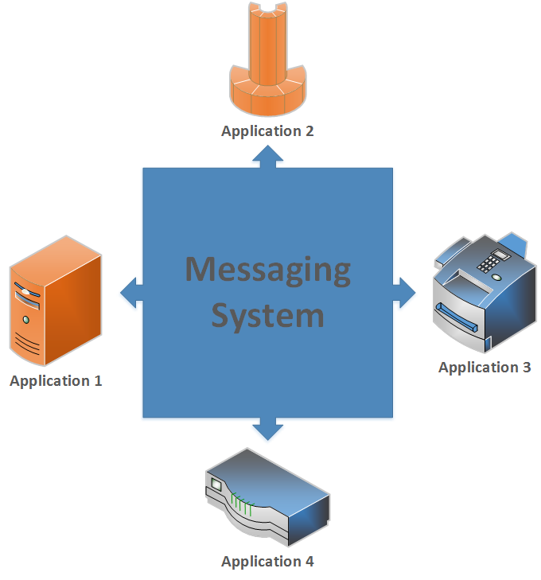
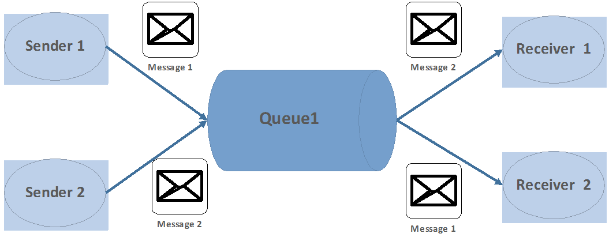
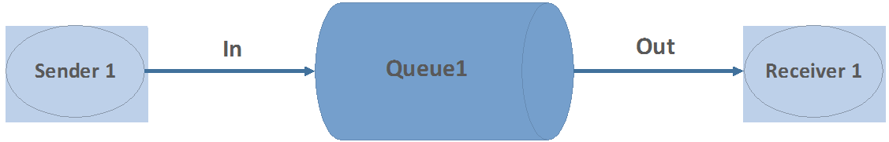
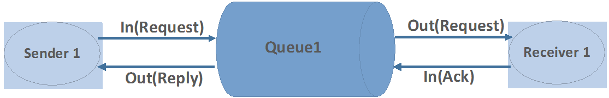
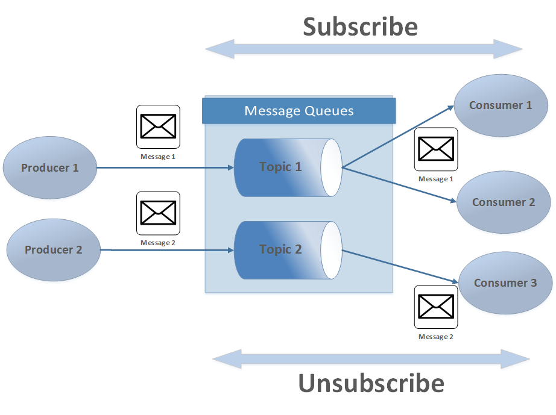
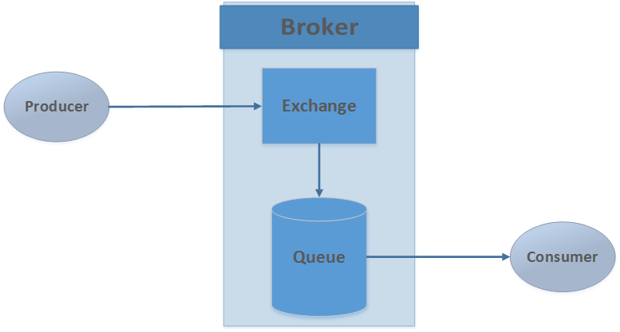
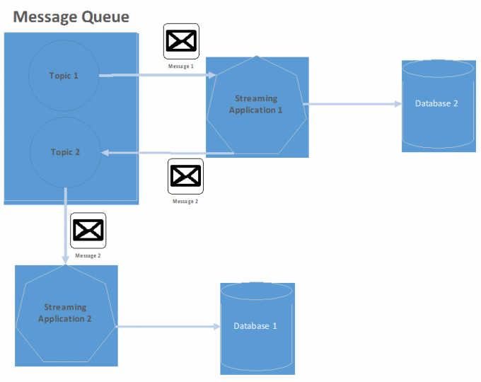

Lab 1. Introduction to Messaging Systems
-----------------------------------------------------

People have different styles of learning. This lab will give you the
necessary context to help you achieve a better understanding of the
course.

The goal of any Enterprise Integration is to establish unification
between separate applications to achieve a consolidated set of
functionalities.

These discrete applications are built using different programming
languages and platforms. To achieve any unified functionality, these
applications need to share information among themselves. This
information exchange happens over a network in small packets using
different protocols and utilities.

So let us say that you are adding a new campaign component to an
existing e-commerce application that needs to interact with a different
application to calculate loyalty points. In this case, you will be
integrating your e-commerce application with a different application
using enterprise integration strategies.

This lab will help you understand messaging systems, one of the
common ways of establishing enterprise integration. It will walk you
through various types of messaging system and their uses. At the end of
this lab, you will be able to distinguish between different
messaging models available today and understand different design
considerations for enterprise application integration.

We will be covering the following topics in this lab:

-   Principles of designing a good messaging system
-   How a messaging system works
-   A point-to-point messaging system
-   A publish-subscribe messaging system
-   The AMQP messaging protocol
-   Finally we will go through the messaging system needed in designing
    streaming applications

Lab 1. Introduction to Messaging Systems
-----------------------------------------------------

People have different styles of learning. This lab will give you the
necessary context to help you achieve a better understanding of the
course.

The goal of any Enterprise Integration is to establish unification
between separate applications to achieve a consolidated set of
functionalities.

These discrete applications are built using different programming
languages and platforms. To achieve any unified functionality, these
applications need to share information among themselves. This
information exchange happens over a network in small packets using
different protocols and utilities.

So let us say that you are adding a new campaign component to an
existing e-commerce application that needs to interact with a different
application to calculate loyalty points. In this case, you will be
integrating your e-commerce application with a different application
using enterprise integration strategies.

This lab will help you understand messaging systems, one of the
common ways of establishing enterprise integration. It will walk you
through various types of messaging system and their uses. At the end of
this lab, you will be able to distinguish between different
messaging models available today and understand different design
considerations for enterprise application integration.

We will be covering the following topics in this lab:

-   Principles of designing a good messaging system
-   How a messaging system works
-   A point-to-point messaging system
-   A publish-subscribe messaging system
-   The AMQP messaging protocol
-   Finally we will go through the messaging system needed in designing
    streaming applications

Understanding the principles of messaging systems 
----------------------------------------------------------------

Continuing our focus on messaging systems, you may have seen
applications where one application uses data that gets processed by
other external applications or applications consuming data from one or
more data sources. In such scenarios, messaging systems can be used as
an integration channel for information exchange between different
applications. If you haven\'t built such an application yet, then don\'t
worry about it. We will build it in upcoming labs.

In any [**application integration system**] design, there are a
few important principles that should be kept in mind, such as [**loose
coupling**], [**common interface definitions**],
[**latency**], and [**reliability**]. Let\'s look into
some of these one by one:

-   [**Loose coupling**] between applications ensures minimal
    dependencies on each other. This ensures that any changes in one
    application do not affect other applications. Tightly coupled
    applications are coded as per predefined specifications of other
    applications. Any change in specification would break or change the
    functionality of other dependent applications.
-   [**Common interface definitions**] ensure a common
    agreed-upon data format for exchange between applications. This not
    only helps in establishing message exchange standards among
    applications but also ensures that some of the best practices of
    information exchange can be enforced easily. For example, you can
    choose to use the Avro data format to exchange messages. This can be
    defined as your common interface standard for information exchange.
    [**Avro**] is a good choice for message exchanges as it
    serializes data in a compact binary format and supports schema
    evolution.
-   [**Latency**] is the time taken by messages to traverse
    between the sender and receiver. Most applications want to achieve
    low latency as a critical requirement. Even in an asynchronous mode
    of communication, high latency is not desirable as significant delay
    in receiving messages could cause significant loss to any
    organization.
-   [**Reliability**] ensures that temporary unavailability of
    applications does not affect dependent applications that need to
    exchange information. In general, the when source application sends
    a message to the remote application, sometimes the remote
    application may be running slow or it may not be running due to some
    failure. Reliable, asynchronous message communication ensures that
    the source application continues its work and feels confident that
    the remote application will resume its task later.

Understanding messaging systems 
----------------------------------------------

As mentioned earlier, application integration is key for any enterprise
to achieve a comprehensive set of functionalities spanning multiple
discrete applications. To achieve this, applications need to share
information in a timely manner. A messaging system is one of the most
commonly used mechanisms for information exchange in applications.

The other mechanisms used to share information could be [**remote
procedure calls**] ([**RPC**]), [**file
share**], [**shared databases**], and [**web service
invocation**]. While choosing your application integration
mechanism, it is important that you keep in mind the guiding principles
discussed earlier. For example, in the case of shared databases, changes
done by one application could directly affect other applications that
are using the same database tables. Both of the applications are tightly
coupled. You may want to avoid that in cases where you have additional
rules to be applied before accepting the changes in the other
application. Likewise, you have to think about all such guiding
principles before finalizing ways of integrating your applications.

As depicted in the following figure, message-based application
integration involves discrete enterprise applications connecting to a
common messaging system and either sending or receiving data to it. A
messaging system acts as an integration component between multiple
applications. Such an integration invokes different application
behaviors based on application information exchanges. It also adheres to
some of the design principles mentioned earlier.

A graphical display of how messaging systems are linked to applications

Enterprises have started adopting micro service architecture and the
main advantage of doing so is to make applications loosely coupled with
each other. Applications communicate with each other asynchronously and
it makes communication more reliable as both applications need not be
running simultaneously. A messaging system helps in transferring data
from one application to the other. It allows applications to think of
what they need to share as data rather than how it needs to be shared.
You can share small packets of data or data streams with other
applications using messaging in a timely and real-time fashion. This
fits the need of low latency real-time application integration.

For a start, you should understand some of the basic concepts of any
messaging system. Understanding these concepts is beneficial to you as
it will help you understand different messaging technologies such as
Kafka. The following are some of the basic messaging concepts:

-   [**Message queues**]: You will sometimes find
    [*queues*] referred as [*channels*] as well.
    In a simple way, they are connectors between sending and receiving
    applications. Their core function is to receive message packets from
    the source application and send it to the receiver application in a
    timely and reliable manner.
-   [**Messages (data packets)**]: A message is an atomic data
    packet that gets transmitted over a network to a message queue. The
    sender application breaks data into smaller data packets and wraps
    it as a message with protocol and header information. It then sends
    it to the message queue. In a similar fashion, a receiver
    application receives a message and extracts the data from the
    message wrapper to further process it.
-   [**Sender (producer)**]: Sender or producer applications
    are the sources of data that needs to be sent to a certain
    destination. They establish connections to message queue endpoints
    and send data in smaller message packets adhering to common
    interface standards. Depending on the type of messaging system in
    use, sender applications can decide to send data one by one or in a
    batch.
-   [**Receiver (consumer)**]: Receiver or consumer
    applications are the receivers of messages sent by the sender
    application. They either pull data from message queues or they
    receive data from messages queues through a persistent connection.
    On receiving messages, they extract data from those message packets
    and use it for further processing.

-   [**Data transmission protocols**]: Data transmission
    protocols determine rules to govern message exchanges between
    applications. Different queuing systems use different data
    transmission protocols. It depends on the technical implementation
    of the messaging endpoints. Kafka uses binary protocols over TCP.
    The client initiates a socket connection with Kafka queues and then
    writes messages along with reading back the acknowledgment message.
    Some examples of such data transmission protocols are
    [**AMQP**] ([**Advance Message Queuing
    Protocol**]), [**STOMP**] ([**Streaming Text
    Oriented Message Protocol**]), [**MQTT**]
    ([**Message Queue Telemetry Protocol**]), and
    [**HTTP**] ([**Hypertext Transfer Protocol**]).

-   [**Transfer mode**]: The transfer mode in a messaging
    system can be understood as the manner in which data is transferred
    from the source application to the receiver application. Examples of
    transfer modes are synchronous, asynchronous, and batch modes.

Peeking into a point-to-point messaging system 
-------------------------------------------------------------

This section focuses on the [**point-to-point**]
([**PTP**]) messaging model. In a PTP messaging model, message
producers are calledsendersandconsumersare called receivers. They
exchange messages by means of a destination called a queue. Senders
produce messages to a queue and receivers consume messages from this
queue. What distinguishes point-to-point messaging is that a message can
be consumed by only one consumer.

Point-to-point messaging is generally used when a single message will be
received by only one message consumer. There may be multiple consumers
listening on the queue for the same message but only one of the
consumers will receive it. Note that there can be multiple producers as
well. They will be sending messages to the queue but it will be received
by only one receiver.

### Note

A [**PTP model**] is based on the concept of sending a message
to a named destination. This named destination is the message queue\'s
endpoint that is listening to incoming messages over a port.

Typically, in the PTP model, a receiver requests a message that a sender
sends to the queue, rather than subscribing to a channel and receiving
all messages sent on a particular queue.

You can think of queues supporting PTP messaging models as FIFO queues.
In such queues, messages are sorted in the order in which they were
received, and as they are consumed, they are removed from the head of
the queue. Queues such as Kafka maintain message offsets. Instead of
deleting the messages, they increment the offsets for the receiver.
Offset-based models provide better support for replaying messages.

The following figure shows an example model of PTP. Suppose there are
two senders, S1 and S2, who send a message to a queue, Q1. On the other
side, there are two receivers, R1 and R2, who receive a message from Q1.
In this case, R1 will consume the message from S2 and R2 will consume
the message from S1:

A graphical representation of how a point-to-point messaging model works

You can deduce the following important points about a PTP messaging
system from the preceding figure:

-   More than one sender can produce and send messages to a queue.
    Senders can share a connection or use different connections, but
    they can all access the same queue.
-   More than one receiver can consume messages from a queue, but each
    message can be consumed by only one receiver. Thus, [**Message
    1**], [**Message 2**], and [**Message
    3**] are consumed by different receivers. (This is a
    message queue extension.)
-   Receivers can share a connection or use different connections, but
    they can all access the same queue. (This is a message queue
    extension.)
-   Senders and receivers have no timing dependencies; the receiver can
    consume a message whether or not it was running when the sender
    produced and sent the message.
-   Messages are placed in a queue in the order they are produced, but
    the order in which they are consumed depends on factors such as
    message expiration date, message priority, whether a selector is
    used in consuming messages, and the relative message processing rate
    of the consumers.
-   Senders and receivers can be added and deleted dynamically at
    runtime, thus allowing the messaging system to expand or contract as
    needed.

The PTP messaging model can be further categorized into two types:

-   Fire-and-forget model
-   Request/reply model

In [**fire-and-forget processing**], the producer sends a
message to a centralized queue and does not wait for any acknowledgment
immediately. It can be used in a scenario where you want to trigger an
action or send a signal to the receiver to trigger some action that does
not require a response. For example, you may want to use this method to
send a message to a logging system, to alert a system to generate a
report, or trigger an action to some other system. The following
figurerepresents a fire-and-forget PTP messaging model:

Fire-and-forget message model

With an asynchronous request/reply PTP model, the message sender sends a
message on one queue and then does a blocking wait on a reply queue
waiting for the response from the receiver. The request/reply model
provides for a high degree of decoupling between the sender and
receiver, allowing the message producer and consumer components to be
heterogeneous languages or platforms. The followingfigurerepresents a
request/reply PTP messaging model:

Request/reply message model

Before concluding this section, it is important for you to understand
where you can use the PTP model of messaging. It is used when you want
one receiver to process any given message once and only once. This is
perhaps the most critical difference: only one consumer will process a
given message.

Another use case for point-to-point messaging is when you need
synchronous communication between components that are written in
different technology platforms or programming languages. For example,
you may have an application written in a language, say PHP, which may
want to communicate with a Twitter application written in Java to
process tweets for analysis. In this scenario, a point-to-point
messaging system helps provide interoperability between these
cross-platform applications.

Publish-subscribe messaging system 
-------------------------------------------------

In this section, we will take a look at a different messaging model
called the [**publish**]/[**subscribe**]
([**Pub/Sub**]) messaging model.

In this type of model, asubscriberregisters its interest in a particular
topic or event and is subsequently notified about the event
asynchronously. Subscribers have the ability to express their interest
in an event, or a pattern of events, and are subsequently notified of
any event generated by a publisher that matches their registered
interest. These events are generated bypublishers. It is different from
the PTP messaging model in a way that a topic can have multiple
receivers and every receiver receives a copy of each message. In other
words, a message is broadcast to all receivers without them having to
poll the topic. In the PTP model, the receiver polls the queue for new
messages.

A [**Pub/Sub messaging model**] is used when you need to
broadcast an event or message to many message consumers. Unlike the PTP
messaging model, all message consumers (called subscribers) listening on
the topic will receive the message.

### Note

One of the important aspects of Pub/Sub messaging models is that the
topic abstraction is easy to understand and enforces platform
interoperability. Moreover, messages can be retained in the topic until
they are delivered to the active subscribers.

There is an option to have durable subscriptions in the Pub/Sub model
that allows the subscriber to disconnect, reconnect, and collect the
messages that were delivered when it was not active. The Kafka messaging
system incorporates some of these important design principles.

The following figure describes a basic model of publish/subscribe
messaging. Such event services are generally called queues. This kind of
interaction need a service that provides storage of the event, a
notification service, a way of managing subscriptions and ensuring the
efficient guaranteed delivery of the event to destination. Generally, we
call this service a queue. Queues act as a neutral mediator between the
event producer and event consumer. The producer can produce all the data
to queue that they want to and all the consumers will subscribe to the
queue that they are interested in. The consumer does not care about the
source and the producer does not care about consumers. Consumers can
unsubscribe to a queue whenever they want to:

A graphical representation of a publish/subscribe message model

You can deduce the following important points about the Pub/Sub
messaging system from the preceding figure:

-   Messages are shared through a channel called atopic. A topic is a
    centralized place where producers can publish, and subscribers can
    consume, messages.
-   Each message is delivered to one or more message consumers,
    calledsubscribers.
-   Thepublishergenerally does not know and is not aware of which
    subscribers are receiving the topic messages.
-   Messages are pushed toconsumers, which means that messages are
    delivered to consumers without their having to request them.
    Messages are exchanged through a virtual channel called a topic.
    Messages delivered to a topic are automatically pushed to all
    qualified consumers.
-   There is no coupling of the producers to the consumers. Subscribers
    and publishers can be added dynamically at runtime, which allows the
    system to grow or shrink in complexity over time.
-   Every client that subscribes to a topic receives its own copy of
    messages published to that topic. A single message produced by one
    publisher may be copied and distributed to hundreds, or even
    thousands, of subscribers.

You should use the Pub/Sub model when you want to broadcast a message or
event to multiple message consumers. The important point here is that
multiple consumers may consume the message.

By design, the Pub/Sub model will push copies of the message out to
multiple subscribers. Some common examples arenotifying exceptions or
errors and change the notification of a particular data item in the
database.

Any situation where you need to notify multiple consumers of an event is
a good use of the Pub/Sub model. For example, you want to send out a
notification to a topic whenever an exception occurs in your application
or a system component. You may not know how that information will be
used or what types of component will use it. Will the exception be
e-mailed to various parties of interest? Will a notification be sent to
a beeper or pager? This is the beauty of the Pub/Sub model. The
publisher does not care or need to worry about how the information will
be used. It simply publishes it to a topic.

Advance Queuing Messaging Protocol 
-------------------------------------------------

As discussed in previous sections, there are different data transmission
protocols using which messages can be transmitted among sender,
receiver, and message queues. It is difficult to cover all such
protocols in the scope of this course. However, it is important to
understand how these data transmission protocols work and why it is an
important design decision for your message-oriented application
integration architecture. In the light of this, we will cover one
example of such a protocol: [**Advance Message Queuing
Protocol**] also known as [**AQMP**].

AQMP is an open protocol for asynchronous message queuing that developed
and matured over several years. AMQP provides richer sets of messaging
functionalities that can be used to support very advanced messaging
scenarios. As depicted in the following figure, there are three main
components in any AQMP-based messaging system:

AQMP architecture

As the name suggests, producers sends messages to brokers that in turn
deliver them to consumers. Every broker has a component called exchange
that is responsible for routing the messages from producers to
appropriate message queues.

An AQMP messaging system consists of three main components:

-   Publisher(s)
-   Consumer(s)
-   Broker/server(s)

Each component can be multiple in number and situated on independent
hosts. Publishers and consumers communicate with each other through
message queues bound to exchanges within the brokers. AQMP provides
reliable, guaranteed, in-order message delivery. Message exchanges in an
AQMP model can follow various methods. Let\'s look at each one of them:

-   [**Direct exchange**]: This is a key-based routing
    mechanism. In this, a message is delivered to the queue whose name
    is equal to the routing key of the message.
-   [**Fan-out exchange**]:A fan-out exchange routes messages
    to all of the queues that are bound to it and the routing key is
    ignored. If N queues are bound to a fan-out exchange, when a new
    message is published to that exchange, a copy of the message is
    delivered to all N queues. Fan-out exchanges are ideal for the
    broadcast routing of messages. In other words, the message is cloned
    and sent to all queues connected to this exchange.
-   [**Topic exchange**]:In topic exchange, the message can be
    routed to some of the connected queues using wildcards. The topic
    exchange type is often used to implement various publish/subscribe
    pattern variations. Topic exchanges are commonly used for the
    multicast routing of messages.

Using messaging systems in big data streaming applications 
-------------------------------------------------------------------------

In this section, we will talk about how messaging systems play important
role in a big data application.

Let\'s understand the different layers in a big data application:

-   [**Ingestion layer**]: The input data required for the
    processing gets ingested in some storage system. There can be many
    sources of data for which the same or different processing needs to
    be done.
-   [**Processing layer**]: This contains the business logic
    that processes the data received in the ingestion layer and applies
    some transformation to make it into a usable form. You can call it
    converting raw data to information. There can be multiple processing
    applications for the same or different data. Each application may
    have its different processing logic and capability.
-   [**Consumption layer**]: This layer contains data processed
    by the processing layer. This processed data is a single point of
    truth and contains important information for business decision
    makers. There can be multiple consumers who can use the same data
    for different purposes or different data for the same purpose.

Streaming applications would probably fall into the second layer\--the
processing layer. The same data can be used by many applications
simultaneously, and there can be different ways of serving this data to
the application. So, applications can be either streaming, batch, or
micro-batch. All these applications consume data in different ways:
streaming applications may require data as a continuous stream and batch
applications may require data as batches. However, we have already said
that there can be multiple sources for this data.

We can see multiple producer and multiple consumer use cases here, so we
have to go for a messaging system. The same message can be consumed by
multiple consumers so we need to retain the message until all the
consumers consume it. How about having a messaging system that can
retain the data until we want it, provides a high degree of fault
tolerance, and provides a different way of consuming data streams,
batches, and micro-batches?

Streaming applications will simply consume the data from the messaging
queue that they want and process it as needed. However, there is one
problem. What if the message received by the streaming application
fails, what if there are a lot of such messages? In such cases, we may
want to have a system that will help us provide those messages based on
the request and reprocess them.

We need a messaging system that immediately tells the streaming
application that, [*Something got published; please process
it*]. The following diagram helps you understand a messaging
system use case with a streaming application:

Real-time streaming with queues

The preceding figure explains the following points:

-   Streaming application 1 has subscribed to Topic 1, which means any
    event published to topic 1 will be immediately available to
    Streaming Application 1.
-   Streaming Application 1 processes the event and stores them into two
    destinations; one is a database and other is Topic 2 of the
    messaging system. Here, the the streaming application acts as the
    producer for Topic 2. Remember there can be other applications that
    may consume the event from Topic 1.
-   Streaming application 2 has subscribed to Topic 2, which will
    immediately receive the event when it gets published to Topic 2.
    Remember that there can be other applications that can publish the
    event to either Topic 1 or Topic 2.
-   Streaming Application 2 processes the event and stores it in the
    database.

In streaming application, each stream or message has its own importance;
something will be triggered based on the type or nature of the message.
There can be a scenario where one streaming application processes the
event and passes it to another streaming application for further
processing. In this case, they both need to have a medium of
communication. Remember that the application should care about what it
wants to do rather than how to send the data somewhere. This is the best
use case for a publish/subscribe messaging system as it would ensure
that a message published by the producer will reach to all the
applications who have subscribed to it.

Concluding our discussion on messaging systems, these are the points
that are important for any streaming application:

-   [**High consuming rate:**]Streaming data sources can be
    click-stream data or social media data where the rate of message
    producing is too high. Stream applications may or may not be
    required to consume at a similar rate. We may want to have a
    messaging queue that can consume data at a higher rate.
-   [**Guaranteed delivery:**]Some streaming applications
    cannot afford to lose messages; we need a system that guarantees the
    delivery of messages to the streaming application whenever needed.
-   [**Persisting capability:**]There can be multiple
    applications consuming similar data at a different rate. We may want
    to have a messaging system that retains data for a period of time
    and serves the data to a different application asynchronously. This
    helps in decoupling all the applications and designing micro service
    architecture.
-   [**Security:**]Some applications may want to have security
    over the data that they consume; you may not want to share some data
    with other applications consuming from the same messaging system.
    You want to have a system that ensures such security.
-   [**Fault tolerance:**]Applications never want to have a
    system that does not deliver messages or data whenever they need. We
    want to have a system that guarantees fault tolerance and serves
    messages irrespective of the failure of the server serving the data
    before.

There are many other points that force us to go for a messaging system
that has at least the capabilities mentioned earlier. We will discuss
how Kafka is different from other messaging systems, and meets the
requirement of a messaging system for a streaming application, in
upcoming labs.

Summary 
----------------------

In this lab, we covered concepts of messaging systems. We learned
the need for Messaging Systems in Enterprises. We further emphasized
different ways of using messaging systems such as point to point or
publish/subscribe. We introduced [**Advance Message Queuing
Protocol**] ([**AQMP**]) as well.

In next lab, we will learn about the Kafka architecture and its
component in detail. We will also learn about implementation part of
what we discuss in messaging system and its type.
