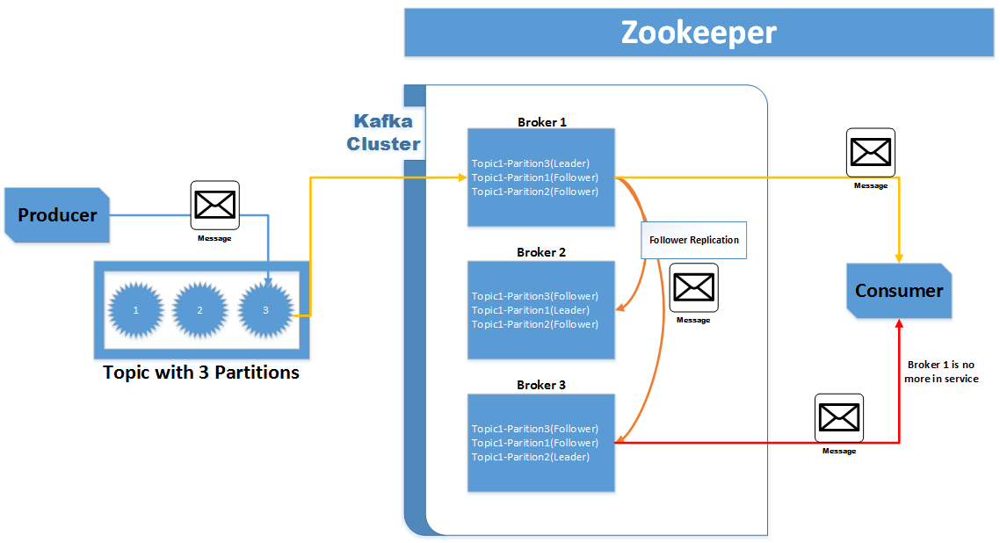

Lab 10. Kafka Cluster Deployment
---------------------------------------------

In the previous labs, we talked about the different use cases
associated with Apache Kafka. We shed light on different technologies
and frameworks associated with the Kafka messaging system. However,
putting Kafka to production use requires additional tasks and knowledge.
Firstly, you must have a very thorough understanding of how the Kafka
cluster works. Later on, you must determine the hardware required for
the Kafka cluster by performing adequate capacity planning. You need to
understand Kafka deployment patterns and how to perform day-to-day Kafka
administrating activities. In this lab, we will cover the following
topics:

-   Kafka cluster internals
-   Capacity planning
-   Single-cluster deployment
-   Multi-cluster deployment
-   Decommissioning brokers
-   Data migration

In a nutshell, this lab focuses on Kafka cluster deployment on
enterprise grade production systems. It covers deep topics of Kafka
clusters such as how to do capacity planning, how to manage single/multi
cluster deployments, and so on. It also covers how to manage Kafka in a
multitenant environment. It further walks through the different steps
involved in Kafka data migrations.

Kafka cluster internals 
---------------------------------------

Well, this topic has been covered in bits and pieces in the introductory
labs of this course. However, in this section, we are covering this
topic with respect to components or processes that play an important
role in Kafka cluster. We will not only talk about different Kafka
cluster components but will also cover how these components communicate
with each other via Kafka protocols.

### Role of Zookeeper

Kafka clusters cannot run without Zookeeper servers, which are tightly
coupled with Kafka cluster installations. Therefore, you should first
start this section by understanding the role of Zookeeper in Kafka
clusters.

If we must define the role of Zookeeper in a few words, we can say that
Zookeeper acts a Kafka cluster coordinator that manages cluster
membership of brokers, producers, and consumers participating in message
transfers via Kafka. It also helps in leader election for a Kafka topic.
It is like a centralized service that manages cluster memberships,
relevant configurations, and cluster registry services.

Zookeeper also keeps track of brokers that are alive and nodes that have
joined or left the cluster. It can be configured to work in quorum or
replicated mode, where the same data and configurations are replicated
across multiple nodes to support high availability and load balancing of
incoming requests. Standalone modes are good for development or testing
purposes. In a production environment where high availability and
performance matters, you should always deploy Zookeeper in the
replicated mode.

If you are looking for detailed documentation on Zookeeper, you can
always consider Apache docs for the same at
<https://zookeeper.apache.org/>, but we believe in the context of Kafka,
there are two important aspects you should learn. The first is how Kafka
cluster data is maintained on Zookeeper nodes, and the second is how
Zookeeper is used in the leader election process. Let\'s look at those
aspects in the following paragraphs.

Let\'s discuss how the Kafka topic leader election process works. Each
Kafka cluster has a designated broker, which has more responsibilities
than the other brokers. These additional responsibilities are related to
partition management. This broker is called [**controller**].
One of the prime responsibilities of the controller is to elect
partition leaders. Generally, it is the first broker that starts in the
cluster. After it starts, it creates an ephemeral znode
(`/controller`) in Zookeeper. In that `/controller`
location, it maintains metadata about brokers that are alive and about
topic partitions along with their data replication status.

To monitor broker live status controller, keep a watch on the ephemeral
znodes (`/brokers`) created by other brokers. In case the
broker leaves the cluster or dies down, the ephemeral znode created by
the broker is deleted. The controller is now aware that the partitions
for which that broker was the leader needs to have a new leader.

After collecting all the information about the partitions that need a
new leader, it finds out the next replica broker for those partitions
and sends them leader requests. The same information is passed to all
the followers so that they can start syncing data from the newly elected
leader. After receiving the leader requests, the new leader brokers know
that they must serve the producer and consumer requests for that topic
partition.

### Note

To summarize, the Zookeeper ephemeral znode feature is used by Kafka to
elect a controller and to notify the controller when other broker nodes
join and leave the cluster. This notification triggers the leader
election process by the controller.

Now that we are aware of the leader election process in Kafka, let\'s
consider the different znodes maintained by Kafka cluster. Kafka uses
Zookeeper for storing a variety of configurations and metadata in
key-value format in the ZK data tree and uses them across the cluster.
The following nodes are maintained by Kafka:

-   `/controller`: This is the Kafka znode for controller
    leader election
-   `/brokers`: This is the Kafka znode for broker metadata
-   `/kafka-acl`: This is the Kafka znode for
    `SimpleACLAuthorizer` ACL storage
-   `/admin`: This is the Kafka admin tool metadata
-   `/isr_change_notification`: This denotes the track changes
    to in sync replication
-   `/controller_epoch`: This denotes the track movement of
    the controller
-   `/consumers`: This is the Kafka consumer list
-   `/config`: This denotes the entity configuration

### Replication

One of the important aspects of Kafka is that it is highly available,
and this is guaranteed through data replication. Replication is the core
principle of Kafka design. Any type of client (producer or consumer)
interacting with Kafka cluster is aware of the replication mechanism
implemented by Kafka.

### Note

You should understand that in Kafka, replications are driven by topic
partitions. All these replicas are stored in different brokers
participating in Kafka cluster.

You should always see replications in terms of leaders and followers. To
further elaborate on this, you always set the replication factor of the
topic. Based on this replication number, the data in every partition of
the topic is copied over to that many different brokers. In the context
of fail over, if the replication factor is set to [*n*], then
Kafka cluster can accommodate [*n-1*] failures to ensure
guaranteed message delivery. 

The diagram following represents how replication works in Kafka:

Partition leaders receive messages from producer applications. Followers
send the fetch requests to the leaders to keep replicas in sync. You can
think of followers as another consumer application trying to read data
from the leaders of the partition.

Once all the replicas are in sync, the consumer can consume messages
from the partition leader. Controllers with the help of Zookeeper keep
track of the leader of the partition, and in case of leader failure,
they choose another leader. Once a new leader is chosen, consumers start
consuming from the new leader of the partition.

There are two types of replication supported by Kafka\--synchronous and
asynchronous:

-   [**Synchronous replication**]: In synchronous replication,
    a producer finds out a leader of topic partition from Zookeeper and
    publishes the message. Once the message is published, it is written
    to the leader's log. The followers of the leader then start reading
    the messages. The order of the messages is always ensured. Once a
    follower successfully writes the message to its own log, it sends an
    acknowledgement to the leader. When the leader knows that the
    replication is done and the acknowledgment is received, it sends the
    acknowledgment to the producer about successful publishing of the
    message.
-   [**Asynchronous replication**]:[** **]In
    asynchronous replication, the acknowledgement to the producer is
    sent immediately after the leader writes the message to its own log.
    The leader does not wait for any acknowledgement from its follower,
    and this practice does not ensure guaranteed message delivery in
    case of broker failure.

### Metadata request processing

Before we jump into producer or consumer request processing, we should
understand some of the common activities that any Kafka client or broker
would perform irrespective of whether it is a write request or fetch
request. One such request is to understand how metadata is requested or
fetched by Kafka clients.

Following are the steps involved in metadata requests for producing a
message:

1.  Based on the configuration files, the client prepares a list of
    topics they are interested in along with the first broker they would
    send the metadata request to.
2.  It sends the requests to the broker with an array of topics prepared
    from step 1. If the array of topics is null, the metadata for all
    the topics is fetched. Along with the list of topics, it also sends
    a Boolean flag `allow_auto_topic_creation` to the broker
    for creating topics that don't exist.
3.  If the response is received from the broker, then send the write
    request to the leader of the partition. If no valid response is
    received or the request times out, the other broker from the
    configuration list is picked for the metadata fetch request.
4.  Finally, the client would receive the acknowledgement from the
    broker for successful or unsuccessful message writes.

Both the broker and the client cache the metadata information and
refresh them at some specific time interval. In general, if the client
receives a [*Not a leader*] response from a broker, it
realizes that the cached metadata is old. It then requests fresh
metadata from the broker as an error indicates that the client metadata
has expired.

### Producer request processing

Client requests that are intended to write messages to Kafka queues are
called producer requests. Based on the information received from the
metadata request, the client issues a write request to the leader
broker. All the write requests contain a parameter called
[**ack**], which determines when brokers should respond with a
successful write to the client. Following are the possible values of the
ack configuration:

-   [**1**]: This means the message is accepted only by the
    leader
-   [**all**]: This means all in-sync replicas along with the
    leader have accepted the message
-   [**0**]: This means do not wait for acceptance from any of
    the brokers

On the other hand, the broker first checks whether all the relevant
information is in the request. It checks whether the user issuing the
request has all the relevant privileges or not and whether the ack
variable has relevant values (1, 0, or all).

For all acks, it checks whether there are enough in sync replicas for
writing the messages. If all relevant parameters and checks are in
place, the broker will write messages to the local disk. The broker uses
the OS page cache to write the messages and does not wait for it to be
written to the disk. Once the messages are written to the cache, the
relevant response is sent back to the client.

So, if the ack value is set to [*0*], the broker sends the
response back to the client as soon as it receives it. If it is set to
[*1*], the broker sends a response back to the client once it
has written the messages to the file cache. If the acks configuration is
set to all, the request will be stored in a [**purgatory
buffer**]. In this case, the response will be sent to the
client when the leader receives an acknowledgement from all the
followers.

### Consumer request processing

Same as the producer requests, consumer fetch requests start with
metadata requests. Once the consumer is aware of the leader information,
it forms a fetch request containing an offset from which it wants to
read the data. It also provides the minimum and maximum number of
messages it wants to read from the leader broker.

The consumer can pre-allocate memory for the response from the broker,
and therefore, we should specify the maximum limit of memory allocation.
If the minimum limit is not specified, there could be inefficient
utilization of resources when the broker sends a small portion of the
data for which very little memory is required. Instead of processing a
small amount of data, the consumer can wait for more data to come and
then run a batch job to process the data.

The brokers upon receiving the fetch requests, checks whether an offset
exists or not. If the offset exists, the broker will read messages till
the batch size reaches the limit set by the client and then eventually
send the response back to the client. It is important to note that all
the fetch requests are handled using the [**zero copy**]
approach. This kind of approach is very common in a Java-based system
for efficiently transferring data over the network. Using this approach,
the broker does not copy intermediate data to memory buffers, instead,
it is sent to network channels immediately. This saves a lot of CPU
cycles and, hence, increases performance.

In addition to the preceding information, it is important for you to
remember two other important aspects of consumer request processing. One
is about the minimum number of messages required by the fetch request.
The other is that consumers can only read messages that are written to
all followers of the leader of the partition.

### Note

In other words, consumers can only fetch those messages that all in-sync
replicas have received and registered to their local files\' system
cache.

Capacity planning 
---------------------------------

[**Capacity planning**] is mostly required when you want to
deploy Kafka in your production environment. Capacity planning helps you
achieve the desired performance from Kafka systems along with the
required hardware. In this section, we will talk about some of the
important aspects to consider while performing capacity planning of
Kafka cluster.

### Note

Note that there is no one definite way to perform Kafka capacity
planning. There are multiple factors that come into the picture, and
they vary depending upon your organizational use cases.

Our goal here is to give you a good starting point for Kafka cluster
capacity planning with some pointers that you should always keep in
mind. Let\'s consider these one by one.

### Capacity planning goals

This is the most important thing while performing capacity planning of
your Kafka cluster. You should be very clear with your capacity planning
goals. You should understand that without having clear goals in mind, it
is very difficult to perform appropriate capacity planning.

Generally, capacity planning goals are driven by [**latency**]
and [**throughput**]. Some of the additional goals could be
fault tolerance and high availability.

### Note

We suggest you derive quantifiable goals so that you can always come up
with logical mathematical conclusions to capacity planning numbers.
Moreover, your goals should also consider future data growth or increase
in the number of requests.

### Replication factor

Replication factor is one of the main factors in capacity planning. As a
rule of thumb, one single broker can only host only one partition
replica. If that had not been the case, one broker failure could have
caused Kafka to become unavailable.

Hence, the number of brokers must be greater than, or equal to, the
number of replicas. As you can clearly observe, the number of replicas
not only decides the number of failures Kafka can handle, but also helps
in deciding the minimum number of broker servers required for your Kafka
cluster.

### Memory

Kafka is highly dependent on the file system for storing and caching
messages. All the data is written to the page cache in the form of log
files, which are flushed to disk later. Generally, most of the modern
Linux OS use free memory for disk cache. Kafka ends up utilizing 25-30
GB of page cache for 32 GB memory.

Moreover, as Kafka utilizes heap memory very efficiently, 4-5 GB of heap
size is enough for it. While calculating memory, one aspect you need to
remember is that Kafka buffers messages for active producers and
consumers. The disk buffer cache lives in your RAM. This means that you
need sufficient RAM to store a certain time of messages in cache. While
calculating buffer requirements, there are two things you should keep in
mind: one is the amount of time you want to buffer messages (this can
vary from 30 seconds to 1 minute), the second is the read or write
throughput goal you have in mind.

Based on that, you can calculate your memory needs using this formula:

[*Throughput \* buffer time*]

Generally, a 64 GB machine is decent for a high performance Kafka
cluster. 32 GB would also meet those needs. However, you should avoid
using anything less than 32 GB as you may end up having smaller machines
to load balance your read and write requests.

### Hard drives

You should try to estimate the amount of hard drive space required per
broker along with the number of disk drives per broker. Multiple drives
help in achieving good throughput. You should also not share Kafka data
drives with Kafka logs, Zookeeper data, or other OS file system data.
This ensures good latency.

Let's first talk about how to determine disk space requirements per
broker. You should first estimate your average message size. You should
also estimate your average message throughput and for how many days you
would like to keep the messages in the Kafka cluster.

Based on these estimates, you can calculate the space per broker using
the following formula:

[*(Message Size \* Write Throughput \* Message Retention Period \*
Replication Factor) / Number of Brokers*]

SSDs provide significant performance improvements for Kafka. There are
two reasons for it, and they are explained as follows:

-   Write to disk from Kafka is asynchronous and no operations of Kafka
    wait for disk sync to complete. However, the disk sync happens in
    the background. If we use a single replica for topic partition, we
    may lose data completely because the disk may crash before it syncs
    data to disk.
-   Each message in Kafka is stored in a particular partition, which
    stores data sequentially in the write ahead log. We may say reads
    and writes in Kafka happen in a sequence. Sequential reads and
    writes are heavily optimized by SSD. 

You should avoid [**network attached storage**]
([**NAS**]). NAS is slower with a higher latency and bottleneck
as a single point of failure. RAID 10 is also recommended, but at times,
due to additional cost, people do not opt for it. In that case, you
should configure your Kafka server with multiple log directories, each
directory mounted on a separate drive.

### Network

Kafka is a distributed messaging system. The network plays a very
important role in a distributed environment. A bad network design may
affect the performance of the overall cluster. A fast and reliable
network ensures that nodes can communicate with each other easily. 

A cluster should not span multiple data centers, even if data centers
are close to each other. High latency will complicate the problem in any
distributed system and will make debugging and resolution look
difficult.

### CPU

Kafka does not have very high CPU requirement. Although more CPU cores
are recommended. Choose a next-generation processor with more cores.
Common clusters consist of 24 core machines. CPU cores help you add
extra concurrency, and more cores will always improve your performance. 

If you want to use SSL with Kafka, it may increase your CPU core
requirement as SSL occupies a few cores for its operation.

Single cluster deployment 
-----------------------------------------

This section will give you an overview of what Kafka cluster would look
like in a single data center. In a single cluster deployment, all your
clients would connect to one data center, and read/write would happen
from the same cluster. You would have multiple brokers and Zookeeper
servers deployed to serve the requests. All those brokers and Zookeepers
would be in the same data center within the same network subnet.

The following diagram represents what single cluster deployments would
look like:

In the preceding diagram, Kafka is deployed in [**Data Center
1**]. Just like any other single Kafka cluster deployment,
there are internal clients ([**Application 1**] and
[**Application 2**]), remote clients in different Data Centers
([**Application 3**] and [**Application 4**]), and
direct remote clients in the form of mobile applications.

As you can clearly see, this kind of setup has dependency on a single
data center. This can cause stoppage of your critical functionalities in
case of data center outage. Moreover, due to cross-region data travel,
sometimes the response time is also delayed. Sometimes, due to a very
high request load, single data center resources are not enough to ensure
latency and throughput SLAs. To avoid such problems, you can adopt
multicluster Kafka deployment. We will discuss that in the following
section.

Multicluster deployment 
---------------------------------------

Generally, multicluster deployment is used to mitigate some of the risks
associated with single cluster deployment. We have mentioned to you,
some of those risks in the preceding section. Multicluster deployment
can come in two flavors - distributive models and aggregate models.

The distributive model diagram is shown in the following figure. In this
model, based on the topics, messages are sent to different Kafka
clusters deployed in different data centers. Here, we have chosen to
deploy Kafka cluster on Data Center 1 and Data Center 3.

Applications deployed in [**Data Center 2**] can choose to send
data to any of the Kafka clusters deployed in [**Data Center
1**] and [**Data Center 3**]. They will use different
a data center-deployed Kafka cluster depending on the Kafka topic
associated with the messages. This kind of message routing can also be
done using some intermediate load balancer application as well. It's a
choice that you must make; whether you want to have routing logic
written in your producer or consumer application, or you want to build a
separate component to decide on the message routing-based on the Kafka
topic.

The aggregate model is another example of multicluster deployment. In
this model, data is synced between clusters in Data Center 1 and Data
Center 3 using a tool called [**Mirror Maker**]. Mirror maker
uses a Kafka consumer to consume messages from the source cluster and
republishes those messages to the local (target) cluster using an
embedded Kafka producer. A detailed document on it can be found at
<https://kafka.apache.org/documentation.html#basic_ops_mirror_maker>.
Clients can use any of the clusters for reading and writing to any of
the clusters. Aggregate models support more availability and scalability
as requests are load balanced equally between the two data centers.
Moreover, it has more tolerance for failure as in case of one data
center outage, the other data center can serve all requests.

Following is a representation of the aggregate model:

Decommissioning brokers 
---------------------------------------

Kafka is a distributed and replicated messaging system. Decommissioning
brokers can become a tedious task sometimes. In lieu of that, we thought
of introducing this section to keep you informed about some of the steps
you should perform for decommissioning the broker.

You can automate this using any scripting language. In general, you
should perform the following steps:

1.  Log in to the Zookeeper shell, and from there, collect the relevant
    broker information based on the broker IP or hostname.
2.  Next, based on the broker information collected from Zookeeper, you
    should gather information about which topics and partition data need
    to be reassigned to different brokers. You can use Kafka topic
    shell-based utilities to gather such information. Basically, topic
    partitions that require reassignment are identified with leader and
    replicas values that are equal to the broker ID of the node that is
    to be decommissioned.
3.  You then should prepare a reassignment partition JSON file, which
    will contain information about topic partitions and newly assigned
    broker IDs. Remember these broker IDs should be different from the
    one that is decommissioned. Details of JSON can be found at
    <https://cwiki.apache.org/confluence/display/KAFKA/Replication+tools#Replicationtools-6.ReassignPartitionsTool>.
4.  Then you should run the `kafka-reassign-partitions.sh`
    shell utility to reassign the partitions. Details of the utility can
    be found at
    [https://cwiki.apache.org/confluence/display/KAFKA/Replication+tools\#Replicationtools-6.ReassignPartitionsTool.](https://cwiki.apache.org/confluence/display/KAFKA/Replication+tools#Replicationtools-6.ReassignPartitionsTool){.ulink}
5.  Finally, check whether partitions are reassigned to different
    brokers using Kafka topic shell utilities. You can use the same
    reassignment utility to verify the re-assignment as well. Run test
    produce and consume request for those topic partitions as well.
    Sometimes, re-assignment does take some time, so it is always
    advisable to run the re-assignment script in the background and keep
    on checking its state periodically.

Data migration 
------------------------------

Data migration in Kafka cluster can be viewed in different aspects. You
may want to migrate data to newly-added disk drives in the same cluster
and then decommission old disks. You may want to move data to a secure
cluster or to newly-added brokers and then decommission old brokers. You
may want to move data to a different new cluster altogether or to the
Cloud. Sometimes, you also end up migrating Zookeeper servers. In this
section, we will, in general, discuss one of the scenarios mentioned
earlier.

Let\'s consider the scenario where we want to add new hard drives/disks
and decommission old ones on broker servers. Kafka data directories
contain topic and partition data. You can always configure more than one
data directory, and Kafka will balance the partition or topic data
across these directory locations.

### Note

One important thing to note here is that Kafka does not have a feature
to balance partition data across multiple directories. It does not
automatically move existing data to new data directories. If this needs
to be achieved, it must be done manually.

However, in scenarios where you must decommission old disks, there are
multiple approaches that can be taken. One such approach is to just
delete the old directories\' content after taking relevant backups and
then configure the new directory location. After the broker restarts,
Kafka would replicate all partition or topic data to the new
directories. This approach is sometimes time consuming if the data that
needs to be replicated is huge. Moreover, while the data is migrated,
this broker would not be serving any requests. This will bring load on
other brokers. Network utilization is also high during the migration
period.

Data migration is a huge topic. We cannot cover all aspects of it in
this course. However, we want to touch base with it to give you a sense of
how data migration can be done in Kafka. In any data migration, we
believe there are two important things that you should always do: the
first is to ensure you have all the relevant backups done along with
recovery plans in case of migration failure, the second is to avoid a
lot of manual work and let Kafka's replication framework do the bulk of
work. This will be much safer and would avoid errors.

Summary 
-----------------------

In this lab, we dove deep into Kafka cluster. You learned how
replication works in Kafka. This lab walked you through how the
Zookeeper maintains its znodes and how Kafka uses Zookeeper servers to
ensure high availability. In this lab, we wanted you to understand
how different processes work in Kafka and how they are coordinated with
different Kafka components. Sections such as [*Metadata request
processing*], [*Producer request processing*], and
[*Consumer request processing*], were written keeping that
goal in mind.

You also learned about the different types of Kafka deployment models
along with the different aspects of Capacity Planning Kafka cluster.
Capacity Planning is important from the perspective of deploying Kafka
cluster in the production environment. This lab also touched base
with complex Kafka administration operations such as broker
decommissioning and data migration. Overall, this lab helped you
improve your skills regarding the internal working of Kafka cluster,
cluster deployment model, planning and managing production grade Kafka
cluster.
