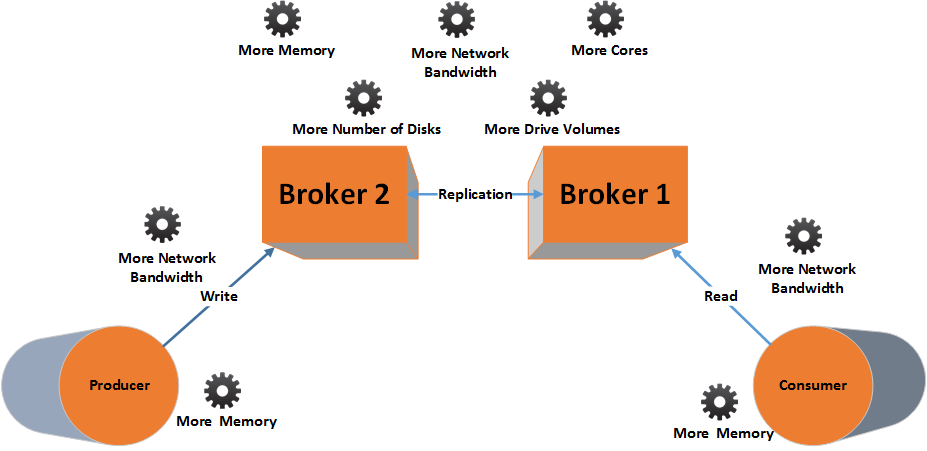
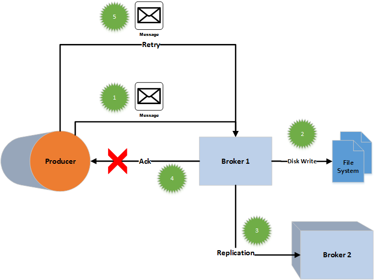
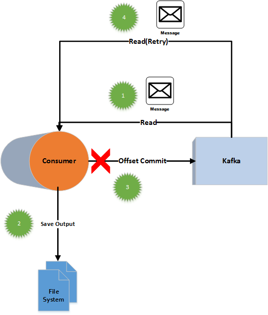
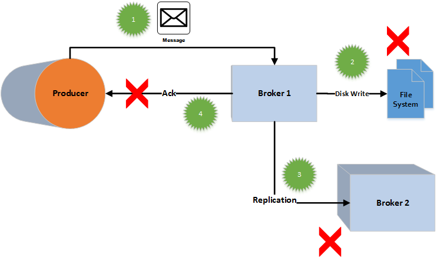
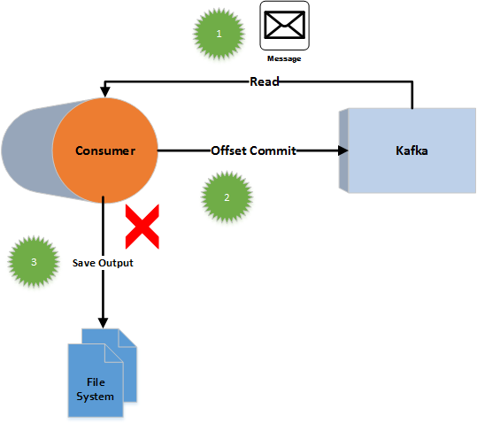
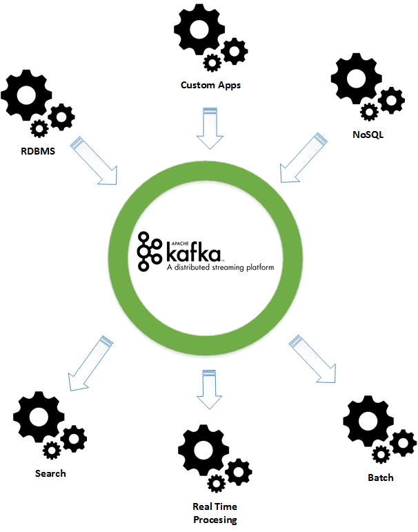
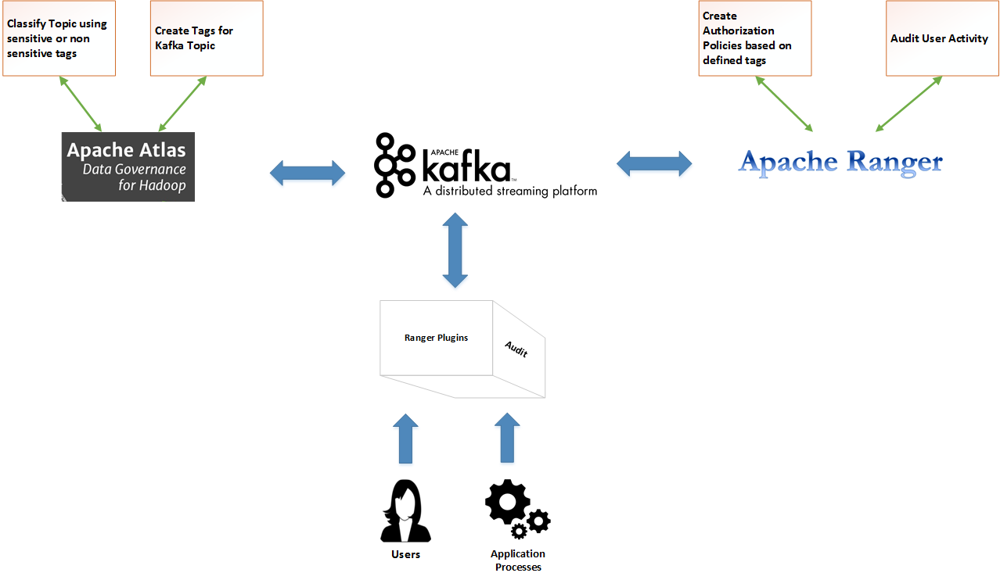
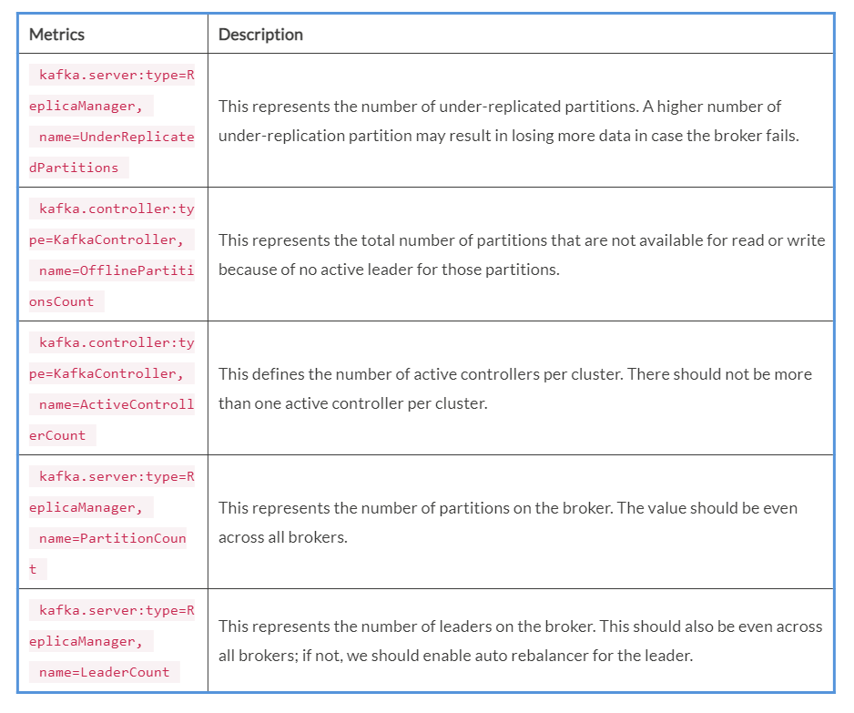

Lab 11. Using Kafka in Big Data Applications
---------------------------------------------------------

In the earlier labs, we covered how Kafka works, what kind of
different components Kafka has, and what some of the Kafka tools that we
can utilize for some specific use cases are. In this lab, our focus
is on understanding the importance of Kafka in big data applications.
Our intention is for you to understand how Kafka can be used in any big
data use cases and what are different types of design aspects you should
keep in mind while using Kafka in this manner.

Kafka is becoming the standard tool for messaging in big data
applications. There are some specific reasons for it. One of the reasons
for it is that we can not use databases as the one-stop destination for
all. Earlier, due to lack of elegant storage systems, databases tend to
be the only solution for any type of data store. If you use a database,
over a period of time, the system will become highly complex to handle
and expensive. Databases expects all data to be present in certain data
formats. To fit all types of data in the expected data formats tends to
make things more complex.

Gone are the days when you would need databases to store every type of
data. The last decade has seen changes in that paradigm, and specialized
systems have been built to cater to different types of use cases.
Moreover, we have improved the process of collecting data from different
systems or devices. Each of those systems has different data formats and
data types. The same data is also utilized to feed in different data
pipelines such as real-time alerting, batch reports, and so on.

Kafka is `apt` for situations like these because of the
following reasons:

-   It has the support to store data of any types and formats
-   It uses commodity hardware for storing high volumes of data
-   It is a high-performance and scalable system
-   It stores data on disk and can be used to serve different data
    pipelines; it can be used in real-time event processing and batch
    processing
-   Due to data and system redundancy, it is highly reliable, which is
    an important requirement in enterprise grade production-deployed big
    data application

The following topics will be covered in the lab:

-   Managing high volumes in Kafka
-   Kafka message delivery semantics
-   Failure handling and retry-ability
-   Big data and Kafka common usage patterns
-   Kafka and data governance
-   Alerting and monitoring
-   Useful Kafka matrices

Managing high volumes in Kafka 
----------------------------------------------

You must be wondering why we need to talk about high volumes in this
lab, considering how aspects such as high volumes, performance, and
scalability are in the genes of Kafka architecture. Well, you are
thinking in the right direction, but certain parameters need to be tuned
to manage Kafka latency and throughput requirements.

Moreover, you have to choose the right set of hardware and perform
appropriate capacity planning. Therefore, we thought that it is better
to discuss it. In a nutshell, when we talk about high volumes in Kafka,
you have to think of following aspects:

-   High volume of writes or high message writing throughput
-   High volumes of reads or high message reading throughput
-   High volume of replication rate
-   High disk flush or I/O

Let\'s look at some of the components that you should consider for high
volumes in Kafka. 

### Appropriate hardware choices 

Kafka is a commodity hardware run tool. In cases where volumes are very
high, you should first have a clear understanding of which Kafka
components are affected and which one of them would need more hardware.

The following diagram will help you understand some of the hardware
aspects in case of high volumes:

High volume impact on Kafka hardwares 

In the case of a high volume of writes, producers should have more
capacity to buffer records. That means it should have more memory
available to it.

Since batching is always suggested for a high volume of writes, you
would require more network bandwidth for a connection between the
producer component and the broker. One batch would have more number of
messages and, hence, more bandwidth. Similar is the case with high
volume reads where you would need more memory for consumer application.
Just like producer application, you would need more network bandwidth
for a connection between the consumer component and the broker.

For brokers, you need to give more thought to the hardware as with high
volumes, brokers do majority of the work. Brokers are multi-threaded
applications. They run parallel threads for both receiving requests and
reading/writing data. High volumes in Kafka result in more read/write
requests and more disk I/O threads. Therefore, broker servers need more
cores to support high number of threads. The case with replication
threads is similar.

### Note

The higher the number of the replication factor, the higher the number
of threads spawned by brokers to copy data. Accordingly, more cores
would be required. Since Kafka stores everything on disks, to support
high volumes, you would need more drive volumes or hard drive space.

Lastly, to manage high throughput and low latency, the number of disk
drives play an important role. As you increase number of disk drives for
Kafka, more parallel threads can efficiently perform I/O on disks. 

### Producer read and consumer write choices

We talked about choices of hardware one should make in case of high
volumes. In this section, we will talk about some of the important
techniques to manage high throughput and low latency in case of reading
and writing high volume data in Kafka.

We are listing some of the techniques that you can use while writing or
reading data:

-   [**Message compression:**] The producer generates the
    compression type of all the data. The value for the compression type
    property are none, GZIP, Snappy, or lZ4. More batching leads to
    better compression ratio because compression happens on the entire
    batch. You may need to compromise with more CPU cycles to complete
    the compression process, but it will definitely save the network
    bandwidth later.

The reason is simple\--compression reduces the data size, and exchanging
less data over the network saves time. If you wish to disable the
compression, make `compression.type=none`. Sometimes, good
compression codec also helps in achieving low latency.

-   [**Message batches:**] This property is specific to
    producers in the asynchronous mode. A small-sized batch may reduce
    throughput, and setting batch size to zero will disable the batch
    size. Setting a large batch size is also not recommended, as it will
    force us to allocate more memory to the producer side, which
    sometime results in wastage of memory. The messages going to the
    same partition are batched together, and then they are sent to Kafka
    brokers in a single request for persisting it to topic partitions.

### Note

Remember that a large-sized batch results in fewer requests to Kafka
brokers, which results in less producer overhead and less brokers CPU
overhead to process each request. You can set the `batch.size`
property along with the `linger.ms` property, which allows
producer to send a batch in case it is taking longer to fill batch.

-   [**Asynchronous send**]: If you set
    the `producer.type` flag to
    `async`, the producer will internally use
    `AsyncProducer`. It offers the capability to do sends on a
    separate thread that isolates the network I/O from the thread doing
    computation and allows multiple messages to be sent in a single
    batch. Both isolation and batching are desirable for good
    performance on the producer side.
-   [**Linger time**]: The producer sends buffer once it is
    available and does not wait for any other trigger. Linger time
    allows us to set the maximum time in which data can be buffered
    before the producer sends it for storage. Sending messages in
    batches will always reduce the number of requests, but we cannot
    wait for the batch reach the configured size as it may cost us in
    throughput and latency. The `linger.ms` property allows us
    to configure the maximum time our producer should wait before
    sending the batch of data. 
-   [**[**Fetch size:**]**] The
    `fetch.message.max.bytes`[*c*]onsumer
    application property sets the maximum message size a consumer can
    read. It must be at least as large as `message.max.bytes`.
    This should be appropriately set to manage high volumes. The number
    of partitions defines the maximum number of consumers from the same
    consumer group who can read messages from it. The partitions are
    split between consumers in the same consumer group, but if the
    consumer count in the same consumer group is greater than the number
    of partitions, a few consumers will be idle. However, this does not
    affect the performance.

You can mark the last read message offset, and this allows you to locate
the missing data in case the consumer fails, but enabling this
checkpoint for every message will impact the performance. However, if
you enable checkpoint for every 100 messages, the impact on throughput
will be reduced with a good margin of safety. 

Kafka message delivery semantics 
------------------------------------------------

Semantic guarantees in Kafka need to be understood from the perspective
of producers and consumers.

### Note

At a very high level, message flows in Kafka comprise the producer
writing messages that are read by consumers to deliver it to the message
processing component. In other words, producer message delivery
semantics impact the way messages are received by the consumer.

For example, suppose the producer component does not receive successful
`acks` from brokers because of network connectivity. In that
case, the producer re-sends those messages even if the broker has
received them. This results in duplicate messages sent to the consumer
application. Therefore, it is important to understand that the way
messages are delivered by the producer effects the manner in which the
consumer would receive the messages. This would ultimately have impact
on applications processing those consumer received messages.

In general, there are three types of message delivery semantics. They
are as follows:

-   [**At most once**]: In this case, messages are only read or
    written once. The messages are not redelivered or sent again even if
    they are lost in between due to component unavailability or loss of
    network connectivity. This semantic can result in message loss.
-   [**At least once**]: In this case, messages are read or
    written at least once, and they are never lost. There is a
    possibility to duplicate messages, because the same message might be
    delivered again.
-   [**Exactly Once**]: This is the most favorable delivery
    semantics as it ensures messages are delivered once and only once.
    This ensures no message loss and no duplication.

Now that we are clear about message delivery semantics, let\'s see how
those works in the producer and consumer context.

### At least once delivery 

In the producer context, at least once delivery can happen if
`acks` are lost in network translation. Suppose the producer
has configuration of `acks=all`. This means the producers will
wait for success or failure acknowledgement from the brokers after
messages are written and replicated to relevant brokers.

In case of timeout or some other kind of error, the producer re-sends
those messages assuming that they are not written to topic partitions.
But what if the failure happens right after the messages are written to
Kafka topic but `ack` can not be sent? In that case, the
producer will retry sending that message, resulting in messages being
written more than once.

In this kind of scenario, generally, message de-duplication techniques
are applied on data processing components after consumers have read the
messages.

The following diagram, and the step numbers therein, depicts how at
least once delivery semantics works in the producer context:

At least once delivery semantics of producers

In the consumer context, at least once processing corresponds to the
fact that the consumer has received the messages and has saved it for
further processing. However, the consumer process fails before
committing its offset.

Once we restart the consumer processes or some other consumer processes
started reading messages from same partition, then it will read the same
message as its offset is not committed, although the message has already
been saved once for further processing. This is called at least once
semantics in case of consumer component failure.

The following diagram depicts how at least once delivery semantics works
in the consumer context. Follow the step numbers to understand it in
sequence:

At least once delivery semantics of consumers

Consumers first read the records from Kafka topics and save them to the
file systems for processing applications as depicted in step 2. File
systems are just taken as an example here. A consumer can directly send
data to data processing applications or store it in databases. Step 3 is
about committing the offset. In the case that offset commits failed,
consumers will retry reading those messages again (after restart or some
new consumer processes in the consumer group). It will then eventually
save the duplicate message as earlier offset commit has failed.

### At most once delivery 

In the producer context, at most delivery can happen if the broker has
failed before receiving messages or `acks` are not received
and the producer does not try sending the message again. In that case,
messages are not written to Kafka topic and, hence, are not delivered to
the consumer processes. This will result in message loss.

The following diagram depicts how at most once delivery semantics works
in the producer context. Follow the step numbers to understand it in
sequence:

At Most Once Delivery Semantics of Producers

The producers in step 1 attempt to write topic messages to Broker 1.
Broker 1 fails immediately after receiving the messages. In case of at
most once delivery semantics, Broker 1 after failure, would not be able
to save the records on the local file system, or able to replicate it to
Broker 2. It will not even send any Ack to the the producer application.
Since producer application is not configured to wait for
acknowledgement, it will not resend the messages. This will result in
message loss.

The following diagram depicts how at most once delivery semantics works
in the consumer context. Follow the step numbers to understand it in
sequence:

At Most Once Delivery Semantics of Consumers

In the consumer context, as shown in previous figure, at most processing
corresponds to the fact that the consumer has read the messages (step 1)
and committed message offset (step 2). However, it crashes after
committing message offset and before saving the message to output files
(step 3) for further message processing. In case the consumer restarts,
it will start reading from the next offset as the previous offset has
been committed. This will result in message loss.

### Exactly once delivery 

Exactly once delivery needs to be understood in the complete messaging
system and not only in the producer or consumer context.

### Note

[**Exactly once delivery**] refers to the semantics that
ensures that the broker or consumer receives only one message,
irrespective of how many times the producer sends the message. In case
of failure, the partially completed steps should either be reverted or
the system should store or process messages in a way that duplicates are
ignored.

To ensure exactly once delivery, Kafka has provisions for idempotent
producers. These kinds of producers ensure that one, and only one,
message is written to a Kafka log. This will be irrespective of how many
retries happen from producer side.

Idempotent producers generate a unique key identifier for each batch of
messages. This unique identifier remains unchanged in case of message
retries. When the message batches are stored by the broker in Kafka
logs, they also have a unique number. So, the next time the brokers
receive a message batch with an already received unique identifier, they
do not write those messages again. 

The other option that is provided with new versions of Kafka is support
for transactions. New versions of Kafka have support for transactions
APIs, which ensure automatic message writes to multiple partitions at a
time. Producers can send a batch of messages to write to multiple
partitions using transaction APIs. Ultimately, either all messages of a
batch will be available for consumers to read or none of them will be
visible to consumers. With both the producer features, one can ensure
exactly once delivery semantics with producer applications. 

On the consumer side, you have two options for reading transactional
messages, expressed through the `isolation.level` consumer
config:

-   `read_committed`: In addition to reading messages that are
    not part of a transaction, this allows reading the ones that are,
    after the transaction is committed.
-   `read_uncommitted`: This allows reading all messages in
    the offset order without waiting for transactions to be committed.
    This option is similar to the current semantics of a Kafka consumer.

To use transactions, you need to configure the consumer to use the right
`isolation.level`, use the new producer APIs, and set a
producer config `transactional.id` to some unique ID. This
unique ID is needed to provide continuity of the transactional state
across application restarts.

Big data and Kafka common usage patterns 
--------------------------------------------------------

In the big data world, Kafka can be used in multiple ways. One of the
common usage patterns of Kafka is to use it as a streaming data
platform. It supports storing streaming data from varied sources, and
that data can later be processed in real time or in batch.

The following diagram shows a typical pattern for using Kafka as a
streaming data platform:

Kafka as streaming data platform

The previous diagram depicts how Kafka can be used for storing events
from a variety of data sources. Of course, the data ingestion mechanism
would differ depending upon the type of data sources. However, once data
is stored in Kafka topics, it can be used in data search engines,
real-time processing, or alerting and even for batch processing.

### Note

Batch processing engines, such as Gobblin, read data from Kafka and use
Hadoop MapReduce to store data in Hadoop. Real-time processing engines
such as Storm can read data, micro batch processing engines, such as
Spark can read data from Kafka topics and use their distributed engines
to process records. Similarly, components such as Kafka Connect can be
used to index Kafka data into search engines such as Elasticsearch. 

Nowadays, Kafka is used in micro-services or IOT-based architecture.
These kinds of architecture are driven by request responses and
event-based approaches with Kafka as a central piece of it. Services or
IOT devices raise events that are received by Kafka brokers. The
messages can then be used for further processing.

Overall, Kafka, due to its high scalability and performance-driven
design, is used as an event store for many different types of
applications, including big data applications.

Kafka and data governance 
-----------------------------------------

In any enterprise grade Kafka deployment, you need to build a solid
governance framework to ensure security of confidential data along with
who is dealing with data and what kind of operations are performed on
data. Moreover, governance framework ensures who can access what data
and who can perform operations on data elements. There are tools
available such as Apache Atlas and Apache Ranger, which will help you
define a proper governance framework around Kafka.

The fundamental data element in Kafka is [**Topic**]. You
should define all your governance processes around Topic data element.

The following diagram represents how data governance can be applied in
Kafka using Apache Atlas and Ranger:

Atlas Data Governance in Kafka

To give an overview of the diagram, we can sum up all the steps as
follows:

1.  Create tags in Apache Atlas. Each tag corresponds to a Topic data
    element in Kafka. You can utilize the topic tags to classify data
    into sensitive or non-sensitive.
2.  Using Atlas and Ranger integration, sync the tags created in Atlas
    into Ranger.
3.  After the sync is complete, use those tags to define authorization
    policies for users or application processes that will be accessing
    Kafka topics.
4.  Ranger can be used for audit purposes as well.

The preceding steps are just directional in nature to give you a brief
overview of how we can apply data governance to Kafka topics. If you
want to explore more and go in to more detail, you can look into
Hortonworks and Apache documents about Apache Atlas and Apache Ranger.

Alerting and monitoring 
---------------------------------------

If you have properly configured the Kafka cluster and it is functioning
well, it can handle a significant amount of data. If you have Kafka as a
centralized messaging system in your data pipeline and many applications
are dependent on it, any cluster disaster or bottleneck in the Kafka
cluster may affect the performance of all application dependent on
Kafka. Hence, it is important to have a proper alerting and monitor
system in place that gives us important information about the health of
the Kafka cluster.

Let\'s discuss some advantages of monitoring and alerting:

-   [**Avoid data loss**]: Sometimes it may happen that topic
    partitions are under replicated, meaning they have fewer number of
    replicas available in the cluster. If there are more such
    partitions, the risk of losing data for partition increases. A
    proper triggering system may help us avoid such problems so that we
    can take necessary action before any partition becomes completely
    unavailable.
-   [**Producer performance**]: The alerting and monitoring
    system will also help us improve the producer performance by
    observing its metrics. We may find that the producer is producing
    more data than it can send, or we may find that the producer memory
    is insufficient for buffering partition data. Getting alerts for
    such scenario will help us tune the producer application.
-   [**Consumer performance**]: We may also observe that the
    consumer is not able to process data as fast as the producer
    is producing it, or that the consumer is not able to consume data
    due to some network bandwidth issue. If we monitor consumer metrics
    for such scenarios, we may find scope for improvement of the
    consumer application.
-   [**Data availability**]: Sometimes, the leaders for
    partitions are not assigned, or it takes time for the assignment to
    happen. In such cases, these partitions will not be available for
    any read and write operation. If we find such information
    beforehand, we may avoid application trying and retrying read and
    write to partition whose leader is not available. 

There are a lot more benefits of having an alerting and monitoring
system in place for Kafka; covering all those is out of the scope of
this course. 

Useful Kafka matrices 
-------------------------------------

For useful monitoring and performance measures, we need to have certain
matrices, and we will talk about those matrices in this section.

We will look into the matrices of Kafka cluster component in detail. The
matrices are as follows:

-   Kafka producer matrices
-   Kafka broker matrices
-   Kafka consumer matrices

### Producer matrices 

Producers are responsible for producing data to Kafka topics. If the
producer fails, the consumer will not have any new messages to consume
and it will be left idle. The performance of the producer also plays an
important role in achieving high throughput and latency. Let\'s look
into a few important matrices of Kafka producer:

-   [**Response rate**]: The producer sends
    records to the Kafka broker, and the broker acknowledges when a
    message is written to a replica in case of a request. Required
    `.acks` is set to -1. The response rate depends on the
    value assigned to this property. If set to, -0, the broker will
    immediately return a response when it receives a request from the
    producer before it writes data to disk. If set to 1, the producer
    first writes data to its disk and then returns a response.
    Obviously, less fewer write operations will lead to high
    performance, but there will be chances of losing data in such
    cases. 
-   [**Request rate**]: The request rate is the
    number of records the producer produces within a given time. 
-   [**I/O wait time**]: The producer sends data and then waits
    for data. It may wait for network resources when the producing rate
    is more than the sending rate. The reason for a low producing rate
    could be slow disk access, and checking the I/O wait time can help
    us identify the performance of reading the data. More waiting time
    means producers are not receiving data quickly. In such cases, we
    may want to use fast access storage such as SSD.
-   [**Failed send rate**]: This gives the number of message
    requests failed per second. If more messages are failing, it
    triggers an alarm to find out the root cause of the problem and then
    fix it.
-   [**Buffer total bytes**]: This represents the maximum
    memory the producer can use to buffer data before it sends it to
    brokers. The maximum buffer size will result in high throughput. 
-   [**Compression rate**]: This represents the
    average compression rate for batch records for topic. A higher
    compression rate triggers us to change the compression type or look
    for some way to reduce it.

### Broker matrices

Brokers are responsible for serving producer and consumer requests. They
also contain important matrices that can help you avoid some critical
issues. There are a lot of metrics available, but we will only look into
a few important ones.

For more metrics, you may visit
[https://kafka.apache.org/documentation/\#monitoring.](https://kafka.apache.org/documentation/#monitoring){.ulink}

### Consumer metrics

Consumers are responsible for consuming data from topic and doing some
processing on it, if needed. Sometimes, your consumer may be slow, or it
may behave unacceptably. The following are some important metrics that
will help you identify some parameters that indicate optimization on the
consumer side:

-   `records-lag-max`: The calculated difference between the
    producer\'s current offset and the consumer\'s current offset is
    known as record lag. If the difference is very big, it\'s fairly
    indicative of the consumer processing data much slower than the
    producer. It sends alerts for suitable action to fix up this issue,
    either by adding more consumer instance or by increasing partitions
    and increasing consumers simultaneously.
-   `bytes-consumed-rate`: This represents the
    number of bytes consumed per second by the consumer. It helps in
    identifying the network bandwidth of your consumer.
-   `records-consumed-rate`: This defines the number of
    messages consumed per second. This value should be constant and
    generally helps when compared with `byte-consumed-rate`.
-   `fetch-rate`: This represents the number of records
    fetched per second by the consumer.
-   `fetch-latency-max`: This represents the maximum time
    taken for the fetch request. If it\'s high, it triggers to optimize
    the consumer application. 

There are more parameters available in Kafka documentation. We recommend
you go through them.

Summary 
-----------------------

We walked you through some of the aspects of using Kafka in big data
applications. By the end of this lab, you should have clear
understanding of how to use Kafka in big data Applications. Volume is
one of the important aspects of any big data application. Therefore, we
have a dedicated section for it in this lab, because you are
required to pay attention to granular details while managing high
volumes in Kafka. Delivery semantics is another aspect you should keep
in mind. Based on your choice of delivery semantics, your processing
logic would differ. Additionally, we covered some of the best ways of
handling failures without any data loss and some of the governance
principles that can be applied while using Kafka in big data pipeline.
We gave you an understanding of how to monitor Kafka and what some of
the useful Kafka matrices are. You learned a good detail of advanced use
of Kafka consumers for high volumes, important aspects of message
delivery semantics, data governance in Kafka, and Kafka monitoring and
alerting.

In the next lab, we will be covering Kafka security in detail.

