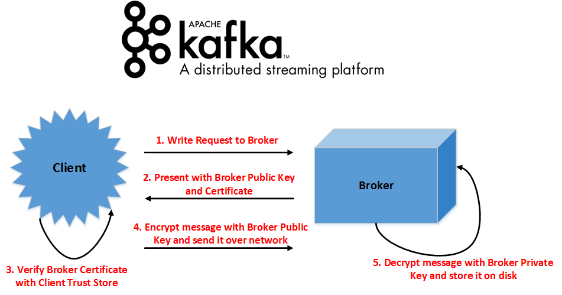

Lab 12. Securing Kafka
-----------------------------------


In all the earlier labs, you learned how to use Kafka. In this
lab, our focus is more towards securing Kafka. Securing Kafka is one
of the important aspect in enterprise adoption of Kafka. Organizations
have lot of sensitive information that needs to be stored in secure
environment to ensure security compliance. In this lab, we focus on
ways of securing sensitive information in Kafka. We will focus on the
different security aspects of Apache Kafka and will cover the following
topics:


-   An overview of securing Kafka
-   Wire encryption using SSL
-   Kerberos SASL for authentication
-   Understanding ACL and authorization
-   Understanding Zookeeper authentication
-   Apache Ranger for authorization
-   Best practices for Kafka security 


An overview of securing Kafka 
---------------------------------------------


Kafka is used as a centralized event data store, receiving data from
various sources, such as micro services and databases.

In any enterprise deployment of Kafka, security should be looked at from
five paradigms. They are as follows:


-   [**Authentication**]: This
    establishes[*who*] the client(producer or consumer) is
    that trying to use Kafka services. Kafka has support for the
    Kerberos authentication mechanism. 
-   [**Authorization**]: This establishes [*what kind of
    permission*] the client (producer or consumer) has on
    topics. Kafka has support for ACLs for authorization. Apache tools,
    such as Ranger, can also be used for Kafka authorization.
-   [**Wire encryption**]: This ensures that any sensitive data
    traveling over the network is encrypted and not in plain text. Kafka
    has support for SSL communication between the client (producer or
    consumer) and the broker. Even inter-broker communication can be
    encrypted.
-   [**Encryption at rest**]:[** **]This ensures that
    any sensitive data that is stored on the disk is encrypted. Kafka
    does not have any direct support for encrypting data on the disk.
    However, you can utilize OS level disk encryption techniques for the
    same. There are lot of third party paid services for the same.
-   [**Auditing**]: This is to ensure that every user activity
    is logged and analyzed for security compliance. Kafka logs form a
    very useful tool for auditing. Apart from that, Apache Ranger also
    provides auditing capabilities.


The following diagram summarizes the different Kafka security paradigms:


Wire encryption using SSL 
-----------------------------------------


In Kafka, you can enable support for [**Secure Sockets Layer**]
([**SSL**]) wire encryption. Any data communication over the
network in Kafka can be SSL-wire encrypted. Therefore, you can encrypt
any communication between Kafka brokers (replication) or between client
and broker (read or write).

The following diagram represents how SSL encryption works in Kafka:




The preceding diagram depicts how communication between broker and
client is encrypted. This is valid for both producer and consumer
communications. Every broker or client maintains their keys and
certificates. They also maintain [**truststores**] containing
certificates for authentication. Whenever certificates are presented for
authentication, they are verified against certificates stored in
truststores of respective components.


### Steps to enable SSL in Kafka


Let\'s now look into the steps to enable SSL in Kafka. Before you begin,
you should generate the key, SSL certificate, keystore, and truststore
that will be used by Kafka clients and brokers. You can follow the link
<https://kafka.apache.org/documentation/#security_ssl_key>  to create
broker keys and certificate, the
link <https://kafka.apache.org/documentation/#security_ssl_ca> to create
your own certificate authority, and the
link [https://kafka.apache.org/documentation/\#security\_ssl\_signing](https://kafka.apache.org/documentation/#security_ssl_signing%C2%A0){.ulink} to
sign the certificates. You should perform the same activity for clients
(producer and consumer applications) as well. Once you are done creating
certificates, you can enable Kafka SSL using the following steps.


#### Configuring SSL for Kafka Broker


The following changes are required in each broker server:


1.  To enable `SSL` for communications between brokers, make
    the following changes in the broker properties:


```
security.inter.broker.protocol = SSL
```


2.  To configure communication protocols and set `SSL` ports,
    make the following changes in server properties:


```
listeners=SSL://host.name1:port,SSL://host.name2:port
```


### Note

If you have not set SSL for inter-broker communication, you will need to
set listeners properties such as
this: `listeners=PLAINTEXT://host.name:port,SSL://host.name:port`


3.  To give `SSL` keystore and truststores path for each
    broker, you should make the following changes in the server
    properties of each broker:


```
ssl.keystore.location = /path/to/kafka.broker.server.keystore.jks
ssl.keystore.password = keystore_password
ssl.key.password = key_password
ssl.truststore.location = /path/to/kafka.broker.server.truststore.jks
ssl.truststore.password = truststore_password
```


### Note

Some other additional properties like security.inter.broker.protocol can
also be used. Use the
link [https://kafka.apache.org/documentation/\#security\_configbroker ](https://kafka.apache.org/documentation/#security_configbroker){.ulink}for
additional properties.


#### Configuring SSL for Kafka clients


The configuration properties for Kafka producer and consumer are the
same. The following are the configuration properties you need to set for
enabling SSL. If client authentication is not required
(`ssl.client.auth = none`), you need to set the following
properties:

```
security.protocol = SSL
ssl.truststore.location = /path/to/kafka.client.truststore.jks
ssl.truststore.password = trustore_password
```


### Note

Technically, you can use truststore without a password, but we strongly
recommend using a truststore password, as it helps in integrity checks. 


If client authentication is required
(`ssl.client.auth = required`), you need to set the following
properties:

```
security.protocol = SSL
ssl.truststore.location = /path/to/kafka.client.truststore.jks
ssl.truststore.password = trustore_password
ssl.keystore.location = /path/to/kafka.client.keystore.jks
ssl.keystore.password = keystore_password
ssl.key.password = key_password
```


Kerberos SASL for authentication 
------------------------------------------------


Kerberos is an authentication mechanism of clients or servers over
secured network. It provides authentication without transferring the
password over the network. It works by using time-sensitive tickets that
are generated using symmetric key cryptography.

It was chosen over the most-widely-used SSL-based authentication.
Kerberos has the following advantages:


-   [**Better performance**]: Kerberos uses symmetric key
    operations. This helps in faster authentication, which is different
    from SSL key-based authentication.
-   [**Easy integration with Enterprise Identity
    Server**]: Kerberos is one of the established
    authentication mechanisms. Identity servers such as Active Directory
    have support for Kerberos. In this way, services such as Kafka can
    be easily integrated with centralized authentication servers.
-   [**Simpler user management**]: Creating, deleting, and
    updating users in Kerberos is very simple. For example, removing a
    user can be done by simply deleting the user from the centrally
    managed Kerberos servers. For SSL authentication, certificates have
    to be removed from all server truststores.
-   [**No passwords over the network**]: Kerberos is a secured
    network authentication protocol that provides strong authentication
    for client/server applications without transferring the password
    over the network. Kerberos works by using time-sensitive tickets
    that are generated using the symmetric key cryptography.
-   [**Scalable**]: It is KDC that maintains the passwords or
    secret keys. This makes the system scalable for authenticating a
    large number of entities as the entities only need to know their own
    secret keys and set the appropriate key in KDC.


Let\'s also understand how Kerberos authentication flows work in Kafka.
They need to be looked at from different perspectives. There is a need
to understand how services and clients are authenticated and how
communication happens between authenticated clients and authenticated
services. We also need to understand in detail how symmetric key
cryptography works in Kerberos authentication and how passwords are not
communicated over the network. 

Services authenticate themselves with Kerberos during startup. During
startup, Kafka services will authenticate with KDC directly using the
service principal and key tab using configuration files. Similarly, it
is essential for the end user to authenticate to Kerberos when it
accesses Kafka service via client tool or other mechanism, using his/her
own user principals.

The following diagram represents how Kerberos authentication works:


Kerberos User Authentication(Ref: access.redhat.com)

To further explore this, let\'s now look into how Kafka SASL
authentication works. The following diagram represents the steps
involved in Kafka Kerberos authentication:


Kafka Kerberos User Authentication Steps


### Steps to enable SASL/GSSAPI - in Kafka


In the following paragraphs, we will walk you through configurations
that are required for enabling Kerberos authentication in Kafka. We will
divide our conversation into two parts\--one is about broker
[**SASL**] ([**Simple Authentication and Secure
Layer**]) configurations, and the other is about client SASL
configurations.


#### Configuring SASL for Kafka broker


Here is how to configure SASL for Kafka broker:


1.  Create JAAS configuration files for each broker server, using the
    following for the content of JAAS files:


```
KafkaServer {
 com.sun.security.auth.module.Krb5LoginModule required
 useKeyTab=true
 keyTab="/path/to/kafka.service.keytab"
 storeKey=true
 useTicketCache=false
 serviceName="kafka" 
 principal="kafka/brokerhost.fqdn@REALM";
 };

Client { // used for zookeeper connection
 com.sun.security.auth.module.Krb5LoginModule required
 useKeyTab=true
 keyTab="/path/to/kafka.service.keytab"
 storeKey=true
 useTicketCache=false
 serviceName="zookeeper"
 principal="kafka/brokerhost.fqdn@EXAMPLE.COM";
 };
```


2.  Once you have saved JAAS configuration to a specific location, you
    can pass the JAAS file location to each broker\'s JAVA OPTS as shown
    in the following code:


```
-Djava.security.auth.login.config=/path/to/kafka_broker_jaas.conf
```


3.  Make the following changes into the broker
    `server.properties` files. If you have SSL enabled in
    Kafka, make the following property file changes:


```
listeners=SASL_SSL://broker.host.name:port
advertised.listeners=SASL_SSL://broker.host.name:port
security.inter.broker.protocol=SASL_SSL
sasl.mechanism.inter.broker.protocol=GSSAPI
sasl.enabled.mechanisms=GSSAPI
sasl.kerberos.service.name=kafka
```


4.  If you do not have SSL enabled in Kafka, make following property
    file changes:


```
listeners=SASL_PLAINTEXT://broker.host.name:port 
advertised.listeners=SASL_PLAINTEXT://broker.host.name:port
security.inter.broker.protocol=SASL_PLAINTEXT
sasl.mechanism.inter.broker.protocol=GSSAPI
sasl.enabled.mechanisms=GSSAPI
sasl.kerberos.service.name=kafka
```


#### Configuring SASL for Kafka client - producer and consumer


To configure the SASL for Kafka client, follow the following
instructions:


1.  The first step you should perform is to create JAAS configuration
    files for each producer and consumer application. Use the following
    for the content of the JAAS files:


```
sasl.jaas.config=com.sun.security.auth.module.Krb5LoginModule required 
useKeyTab=true 
storeKey=true 
keyTab="/path/to/kafka_client.keytab" 
principal="kafka-client@REALM";
```


2.  The aforementioned JAAS configuration is for Java processes or for
    applications acting as producer or consumer. If you want to use SASL
    authentication for command line tools, use the following
    configurations:


```
KafkaClient {
    com.sun.security.auth.module.Krb5LoginModule required
    useTicketCache=true;};
```


3.  Once you have saved JAAS configuration to specific location, you can
    pass the JAAS file location to each client\'s JAVA OPTS as shown
    here:


```
-Djava.security.auth.login.config=/path/to/kafka_client_jaas.conf
```


4.  Make the following changes to the `producer.properties` or
    `consumer.properties` files. If you have SSL enabled in
    Kafka, make the following property file changes:


```
security.protocol=SASL_SSL
sasl.mechanism=GSSAPI
sasl.kerberos.service.name=kafka
```


5.  If you do not have SSL enabled in Kafka, make the following property
    file changes:


```
security.protocol=SASL_PLAINTEXT 
sasl.mechanism=GSSAPI 
sasl.kerberos.service.name=kafka
```


### Note

Kafka has support for other types of SASL mechanisms such as the
following: 


-   Plain
    (<https://kafka.apache.org/documentation/#security_sasl_plain>)
-   SCRAM-SHA-256
    (<https://kafka.apache.org/documentation/#security_sasl_scram>)
-   SCRAM-SHA-512
    (<https://kafka.apache.org/documentation/#security_sasl_scram>)

You can use them as well. However, GSSAPI (Kerberos) is the most
frequently adopted as it easily integrates with Kerberos-enabled Hadoop
services.


Understanding ACL and authorization 
---------------------------------------------------


Apache Kafka comes with a pluggable authorizer known as Kafka
[**Authorization Command Line**] ([**ACL**])
Interface, which is used for defining users and allowing or denying them
to access its various APIs. The default behavior is that only a
superuser is allowed to access all the resources of the Kafka cluster,
and no other user can access those resources if no proper ACL is defined
for those users. The general format in which Kafka ACL is defined is as
follows:

[*Principal P is Allowed OR Denied Operation O From Host H On Resource
R.*]

The terms used in this definition are as follows:


-   Principal is the user who can access Kafka
-   Operation is read, write, describe, delete, and so on
-   Host is an IP of the Kafka client that is trying to connect to the
    broker
-   Resource refers to Kafka resources such as topic, group, cluster


Let\'s discuss a few common ACL types:


-   [**Broker or server ACL**]: The operation between brokers,
    such as updating broker and partition metadata, changing the leader
    of partition, and so on, needs to be authorized. Brokers also need
    to have access to topic because a broker has to perform replication
    and some internal operation on topic and it requires read and
    describe operation access on topic. 
-   [**Topic**]: The principle using Kafka client to connect to
    brokers for topic creation will require `Read` and
    `Describe` permissions to be able to create topic.
    Sometimes clients are not allowed to create topics on cluster due to
    security policies, and in such cases, they need to connect to the
    Admin to create the topic.
-   [**Producer**]: The producer is responsible for producing
    data for topic and storing it in the topic partition. It requires
    `Read` and `Write` access on topic resources to
    do so. 
-   [**Consumer**]: The consumer reads data from topic, and
    hence, `Read` operation access is required on the topic\'s
    resources.


### Common ACL operations


Let\'s now look into the basic operations of the ACL:


1.  Kafka provides a simple authorizer; to enable this authorizer, add
    the following line to server properties of Kafka:


```
authorizer.class.name=kafka.security.auth.SimpleAclAuthorizer
```


2.  As discussed in previous paragraphs, by default, only a superuser
    will have access to resources if no ACL is found. However, this
    behavior can be changed if we want to allow everyone to access
    resources if no ACL is set. Add the following line to server
    properties:


```
allow.everyone.if.no.acl.found=true
```


3.  You can also add more superusers to your Kafka cluster by adding
    users to the following property in the server property file:


```
super.users=User:Bob;User:Alice
```


4.  [**Adding an ACL**]:[** **]An[** **]ACL
    can be added using the command line interface. For example, if you
    want to add an ACL where `principals User: Chanchal` and
    `User: Manish` are allowed to perform `Read` and
    `Write` operations on `topic Fenago` from
    `10.200.99.104` and `10.200.99.105`, it can be
    done using the following command:


```
kafka-acls.sh --authorizer kafka.security.auth.SimpleAclAuthorizer --authorizer-properties zookeeper.connect=localhost:2181 --add --allow-principal User:Chanchal --allow-principal User:Manish --allow-hosts 10.200.99.104,10.200.99.105 --operations Read,Write --topic Fenago
```

`--deny-principal` and `--deny-host` options can be
used if you want to restrict the user or host from accessing topic. 


5.  [**Removing ACL**]: The ACL added in the preceding part can
    be removed using the following command:


```
kafka-acls.sh --authorizer kafka.security.auth.SimpleAclAuthorizer --authorizer-properties zookeeper.connect=localhost:2181 --remove --allow-principal User:Chanchal --allow-principal User:Manish --allow-hosts 10.200.99.104,10.200.99.105--operations Read,Write --topic Fenago
```


#### List ACLs


You can also list all the ACLs applied on following resources:


1.  For example, if you want to see all ACLs applied in the topic Fenago,
    you can do it using the following command:


```
kafka-acls.sh --authorizer kafka.security.auth.SimpleAclAuthorizer --authorizer-properties zookeeper.connect=localhost:2181 --list --topic Fenago
```


2.  [**Producer and consumer ACL**]: Adding a user as the
    producer or consumer is a very common ACL used in Kafka. If you want
    to add user `Chanchal` as a producer for
    `topic Fenago`, it can be done using the following simple
    command:


```
kafka-acls --authorizer-properties zookeeper.connect=localhost:2181\
   --add --allow-principal User:Chanchal \
   --producer --topic Fenago
```


3.  To add a consumer ACL where `Manish` will act as the
    consumer for `topic Fenago` with consumer
    `group G1`, the following command will be used:


```
kafka-acls --authorizer-properties zookeeper.connect=localhost:2181\
   --add --allow-principal User:Manish \
   --consumer --topic Fenago --group G1
```


4.  There are lots of resources for which you can create an ACL list for
    allowing or not allowing access on particular resources for
    particular users. Covering all ACLs is out of the scope of this
    course. 


Understanding Zookeeper authentication 
------------------------------------------------------


Zookeeper is the metadata service for Kafka. SASL-enabled Zookeeper
services first authenticate access to metadata stored in Zookeeper.
Kafka brokers need to authenticate themselves using Kerberos to use
Zookeeper services. If valid, the Kerberos ticket is presented to
Zookeeper, it then provides access to the metadata stored in it. After
valid authentication, Zookeeper establishes connecting user or service
identity. This identity is then used to authorize access to metadata
Znodes guarded by ACLs.

One important thing for you to understand is that Zookeeper ACLs
restrict modifications to Znodes. Znodes can be read by any client. The
philosophy behind this behavior is that sensitive data is not stored in
Zookeeper. However, modifications by an unauthorized user can disrupt
your cluster\'s behavior. Hence, Znodes are world readable, but not
world modifiable. Although authentication must be established
irrespective of what kind of access you have on Znodes, without a valid
Kerberos ticket, you cannot access Zookeeper services at all.

In a highly-secured cluster, to mitigate this risk, you can always use
network IP filtering via firewalls to restrict Zookeeper service access
for selective servers. Zookeeper authentications use  [**Java
Authentication and Authorization
Service **]([**JAAS**]) to establish the login context
for connecting clients. JAAS establishes the login context using a
standard configuration file and it directs the code to use the login
context to drive authentication. JAAS login context can be defined in
two ways:


1.  One is using Kerberos key tabs. An example of such login context can
    be seen as follows:


```
Client {
  com.sun.security.auth.module.Krb5LoginModule required
  useKeyTab=true
  keyTab="/path/to/client/keytab(Kafka keytab)"
  storeKey=true
  useTicketCache=false
  principal="yourzookeeperclient(Kafka)";
};
```


2.  The second one is by user login credential cache. An example of such
    login context can be seen as follows:


```
Client {
  com.sun.security.auth.module.Krb5LoginModule required
  useKeyTab=false
  useTicketCache=true
  principal="client@REALM.COM";
  doNotPrompt=true
};
```


Apache Ranger for authorization 
-----------------------------------------------


Ranger is a used to monitor and manage security across the Hadoop
ecosystem. It provides a centralized platform from which to create and
manage security policies across the cluster.  We will look at how we can
use Ranger to create policies for the Kafka cluster. 


### Adding Kafka Service to Ranger


The following screenshot shows the user interface in Ranger which is
used to add services. We will add Kafka service here to configure
policies for it later:


Let\'s look into the **`Service Details `**:


-   **`Service name`**: The service name needs to be set up in agent
    config. For example, in this case, it can be Kafka
-   **`Description`**: This represents what this service will do
-   **`Active Status`**: This refers to enabling or disabling this
    service


**`Config properties : `**


-   **`Username`**: This will be used to connect to this service. In
    case of Kafka, this is a principal who has access to defined
    resources to configure security.
-   **`Password`**: This refers to the password of the user for
    authentication.
-   **`Zookeeper Connect String`**: This refers to the IP address and
    port of Zookeeper running on cluster. The default value is
    `localhost:2181`.
-   **`Ranger Plugin SSL CName`**:[** **]You need to install
    Ranger Kafka plugin for integrating Kafka with Ranger and provide a
    common name for the certificate, which is then registered. 


### Adding policies 


Once the service is configured and enabled, you can start adding
policies by going into the Kafka policy listing page, which looks like
the following screenshot. On the left side, you can see the
**`Add New Policy`** tab:


 Kafka policy listing page 

Once you click on the **`Add New Policy`** tab, you will be redirected
to the following page, where you need to specify permission and policy
detail:


Kafka add policy page 

Let\'s discuss the parameters available in the preceding screenshot and
see their meaning:

**`Policy Detail:`**


-   **`Policy Name:`** This defines what this policy is meant for. The
    policy name should match the objective of the policy.
-   **`Enable Policy:`** You can enable or disable this policy.
-   **`Topic:`** This refers to the Kafka Topic name for which the
    policy is being created.
-   **`Description:`** This refers to a detailed description of why you
    are creating this policy.
-   **`Audit Logging:`** This needs to be enabled or disabled for
    auditing this policy.


**`User and Group Permission :`**


-   **`Select Group:`** This refers to the user group name from the list
    of user groups configured in the cluster. You can assign permissions
    to the group as well.
-   **`Select User:`** This refers to the username (Principal) from the
    group for which permission has to be given.
-   **`Permission:`** This defines the type of permission you want to
    grant to this user:
    
    -   [**Publish**]:[** **]If a given user can
        produce data to Kafka topic
    -   [**Consume**]:[** **]If a given user can
        consume data from topic partitions
    -   [**Configure**]:[** **]If a given user can
        configure brokers/clusters
    -   [**Describe**]:[** **]Permission to fetch
        metadata on the topic
    -   [**Kafka Admin**]:[** **]If checked, the user
        will have the permissions of an admin
    


Ranger is easy to configure and provides a nice user interface. You can
install Ranger and try using this policy creation. All the diagram
reference for Ranger is taken
from [https://cwiki.apache.org/confluence/display/RANGER](https://cwiki.apache.org/confluence/display/RANGER/Index){.ulink}. 


Summary 
-----------------------


In this lab, we covered different Kafka security paradigms. Our goal
with this lab is to ensure that you understand different paradigms
of securing Kafka. We wanted you to first understand what are different
areas you should evaluate while securing Kafka. After that, we wanted to
address how parts of securing Kafka. One thing to note here is that
Authentication and Authorization is something you have to always
implement in a secure Kafka cluster. Without these two, your Kafka
cluster is not secure. SSL can be optional but is strongly recommended
for highly sensitive data. Please keep not of best practices of securing
Kafka as these are more gathered from  practical industry implementation
experiences of securing Kafka.


