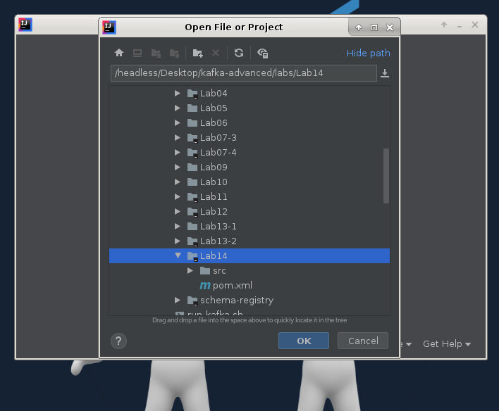
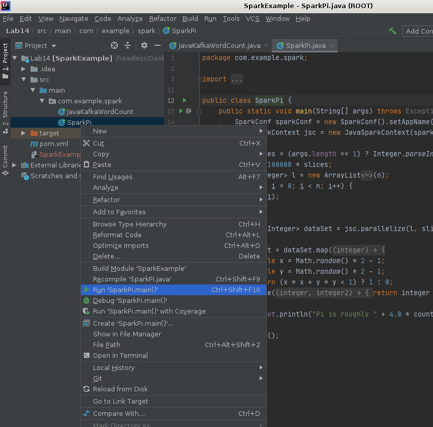
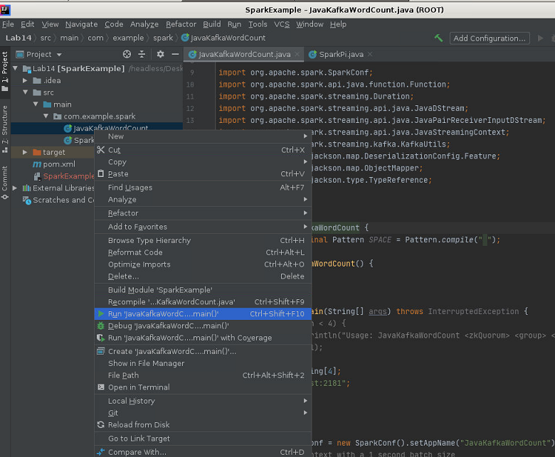
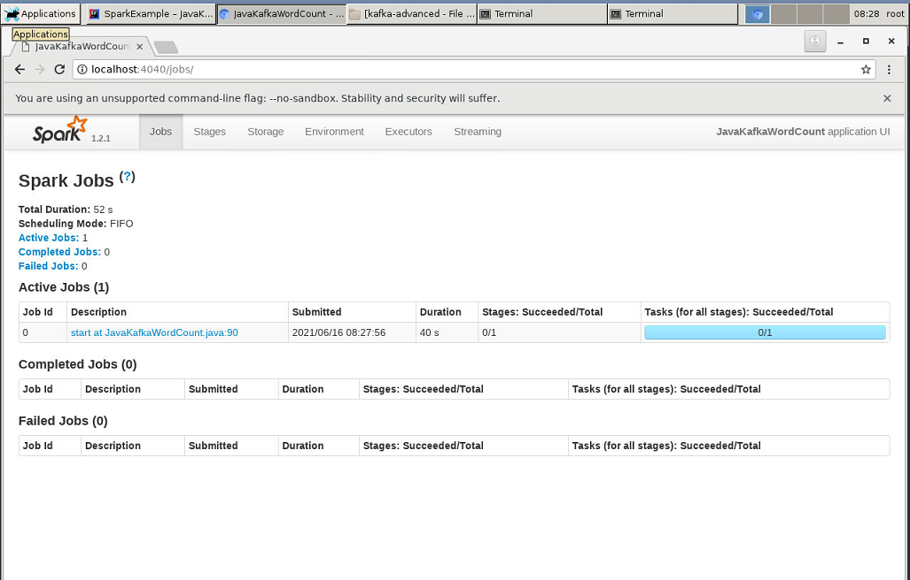

Connecting Kafka to Spark Streaming
-----------------------------------

In this lab, we will develop a program that reads the
streaming data off the Kafka topic and counts the words. The aspects
that will be captured in the following code are as follows:


### Prereq
Zookeeper and apache kafka should be running.

### Lab Solution

Complete solution for this lab is available in the following directory:

```
cd ~/kafka-advanced/labs/Lab14

mvn clean compile
```

Open solution in IntelliJ IDE:




#### SparkPi Example

Open project folder in IntelliJ and run the program as shown below:





#### JavaKafkaWordCount Example

Complete solution for this example is present in `JavaKafkaWordCount.java` file.

Let\'s take a look at the following code:


```
package com.example.spark; 
Import files: 
import java.util.Collection; 
import java.util.HashMap; 
import java.util.Iterator; 
import java.util.Map; 
import java.util.regex.Pattern; 
 
import org.apache.spark.SparkConf; 
import org.apache.spark.api.java.function.Function; 
import org.apache.spark.streaming.Duration; 
import org.apache.spark.streaming.api.java.JavaDStream; 
import org.apache.spark.streaming.api.java.JavaPairReceiverInputDStream; 
import org.apache.spark.streaming.api.java.JavaStreamingContext; 
import org.apache.spark.streaming.kafka.KafkaUtils; 
import org.codehaus.jackson.map.DeserializationConfig.Feature; 
import org.codehaus.jackson.map.ObjectMapper; 
import org.codehaus.jackson.type.TypeReference; 
 
import scala.Tuple2; 
 
Then main classes: 
public class JavaKafkaWordCount { 
private static final Pattern SPACE = Pattern.compile(""); 
 
private JavaKafkaWordCount() { 
} 
 
@SuppressWarnings("serial") 
public static void main(String[] args) throws InterruptedException { 
//    if (args.length < 4) { 
//      System.err.println("Usage: JavaKafkaWordCount <zkQuorum><group><topics><numThreads>"); 
//      System.exit(1); 
//    } 
 
```

Defining arrays:

```
args = new String[4]; 
    args[0]="localhost:2181"; 
    args[1]= "1"; 
    args[2]= "test"; 
    args[3]= "1"; 
 
```

We define the methods:

```
    SparkConf sparkConf = new SparkConf().setAppName("JavaKafkaWordCount").setMaster("local[2]"); 
    // Create the context with a 1 second batch size 
    JavaStreamingContext jssc = new JavaStreamingContext(sparkConf, new Duration(20000)); 
 
```

The translation for the arguments:

```
    int numThreads = Integer.parseInt(args[3]); 
    Map<String, Integer> topicMap = new HashMap<String, Integer>(); 
    String[] topics = args[2].split(","); 
    for (String topic: topics) { 
      topicMap.put(topic, numThreads); 
    } 
 
 
```

Receive the parameters:

```
    JavaPairReceiverInputDStream<String, String> messages = 
            KafkaUtils.createStream(jssc, args[0], args[1], topicMap); 
 
    final JavaDStream<String> lines = messages.map(new Function<Tuple2<String,String>, String>() { 
@Override 
public String call(Tuple2<String, String> v1) throws Exception { 
ObjectMapper objectMapper = new ObjectMapper(); 
objectMapper.configure(Feature.USE_ANNOTATIONS, false); 
Map<String,String> mapValue = objectMapper.readValue(v1._2(), new TypeReference<Map<String,String>>() { 
}); 
```

Adapt the types of variables:

```
Collection<String> values = mapValue.values(); 
String finalString = ""; 
for (Iterator<String> iterator = values.iterator(); iterator.hasNext();) { 
String value = iterator.next(); 
if(finalString.length()==0){ 
finalString = finalString +value; 
}else { 
finalString = finalString+","+ value; 
} 
} 
```

Return function with parameters:

```
return finalString; 
} 
}); 
 
    lines.print(); 
    new Thread(){ 
public void run() { 
while(true){ 
try { 
Thread.sleep(1000); 
} catch (InterruptedException e) { 
// TODO Auto-generated catch block 
e.printStackTrace(); 
} 
System.out.println("#############################################################################"+lines.count()); 
} 
}; 
    }.start(); 
 
    jssc.start(); 
    jssc.awaitTermination(); 
  } 
} 
 
```


### Run Kafka Spark Application

1. Run the program as shown below:




2. Enter `http://localhost:4040` in browser after running java program:



