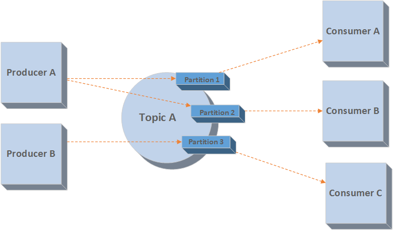
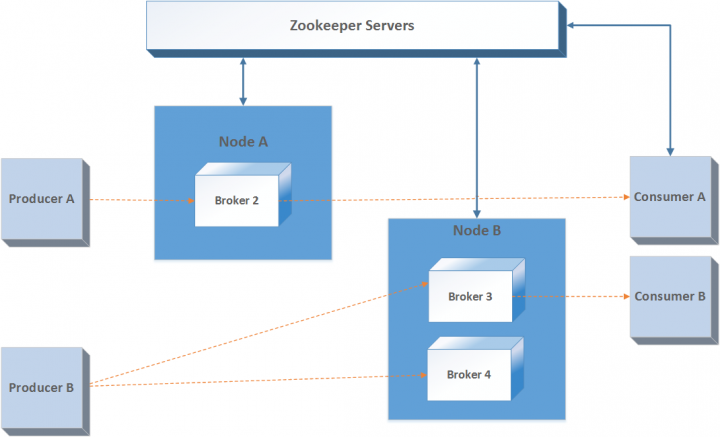

Lab 2. Introducing Kafka the Distributed Messaging Platform
------------------------------------------------------------------------

In this lab, we will introduce [**Kafka**], a widely
adopted scalable, performant, and distributed messaging platform. We
will touch-base on different Kafka components and how they work in
coherence to achieve reliable message delivery. You should see this
lab as a foundation lab on Kafka that will help you establish
familiarity with the systems involved. This lab will help you better
grasp the next labs, which cover various Kafka components in detail.
At the end of this lab, you will have a clear understanding of
Kafka\'s architecture and fundamental components of the Kafka messaging
system.

We will cover the following topics in this lab:

-   Kafka origins
-   Kafka\'s architecture
-   Message topics
-   Message partitions
-   Replication and replicated logs
-   Message producers
-   Message consumers
-   Role of Zookeeper

Kafka origins 
----------------------------

Most of you must have used the [**LinkedIn**] portal in your
professional career. The Kafka system was first built by the LinkedIn
technical team. LinkedIn constructed a software metrics collecting
system using custom in-house components with some support from existing
open source tools. The system was used to collect user activity data on
their portal. They use this activity data to show relevant information
to each respective user on their web portal. The system was originally
built as a traditional XML-based logging service, which was later
processed using different [**Extract Transform Load**]
([**ETL**]) tools. However, this arrangement did not work well
for a long time. They started running into various problems. To solve
these problems, they built a system called Kafka.

LinkedIn built Kafka as a distributed, fault-tolerant, publish/subscribe
system. It records messages organized into topics. Applications can
produce or consume messages from topics. All messages are stored as logs
to persistent filesystems. Kafka is a [**write-ahead logging**]
([**WAL**]) system that writes all published messages to log
files before making it available for consumer applications.
Subscribers/consumers can read these written messages as required in an
appropriate time-frame. Kafka was built with the following goals in
mind:

-   Loose coupling between message Producers and message Consumers
-   Persistence of message data to support a variety of data consumption
    scenarios and failure handling
-   Maximum end-to-end throughput with low latency components
-   Managing diverse data formats and types using binary data formats
-   Scaling servers linearly without affecting the existing cluster
    setup

### Note

While we will introduce Kafka in more detail in up coming sections, you
should understand that one of the common uses of Kafka is in its stream
processing architecture. With its reliable message delivery semantics,
it helps in consuming high rates of events. Moreover, it provides
message replaying capabilities along with support for different types of
consumer.

This further helps in making streaming architecture fault-tolerant and
supports a variety of alerting and notification services.

Kafka\'s architecture 
-------------------------------------

This section introduces you to Kafka architecture. By the end of this
section, you will have a clear understanding of both the logical and
physical architecture of Kafka. Let\'s see how Kafka components are
organized logically.

Every message in [**Kafka topics**] is a collection of bytes.
This collection is represented as an [**array**].
[**Producers**] are the applications that store information in
[**Kafka queues**]. They send messages to Kafka topics that can
store all types of messages. Every topic is further differentiated into
[**partitions**]. Each partition stores messages in the
sequence in which they arrive. There are two major operations that
producers/consumers can perform in Kafka. Producers append to the end of
the write-ahead log files. [**Consumers**] fetch messages from
these log files belonging to a given topic partition. Physically, each
topic is spread over different Kafka brokers, which host one or two
partitions of each topic.

Ideally, Kafka pipelines should have a uniform number of partitions per
broker and all topics on each machine. Consumers are applications or
processes that subscribe to a topic or receive messages from these
topics.

The following diagram shows you the conceptual layout of a Kafka
cluster:

Kafka\'s logical architecture

The preceding paragraphs explain the logical architecture of Kafka and
how different logical components coherently work together. While it is
important to understand how Kafka architecture is divided logically, you
also need to understand what Kafka\'s physical architecture looks like.
This will help you in later labs as well. A Kafka cluster is
basically composed of one or more servers (nodes). The following diagram
depicts how a multi-node Kafka cluster looks:

Kafka\'s physical architecture

A typical Kafka cluster consists of [**multiple brokers**]. It
helps in load-balancing message reads and writes to the cluster. Each of
these brokers is [**stateless**]. However, they use Zookeeper
to maintain their states. Each topic partition has one of the brokers as
a [**leader**] and zero or more brokers as
[**followers**]. The leaders manage any read or write requests
for their respective partitions. Followers replicate the leader in the
background without actively interfering with the leader\'s working. You
should think of followers as a backup for the leader and one of those
followers will be chosen as the leader in the case of leader failure.

### Note

Each server in a Kafka cluster will either be a leader for some of the
topic\'s partitions or a follower for others. In this way, the load on
every server is equally balanced. Kafka broker leader election is done
with the help of Zookeeper.

[**Zookeeper**] is an important component of a Kafka cluster.
It manages and coordinates Kafka brokers and consumers. Zookeeper keeps
track of any new broker additions or any existing broker failures in the
Kafka cluster. Accordingly, it will notify the producer or consumers of
Kafka queues about the cluster state. This helps both producers and
consumers in coordinating work with active brokers. Zookeeper also
records which broker is the leader for which topic partition and passes
on this information to the producer or consumer to read and write the
messages.

At this juncture, you must be familiar with producer and consumer
applications with respect to the Kafka cluster. However, it is
beneficial to touch on these briefly so that you can verify your
understanding. Producers push data to brokers. At the time of publishing
data, producers search for the [**e**]lected leader (broker) of
the respective topic partition and automatically send a message to that
leader broker server. Similarly, the consumer reads messages from
brokers.

The consumer records its state with the help of Zookeeper as Kafka
brokers are stateless. This design helps in scaling Kafka well. The
consumer offset value is maintained by Zookeeper. The consumer records
how many messages have been consumed by it using partition offset. It
ultimately acknowledges that message offset to Zookeeper. It means that
the consumer has consumed all prior messages.

### Note

This brings us to an end of our section on Kafka architecture.
Hopefully, by this time, you are well versed with Kafka architecture and
understand all logical and physical components. The next sections cover
each of these components in detail. However, it is imperative that you
understand the overall Kafka architecture before delving into each of
the components.

Message topics 
------------------------------

If you are into software development and services, I am sure you will
have heard terms such as database, tables, records, and so on. In a
database, we have multiple tables; let\'s say, Items, Price, Sales,
Inventory, Purchase, and many more. Each table contains data of a
specific category. There will be two parts in the application: one will
be inserting records into these tables and the other will be reading
records from these tables. Here, tables are the topics in Kafka,
applications that are inserting data into tables are producers, and
applications that are reading data are consumers.

In a messaging system, messages need to be stored somewhere. In Kafka,
we store messages into topics. Each topic belongs to a category, which
means that you may have one topic storing item information and another
may store sales information. A producer who wants to send a message may
send it to its own category of topics. A consumer who wants to read
these messages will simply subscribe to the category of topics that he
is interested in and will consume it. Here are a few terms that we need
to know:

-   [**Retention Period**]: The messages in the topic need to
    be stored for a defined period of time to save space irrespective of
    throughput. We can configure the retention period, which is by
    default seven days, to whatever number of days we choose. Kafka
    keeps messages up to the defined period of time and then ultimately
    deletes them.
-   [**Space Retention Policy**]: We can also configure Kafka
    topics to clear messages when the size reaches the threshold
    mentioned in the configuration. However, this scenario may occur if
    you haven\'t done enough capacity planning before deploying Kafka
    into your organization.
-   [**Offset**]: Each message in Kafka is assigned with a
    number called as an offset. Topics consist of many partitions. Each
    partition stores messages in the sequence in which they arrive.
    Consumers acknowledge messages with an offset, which means that all
    the messages before that message offset are received by the
    consumer.
-   [**Partition**]: Each Kafka topic consists of a fixed
    number of partitions. During topic creation in Kafka, you need to
    configure the number of partitions. Partitions are distributed and
    help in achieving high throughput.
-   [**Compaction**]: Topic compaction was introduced in Kafka
    0.8. There is no way to change previous messages in Kafka; messages
    only get deleted when the retention period is over. Sometimes, you
    may get new Kafka messages with the same key that includes a few
    changes, and on the consumer side, you only want to process the
    latest data. Compaction helps you achieve this goal by compacting
    all messages with the same key and creating a map offset for key:
    [*offset*]. It helps in removing duplicates from a large
    number of messages.
-   [**Leader**]: Partitions are replicated across the Kafka
    cluster based on the replication factor specified. Each partition
    has a leader broker and followers and all the read write requests to
    the partition will go through the leader only. If the leader fails,
    another leader will get elected and the process will resume.
-   [**Buffering**]: Kafka buffers messages both at the
    producer and consumer side to increase throughput and reduce
    [**Input/Output**] ([**IO**]). We will talk about
    it in detail later.

Message partitions 
----------------------------------

Suppose that we have in our possession a purchase table and we want to
read records for an item from the purchase table that belongs to a
certain category, say, electronics. In the normal course of events, we
will simply filter out other records, but what if we partition our table
in such a way that we will be able to read the records of our choice
quickly?

This is exactly what happens when topics are broken into partitions
known as [**units of parallelism**] in Kafka. This means that
the greater the number of partitions, the more throughput. This does not
mean that we should choose a huge number of partitions. We will talk
about the pros and cons of increasing the number of partitions further.

While creating topics, you can always mention the number of partitions
that you require for a topic. Each of the messages will be appended to
partitions and each message is then assigned with a number called an
offset. Kafka makes sure that messages with similar keys always go to
the same partition; it calculates the hash of the message key and
appends the message to the partition. Time ordering of messages is not
guaranteed in topics but within a partition, it\'s always guaranteed.
This means that messages that come later will always be appended to the
end of the partition.

### Note

Partitions are fault-tolerant; they are replicated across the Kafka
brokers. Each partition has its leader that serves messages to the
consumer that wants to read the message from the partition. If the
leader fails a new leader is elected and continues to serve messages to
the consumers. This helps in achieving high throughput and latency.

Let\'s understand the pros and cons of a large number of partitions:

-   [**High throughput**]: Partitions are a way to achieve
    parallelism in Kafka. Write operations on different partitions
    happen in parallel. All time-consuming operations will happen in
    parallel as well; this operation will utilize hardware resources at
    the maximum. On the consumer side, one partition will be assigned to
    one consumer within a consumer group, which means that different
    consumers available in different groups can read from the same
    partition, but different consumers from the same consumer group will
    not be allowed to read from the same partition.

-   [**Increases producer memory**]: You must be wondering how
    increasing the number of partitions will force us to increase
    producer memory. A producer does some internal stuff before flushing
    data to the broker and asking them to store it in the partition. The
    producer buffers incoming messages per partition. Once the upper
    bound or the time set is reached, the producer sends his messages to
    the broker and removes it from the buffer.

If we increase the number of partitions, the memory allocated for the
buffering may exceed in a very short interval of time, and the producer
will block producing messages until it sends buffered data to the
broker. This may result in lower throughput. To overcome this, we need
to configure more memory on the producer side, which will result in
allocating extra memory to the producer.

-   [**High availability issue**]: Kafka is known as
    high-availability, high-throughput, and distributed messaging
    system. Brokers in Kafka store thousands of partitions of different
    topics. Reading and writing to partitions happens through the leader
    of that partition. Generally, if the leader fails, electing a new
    leader takes only a few milliseconds. Observation of failure is done
    through controllers. [**Controllers**] are just one of the
    brokers. Now, the new leader will serve the request from the
    producer and consumer. Before serving the request, it reads metadata
    of the partition from Zookeeper. However, for normal and expected
    failure, the window is very small and takes only a few milliseconds.
    In the case of unexpected failure, such as killing a broker
    unintentionally, it may result in a delay of a few seconds based on
    the number of partitions. The general formula is:

[*Delay Time = (Number of Partition/replication \* Time to read metadata
for single partition)*]

The other possibility could be that the failed broker is a controller,
the controller replacement time depends on the number of partitions, the
new controller reads the metadata of each partition, and the time to
start the controller will increase with an increase in the number of
partitions.

Kafka partitions (Ref: https://kafka.apache.org/documentation/)

We should take care while choosing the number of partitions and we will
talk about this in upcoming labs and how we can make the best use of
Kafka\'s capability.

Replication and replicated logs 
-----------------------------------------------

[**Replication**] is one of the most important factors in
achieving reliability for Kafka systems. Replicas of message logs for
each topic partition are maintained across different servers in a Kafka
cluster. This can be configured for each topic separately. What it
essentially means is that for one topic, you can have the replication
factor as 3 and for another, you can use 5. All the reads and writes
happen through the leader; if the leader fails, one of the followers
will be elected as leader.

Generally, followers keep a copy of the leader\'s log, which means that
the leader does not make the message as committed until it receives
acknowledgment from all the followers. There are different ways that the
log replication algorithm has been implemented; it should ensure that,
if leader tells the producer that the message is committed, it must be
available for the consumer to read it.

To maintain such replica consistency, there are two approaches. In both
approaches, there will be a leader through which all the read and write
requests will be processed. There is a slight difference in replica
management and leader election:

-   [**Quorum-based approach**]: In this approach, the leader
    will mark messages committed only when the majority of replicas have
    an acknowledged receiving the message. If the leader fails, the
    election of the new a leader will only happen with coordination
    between followers. There are many algorithms that exist for electing
    leader and going to depth of those algorithm is beyond the scope of
    this course. Zookeeper follows a quorum-based approach for leader
    election.
-   [**Primary backup approach**]: Kafka follows a different
    approach to maintaining replicas; the leader in Kafka waits for an
    acknowledgement from all the followers before marking the message as
    committed. If the leader fails, any of the followers can take over
    as leader.

This approach can cost you more in terms of latency and throughput but
this will guarantee better consistency for messages or data. Each leader
records an in-sync replica set abbreviated to [**in sync
replica**] ([**ISR**]). This means that for each
partition, we will have a leader and ISR stored in Zookeeper. Now the
writes and reads will happen as follows:

-   
    -   [**Write**]: All the leaders and followers have their
        own local log where they maintain the log end offset that
        represents the tail of the log. The last committed message
        offset is called the High Watermark. When a client requests to
        write a message to partition, it first picks the leader of the
        partition from Zookeeper and creates a write request. The leader
        writes a message to the log and subsequently waits for the
        followers in ISR to return an acknowledgement. Once
        acknowledgement is received, it simply increases the pointer to
        High Watermark and sends an acknowledgment to the client. If any
        followers present in ISR fail, the leader simply drops them from
        ISR and continues its operation with other followers. Once
        failed followers come back, they catch up with a leader by
        making the logs sync. Now, the leader adds this follower to ISR
        again.
    -   [**Read**]: All the reads happen through the leader
        only. The message that is acknowledged successfully by the
        leader will be available for the client to read.
    

Here is the diagram that will clear the Kafka Log Implementation:

Kafka log implementation (Ref:
https://kafka.apache.org/documentation/\#log)

Message producers 
---------------------------------

In Kafka, the producer is responsible for sending data to the partition
of the topic for which it is producing data.

### Note

The producer generally does not write data to partitions, it creates
write requests for messages and sends them to the leader broker.
Partitioner calculates the hash value of the message, which helps the
producer to choose which partition should be selected.

The hash value is generally calculated by the message key that we
provide when writing the message to a Kafka topic. The message with a
null key will be distributed in a round-robin fashion across partitions
to ensure even distribution of messages. In Kafka, each partition has a
leader and each read write request goes through the leader only. So a
request to write messages to a partition of a topic will go through the
leader broker. The producer waits for an acknowledgement of messages
depending on the setting. Generally, it waits until the replication for
a particular message is successfully acknowledged.

### Note

Remember that until and unless all replicas have been acknowledged to
commit the message, it will not be available to read. This setting is
the default and ensures that a message cannot be lost if a leader broker
fails.

However, you can set the configuration for acknowledgement to 1, which
assumes that if a message is committed by the leader, it will be
available to read and the Kafka producer can produce the next messages.
This setting is dangerous because, if brokers fail before other replicas
commit the message, the message will be lost. This leads to less
durability but high throughput.

However, it\'s better to compromise on throughput if your consumer
system does not want to lose a single message as part of the
application. We will talk in detail about the producer in the next
lab.

Message consumers 
---------------------------------

The consumer is any one who subscribes for topics in Kafka. Each
consumer belongs to a consumer group and some consumer groups contains
multiple consumers. Consumers are an interesting part of Kafka and we
will cover them in detail.

### Note

Two consumers from the same group cannot consume message from a similar
partition because it will lead to the message being consumed out of
order. However, consumers from the same group can consume message from a
different partition of the same topic simultaneously. Similarly,
consumers from a different group can consume messages from the same
partition in parallel without affecting the order of consumption.

So, it\'s clear that groups play an important role; in Kafka\'s initial
version, Zookeeper was used for group management, but in the latest
version, Kafka has its own group protocol built in. One of the brokers
will act as a group coordinator and will be responsible for assigning
and managing partitions for groups. We will talk about Zookeeper and its
own protocol in later labs specific to the consumer.

Remember that we talked about assigning an offset to a message in a
partition; each consumer reads the offset and commits the offset to the
group coordinator or Zookeeper. So if consumers fail for any reason, it
will start from the next message of the [**committed offset**].

### Note

Offset helps guarantee the processing of messages by consumers, which is
important for most applications that cannot afford losing any message as
part of their processing.

Role of Zookeeper 
---------------------------------

We have already talked a lot about Zookeeper in the previous sections.
Zookeeper plays a very important role in Kafka architecture and it is
very important for you to understand how it records the Kafka cluster
state. Therefore, we are dedicating a separate section to the role of
Zookeeper in the Kafka cluster. Kafka cannot work without Zookeeper.
Kafka uses Zookeeper for the following functions:

-   [**Choosing a controller**]: The controller is one of the
    brokers responsible for partition management with respect to leader
    election, topic creation, partition creation, and replica
    management. When a node or server shuts down, Kafka controllers
    elect partition leaders from followers. Kafka uses Zookeeper\'s
    metadata information to elect a controller. Zookeeper ensures that a
    new controller is elected in case the current controller crashes.
-   [**Brokers metadata:**] Zookeeper records the state of each
    of the brokers that are part of the Kafka cluster. It records all
    relevant metadata about each broker in a cluster. The
    producer/consumer interacts with Zookeeper to get the broker\'s
    state.
-   [**Topic metadata:**] Zookeeper also records topic metadata
    such as the number of partitions, specific configuration parameters,
    and so on.
-   [**Client quota information:**] With newer versions of
    Kafka, quota features have been introduced. Quotas enforce byte-rate
    thresholds on clients to read and write messages to a Kafka topic.
    All the information and states are maintained by Zookeeper.
-   [**Kafka topic ACLs:**] Kafka has an in-built authorization
    module that is defined as [**Access Control Lists**]
    ([**ACLs**]). These ACLs determine user roles and what kind
    of read and write permissions each of these roles has on respective
    topics. Kafka uses Zookeeper to store all ACLs.

The preceding points summarize how Zookeeper is used in the Kafka
cluster and why a Kafka cluster cannot run without Zookeeper. In
upcoming labs, you will understand Zookeeper concepts in more
technical depth.

Summary 
-----------------------

We have come to the end of this lab, and by now you should have a
basic understanding of the Kafka messaging system. An important aspect
of mastering any system is that you should understand the system end to
end at a high level first. This will put you in a better position when
you understand individual components of the system in detail. You can
always establish the logical connection with end-to-end system
understanding and understand why individual components are designed in a
particular way. In this lab, our goal was the same.

We started by discovering why Kafka was built in the first place. We
have put forward problems in LinkedIn systems that led to the creation
of Kafka. That section will give you a very clear understanding of the
types of problem that Kafka can solve.

We further covered Kafka\'s logical and system architecture. Putting
Kafka architecture in two viewpoints will help you with both a
functional and technical understanding of Kafka. The logical viewpoint
is more from the perspective of establishing data flows and seeing how
different components depend on each other. The technical viewpoint will
help you in technically designing producer/consumer applications and
understanding the Kafka physical design. The physical viewpoint is more
a system-wise view of the logical structure. The physical architecture
covers producer Applications, consumer Applications, Kafka brokers
(nodes), and Zookeeper.

In this lab, we have touched on all components that we have
illustrated in the Kafka architecture. We will cover all these
components in depth in upcoming labs. However, the important goal
for you should be to understand the roles and responsibilities of each
Kafka component. Every component in Kafka has some specific role to
play, and, even if one of these is missing overall Kafka functionality
cannot be achieved. The other key takeaways from this lab should be
understanding how the unit of parallelism and partitioning system works
in Kafka. This is one of the key aspects in designing low\'- latency
systems with Kafka.

In the next lab, we will delve into Kafka producers and how you
should design a producer application. We will cover different producer
APIs and some of the best practices associated with Kafka producers.
