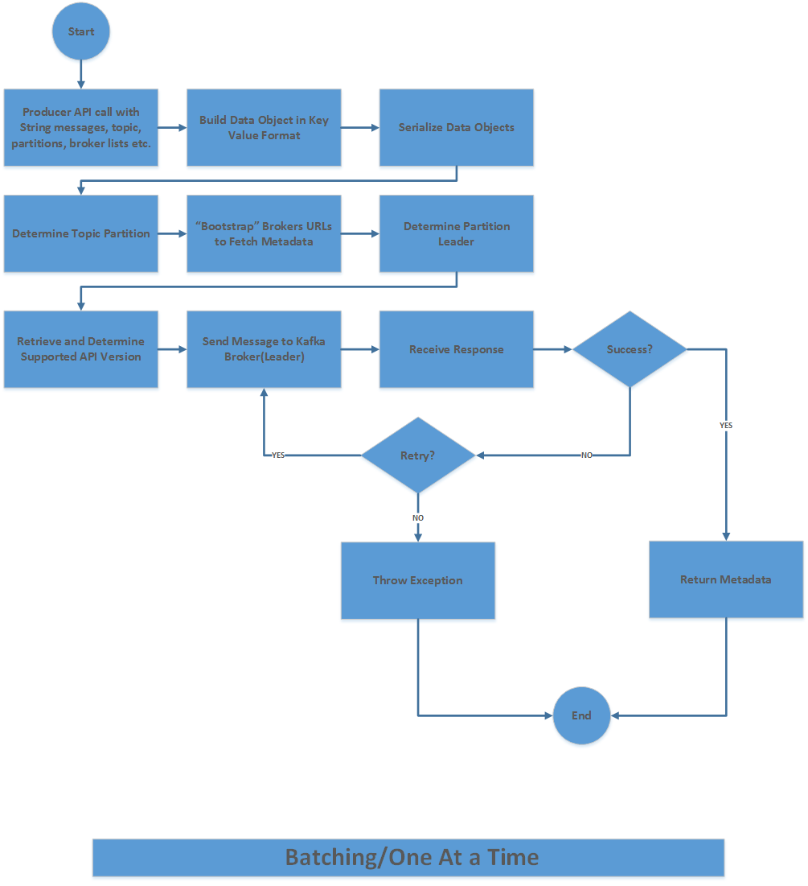
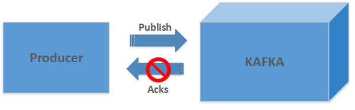

Lab 3. Deep Dive into Kafka Producers
--------------------------------------------------


In previous labs, you have learned about messaging systems and Kafka
architecture. While it is a good start, we will now take a deeper look
into Kafka producers. Kafka can be used as a message queue, message bus,
or data storage system. Irrespective of how Kafka is used in your
enterprise, you will need an application system that can write data to
the Kafka cluster. Such a system is called a [**producer**]. As
the name suggests, they are the source or producers of messages for
Kafka topics. Kafka producers publish messages as per Kafka protocols
defined by the makers of Kafka. This lab is all about producers,
their internal working, examples of writing producers using Java or
Scala APIs, and some of the best practices of writing Kafka APIs. We
will cover the following topics in this lab:


-   Internals of a Kafka producer
-   The Kafka Producer API and its uses
-   Partitions and their uses
-   Additional configuration for producers
-   Some common producer patterns
-   An example of a producer
-   Best practices to be followed for a Kafka producer


Kafka producer internals 
----------------------------------------


In this section, we will walk through different Kafka producer
components, and at a higher level, cover how messages get transferred
from a Kafka producer application to Kafka queues. While writing
producer applications, you generally use Producer APIs, which expose
methods at a very abstract level. Before sending any data, a lot of
steps are performed by these APIs. So it is very important to understand
these internal steps in order to gain complete knowledge about Kafka
producers. We will cover these in this section. First, we need to
understand the responsibilities of Kafka producers apart from publishing
messages. Let\'s look at them one by one:


-   [**Bootstrapping Kafka broker URLs**]: The Producer
    connects to at least one broker to fetch metadata about the Kafka
    cluster. It may happen that the first broker to which the producer
    wants to connect may be down. To ensure a failover, the producer
    implementation takes a list of more than one broker URL to bootstrap
    from. Producer iterates through a list of Kafka broker addresses
    until it finds the one to connect to fetch cluster metadata.
-   [**Data serialization:**] Kafka uses a binary protocol to
    send and receive data over TCP. This means that while writing data
    to Kafka, producers need to send the ordered byte sequence to the
    defined Kafka broker\'s network port. Subsequently, it will read the
    response byte sequence from the Kafka broker in the same ordered
    fashion. Kafka producer serializes every message data object into
    [**ByteArrays**] before sending any record to the
    respective broker over the wire. Similarly, it converts any byte
    sequence received from the broker as a response to the message
    object.
-   [**Determining topic partition:**] It is the responsibility
    of the Kafka producer to determine which topic partition data needs
    to be sent. If the partition is specified by the caller program,
    then Producer APIs do not determine topic partition and send data
    directly to it. However, if no partition is specified, then producer
    will choose a partition for the message. This is generally based on
    the key of the message data object. You can also code for your
    custom partitioner in case you want data to be partitioned as per
    specific business logic for your enterprise.
-   [**Determining the leader of the partition**]: Producers
    send data to the leader of the partition directly. It is the
    producer\'s responsibility to determine the leader of the partition
    to which it will write messages. To do so, producers ask for
    metadata from any of the Kafka brokers. Brokers answer the request
    for metadata about active servers and leaders of the topic\'s
    partitions at that point of time.
-   [**Failure handling/retry ability:**] Handling failure
    responses or number of retries is something that needs to be
    controlled through the producer application. You can configure the
    number of retries through Producer API configuration, and this has
    to be decided as per your enterprise standards. Exception handling
    should be done through the producer application component. Depending
    on the type of exception, you can determine different data flows.
-   [**Batching:**] For efficient message transfers, batching
    is a very useful mechanism. Through Producer API configurations, you
    can control whether you need to use the producer in
    [**asynchronous**] mode or not. Batching ensures reduced
    I/O and optimum utilization of producer memory. While deciding on
    the number of messages in a batch, you have to keep in mind the
    end-to-end latency. End-to-end latency increases with the number of
    messages in a batch.


Hopefully, the preceding paragraphs have given you an idea about the
prime responsibilities of Kafka producers. Now, we will discuss Kafka
producer data flows. This will give you a clear understanding about the
steps involved in producing Kafka messages.


### Note

Internal implementation or the sequence of steps in Producer APIs may
differ for respective programming languages. Some of the steps can be
done in parallel using threads or callbacks.


The following image shows the high-level steps involved in producing
messages to the Kafka cluster:




Kafka producer high-level flow

Publishing messages to a Kafka topic starts with calling Producer APIs
with appropriate details such as messages in string format, topic,
partitions (optional), and other configuration details such as broker
URLs and so on. The Producer API uses the passed on information to form
a data object in a form of nested key-value pair. Once the data object
is formed, the producer serializes it into byte arrays. You can either
use an inbuilt serializer or you can develop your custom serializer.
[**Avro**] is one of the commonly used data serializers.


### Note

[**Serialization**] ensures compliance to the Kafka binary
protocol and efficient network transfer.


Next, the partition to which data needs to be sent is determined. If
partition information is passed in API calls, then producer would use
that partition directly. However, in case partition information is not
passed, then producer determines the partition to which data should be
sent. Generally, this is decided by the keys defined in data objects.
Once the record partition is decided, producer determines which broker
to connect to in order to send messages. This is generally done by the
bootstrap process of selecting the producers and then, based on the
fetched metadata, determining the leader broker.

Producers also need to determine supported API versions of a Kafka
broker. This is accomplished by using API versions exposed by the Kafka
cluster. The goal is that producer will support different versions of
Producer APIs. While communicating with the respective leader broker,
they should use the highest API version supported by both the producers
and brokers.

Producers send the used API version in their write requests. Brokers can
reject the write request if a compatible API version is not reflected in
the write request. This kind of setup ensures incremental API evolution
while supporting older versions of APIs.

Once a serialized data object is sent to the selected Broker, producer
receives a response from those brokers. If they receive metadata about
the respective partition along with new message offsets, then the
response is considered successful. However, if error codes are received
in the response, then producer can either throw the exception or retry
as per the received configuration.

As we move further in the lab, we will dive deeply into the
technical side of Kafka Producer APIs and write them using Java and
Scala programs.


Kafka Producer APIs 
-----------------------------------


Kafka has provided you with a rich set of APIs to create applications to
interact with it. We will go through Producer API details and understand
its uses.

Creating a Kafka producer involves the following steps:


1.  Required configuration.
2.  Creating a producer object.
3.  Setting up a producer record.
4.  Creating a custom partition if required.
5.  Additional configuration.


Required configuration: In most applications, we first start with
creating the initial configuration without which we cannot run the
application. The following are three mandatory configuration parameters:


-   `bootstrap.servers`: This contains a list of Kafka brokers
    addresses. The address is specified in terms of
    `hostname:port`. We can specify one or more broker detail,
    but we recommend that you provide at least two so that if one broker
    goes down, producer can use the other one.


### Note

It is not necessary to specify all brokers as the Kafka producer queries
this configured broker for information about other brokers. In older
versions of Kafka, this property was `metadata.broker.list`,
where we used to specify a list of brokers `host:port`.


-   `key.serializer`: The message is sent to Kafka brokers in
    the form of a key-value pair. Brokers expect this key-value to be in
    byte arrays. So we need to tell producer which serializer class is
    to be used to convert this key-value object to a byte array. This
    property is set to tell the producer which class to use to serialize
    the key of the message.


Kafka provides us with three inbuilt serializer classes:
`ByteArraySerializer`, `StringSerializer`, and
`IntegerSerializer`. All these classes are present in the
`org.apache.kafka.common.serialization` package and implement
the serializer interface.

 


-   `value.serializer`: This is similar to the
    `key.serializer` property, but this property tells the
    producer which class to use in order to serialize the value. You can
    implement your own serialize class and assign to this property.


Let\'s see how we do it in a programming context.

Here is how Java works for Producer APIs:

```
Properties producerProps = new Properties();
producerProps.put("bootstrap.servers", "broker1:port,broker2:port");
producerProps.put("key.serializer",
    "org.apache.kafka.common.serialization.StringSerializer");
     producerProps.put("value.serializer",
      "org.apache.kafka.common.serialization.StringSerializer");
KafkaProducer<String, String> producer = new KafkaProducer<String,String>(producerProps);
```

The Producer API in Scala:

```
val producerProps = new Properties()
 producerProps.put("bootstrap.servers", "broker1:port,broker2:port");

       producerProps.put("key.serializer",        "org.apache.kafka.common.serialization.StringSerializer")
     producerProps.put("value.serializer",      "org.apache.kafka.common.serialization.StringSerializer")

 val producer = new KafkaProducer[String, String](producerProps)
```

The preceding code contains three specific points:


-   [**Properties object**]: We start with creating a property
    object; this object contains the `put` method that is used
    to put the configuration key-value pair in place
-   [**Serializer class**]: We will use
    `StringSerializer` for both key and value as our key and
    value will be of the string type
-   [**Producer object**]: We create a producer object by
    passing the configuration object to it, which provides the producer
    with specific information about broker servers, serializer classes,
    and other configurations that we will see later


### Producer object and ProducerRecord object


Producer accepts the `ProducerRecord` object to send records
to the `.ProducerRecord` topic. It contains a topic name,
partition number, `timestamp`, key, and value. Partition
number, `timestamp`, and key are optional parameters, but the
topic to which data will be sent and value that contains the data is
mandatory.


-   If the partition number is specified, then the specified partition
    will be used when sending the record
-   If the partition is not specified but a key is specified, a
    partition will be chosen using a hash of the key
-   If both key and partition are not specified, a partition will be
    assigned in a round-robin fashion


Here is the `producerRecord` in Java:

```
ProducerRecord producerRecord = new ProducerRecord<String, String>(topicName, data);
Future<RecordMetadata> recordMetadata = producer.send(producerRecord);
```

Here is an example of `producerRecord` in Scala:

```
val producerRecord = new ProducerRecord<String, String>(topicName, data);
val recordMetadata = producer.send(producerRecord);
```

We have different constructors available for `ProducerRecord`:


-   Here is the first constructor for `producerRecord`:


```
ProducerRecord(String topicName, Integer numberOfpartition, K key, V value)
```


-   The second constructor goes something like this:


```
ProducerRecord(String topicName, Integer numberOfpartition, Long timestamp, K key, V value)
```


-   The third constructor is as follows:


```
ProducerRecord(String topicName, K key, V value)
```


-   The final constructor of our discussion is as follows:


```
ProducerRecord(String topicName, V value)
```

Each record also has a `timestamp` associated with it. If we
do not mention a `timestamp`, the producer will stamp the
record with its current time. The `timestamp` eventually used
by Kafka depends on the `timestamp` type configured for the
particular topic:


-   [**CreateTime**]: The `timestamp` of
    `ProducerRecord` will be used to append a
    `timestamp` to the data
-   [**LogAppendTime**]: The Kafka broker will overwrite the
    `timestamp` of `ProducerRecord` to the message
    and add a new `timestamp` when the message is appended to
    the log


Once data is sent using the `send()` method, the broker
persists that message to the partition log and returns
`RecordMetadata`, which contains metadata of the server
response for the record, which includes `offset`,
`checksum`, `timestamp`, `topic`,
`serializedKeySize`, and so on. We previously discussed common
messaging publishing patterns. The sending of messages can be either
synchronous or asynchronous.

[**Synchronous messaging**]: Producer sends a message and waits
for brokers to reply. The Kafka broker either sends an error or
`RecordMetdata`. We can deal with errors depending on their
type. This kind of messaging will reduce throughput and latency as the
producer will wait for the response to send the next message.

Generally, Kafka retries sending the message in case certain connection
errors occur. However, errors related to serialization, message, and so
on have to be handled by the application, and in such cases, Kafka does
not try to resend the message and throws an exception immediately.

Java:

```
ProducerRecord producerRecord = new ProducerRecord<String, String>(topicName, data);

Object recordMetadata = producer.send(producerRecord).get();
```

Scala:

```
val producerRecord = new ProducerRecord<String, String>(topicName, data);

valrecordMetadata = producer.send(producerRecord);
```

[**Asynchronous messaging**]: Sometimes, we have a scenario
where we do not want to deal with responses immediately or we do not
care about losing a few messages and we want to deal with it after some
time.

Kafka provides us with the callback interface that helps in dealing with
message reply, irrespective of error or successful. `send()`
can accept an object that implements the callback interface.

`send(ProducerRecord<K,V> record,Callbackcallback)`

The callback interface contains the `onCompletion` method,
which we need to override. Let\'s look at the following example:

Here is the example in Java:

```
public class ProducerCallback implements Callback {
public void onCompletion(RecordMetadata recordMetadata, Exception ex) {
if(ex!=null){
//deal with exception here 
}
else{
//deal with RecordMetadata here
}
}
}
```

Scala:

```
class ProducerCallback extends Callback {
override def onCompletion(recordMetadata: RecordMetadata, ex: Exception): Unit = {
if (ex != null) {
//deal with exception here
}
else {
//deal with RecordMetadata here
}
}
} 
```

Once we have the `Callback` class implemented, we can simply
use it in the `send` method as follows:

```
val callBackObject = producer.send(producerRecord,new ProducerCallback());
```

If Kafka has thrown an exception for the message, we will not have a
null exception object. We can also deal with successful and error
messages accordingly in `onCompletion()`.


### Custom partition


Remember that we talked about key serializer and value serializer as
well as partitions used in Kafka producer. As of now, we have just used
the default partitioner and inbuilt serializer. Let\'s see how we can
create a custom partitioner.

Kafka generally selects a partition based on the hash value of the key
specified in messages. If the key is not specified/null, it will
distribute the message in a round-robin fashion. However, sometimes you
may want to have your own partition logic so that records with the same
partition key go to the same partition on the broker. We will see some
best practices for partitions later in this lab. Kafka provides you
with an API to implement your own partition.

In most cases, a hash-based default partition may suffice, but for some
scenarios where a percentage of data for one key is very large, we may
be required to allocate a separate partition for that key. This means
that if key K has 30 percent of total data, it will be allocated to
partition N so that no other key will be assigned to partition N and we
will not run out of space or slow down. There can be other use cases as
well where you may want to write `Custom Partition`. Kafka
provides the partitionerinterface, which helps us create our own
partition.

Here is an example in Java:

```
public class CustomePartition implements Partitioner {
    public int partition(String topicName, Object key, byte[] keyBytes, Object value, byte[] valueByte, Cluster cluster) {
        List<PartitionInfo> partitions = cluster.partitionsForTopic(topicName);

        int numPartitions = partitions.size();
        //Todo: Partition logic here
        return 0;
    }

    public void close() {

    }

    public void configure(Map<String, ?> map) {

    }
}
```

Scala:

```
class CustomPartition extends Partitioner {
  override def close(): Unit = {}

  override def partition(topicName: String, key: scala.Any, keyBytes: Array[Byte], value: scala.Any, valueBytes: Array[Byte], cluster: Cluster): Int = {

    val partitions: util.List[PartitionInfo] = cluster.partitionsForTopic(topicName)

    val numPartitions: Int = partitions.size

    //TODO : your partition logic here
    0
  }

  override def configure(map: util.Map[String, _]): Unit = {}
}
```


### Additional producer configuration


There are other optional configuration properties available for Kafka
producer that can play an important role in performance, memory,
reliability, and so on:


-   `buffer.memory`: This is the amount of memory that
    producer can use to buffer a message that is waiting to be sent to
    the Kafka server.In simple terms, it is the total memory that is
    available to the Java producer to collect unsent messages. When this
    limit is reached, the producer will block the messages for
    `max.block.ms`before raising an exception. If your batch
    size is more, allocate more memory to the producer buffer.


Additionally, to avoid keeping records queued indefinitely, you can set
a timeout using `request.timeout.ms`. If this timeout expires
before a message can be successfully sent, then it will be removed from
the queue and an exception will be thrown.


-   `acks`: This configuration helps in configuring when
    producer will receive acknowledgment from the leader before
    considering that the message is committed successfully:
    
    -   `acks=0`: Producer will not wait for any
        acknowledgment from the server. Producer will not know if the
        message is lost at any point in time and is not committed by the
        leader broker. Note that no retry will happen in this case and
        the message will be completely lost. This can be used when you
        want to achieve very high throughput and when you don\'t care
        about potential message loss.
    -   `acks=1`: Producer will receive an acknowledgment as
        soon as the leader has written the message to its local log. If
        the leader fails to write the message to its log, producer will
        retry sending the data according to the retry policy set and
        avoid potential loss of messages. However, we can still have
        message loss in a scenario where the leader acknowledges to
        producer but does not replicate the message to the other broker
        before it goes down.
    -   `acks=all`: Producer will only receive acknowledgment
        when the leader has received acknowledgment for all the replicas
        successfully. This is a safe setting where we cannot lose data
        if the replica number is sufficient to avoid such failures.
        Remember, throughput will be lesser then the first two settings.
    
-   `batch.size`: This setting allows the producer to batch
    the messages based on the partition up to the configured amount of
    size. When the batch reaches the limit, all messages in the batch
    will be sent. However, it\'s not necessary that producer wait for
    the batch to be full. It sends the batch after a specific time
    interval without worrying about the number of messages in the batch.
-   `linger.ms`: This represents an amount of time that a
    producer should wait for additional messages before sending a
    current batch to the broker. Kafka producer waits for the batch to
    be full or the configured `linger.ms` time; if any
    condition is met, it will send the batch to brokers. Producer will
    wait till the configured amount of time in milliseconds for any
    additional messages to get added to the current batch.
-   `compression.type`: By default, producer sends
    uncompressed messages to brokers. When sending a single message, it
    will not make that much sense, but when we use batches, it\'s good
    to use compression to avoid network overhead and increase
    throughput. The available compressions are GZIP, Snappy, or LZ4.
    Remember that more batching would lead to better compression.
-   `retires`: If message sending fails, this
    represents the number of times producer will retry sending messages
    before it throws an exception. It is irrespective of reseeding a
    message after receiving an exception.
-   `max.in.flight.requests.per.connection`: This is the
    number of messages producer can send to brokers without waiting for
    a response. If you do not care about the order of the messages, then
    setting its value to more than 1 will increase throughput. However,
    ordering may change if you set it to more than 1 with retry enabled.
-   `partitioner.class`: If you want to use a custom
    partitioner for your producer, then this configuration allows you to
    set the partitioner class, which implements the partitioner
    interface.
-   `timeout.ms`: This is the amount of time a leader will
    wait for its followers to acknowledge the message before sending an
    error to producer. This setting will only help when `acks`
    is set to all.


Java Kafka producer example 
-------------------------------------------


We have covered different configurations and APIs in previous sections.
Let\'s start coding one simple Java producer, which will help you create
your own Kafka producer.

[**Prerequisite**]


-   IDE: We recommend that you use a Scala-supported IDE such as IDEA,
    NetBeans, or Eclipse. We have used JetBrains
    IDEA:<https://www.jetbrains.com/idea/download/>.
-   Build tool: Maven, Gradle, or others. We have used Maven to build
    our project.
-   `Pom.xml`: Add Kafka dependency to the `pom`
    file:


```
<dependency>
    <groupId>org.apache.kafka</groupId>
    <artifactId>kafka_2.11</artifactId>
    <version>0.10.0.0</version>
</dependency>
```

Java:

```
import java.util.Properties;
import java.util.concurrent.Future;
import org.apache.kafka.clients.producer.KafkaProducer;
import org.apache.kafka.clients.producer.ProducerRecord;
import org.apache.kafka.clients.producer.RecordMetadata;

public class DemoProducer {

    public static void main(final String[] args) {
        Properties producerProps = new Properties();
        producerProps.put("bootstrap.servers", "localhost:9092");
        producerProps.put("key.serializer", "org.apache.kafka.common.serialization.StringSerializer");
        producerProps.put("value.serializer", "org.apache.kafka.common.serialization.StringSerializer");
        producerProps.put("acks", "all");
        producerProps.put("retries", 1);
        producerProps.put("batch.size", 20000);
        producerProps.put("linger.ms", 1);
        producerProps.put("buffer.memory", 24568545);
        KafkaProducer<String, String> producer = new KafkaProducer<String, String>(producerProps);

        for (int i = 0; i < 2000; i++) {
           ProducerRecord data = new ProducerRecord<String, String>("test1", "Hello this is record " + i);
           Future<RecordMetadata> recordMetadata = producer.send(data);
        }
     producer.close();
    }
}
```

Scala:

```
import java.util.Properties
import org.apache.kafka.clients.producer._

object DemoProducer extends App {
  override def main(args: Array[String]): Unit = {

    val producerProps = new Properties()
    producerProps.put("bootstrap.servers", "localhost:9092")
    producerProps.put("key.serializer", "org.apache.kafka.common.serialization.StringSerializer")
    producerProps.put("value.serializer", "org.apache.kafka.common.serialization.StringSerializer")
    producerProps.put("client.id", "SampleProducer")
    producerProps.put("acks", "all")
    producerProps.put("retries", new Integer(1))
    producerProps.put("batch.size", new Integer(16384))
    producerProps.put("linger.ms", new Integer(1))
    producerProps.put("buffer.memory", new Integer(133554432))

    val producer = new KafkaProducer[String, String](producerProps)

    for (a <- 1 to 2000) {
      val record: ProducerRecord[String, String] = new ProducerRecord("test1", "Hello this is record"+a)
      producer.send(record);
    }

    producer.close()
  }

}
```

The preceding example is a simple Java producer where we are producing
string data without a key. We have also hardcoded the topic name, which
probably can be read through configuration file or as an command line
input. To understand producer, we have kept it simple. However, we will
see good examples in upcoming labs where we will follow good coding
practice.


Common messaging publishing patterns 
----------------------------------------------------


Applications may have different requirements of producer\--a producer
that does not care about acknowledgement for the message they have sent
or a producer that cares about acknowledgement but the order of messages
does not matter. We have different producer patterns that can be used
for application requirement. Let\'s discuss them one by one:


-   [**Fire-and-forget**]: In this pattern, producers only care
    about sending messages to Kafka queues. They really do not wait for
    any success or failure response from Kafka. Kafka is a highly
    available system and most of the time, messages would be delivered
    successfully. However, there is some risk of message loss in this
    pattern. This kind of pattern is useful when latency has to be
    minimized to the lowest level possible and one or two lost messages
    does not affect the overall system functionality. To use the fire
    and forget model with Kafka, you have to set producer
    `acks` config to `0`. The following image
    represents the Kafka-based fire and forget model:
    
    
    


Kafka producer fire and forget model


-   [**One message transfers**]: In this pattern, producer
    sends one message at a time. It can do so in synchronous or
    asynchronous mode. In synchronous mode, producer sends the message
    and waits for a success or failure response before retrying the
    message or throwing the exception. In asynchronous mode, producer
    sends the message and receives the success or failure response as a
    callback function. The following image indicates this model. This
    kind of pattern is used for highly reliable systems where guaranteed
    delivery is the requirement. In this model, producer thread waits
    for response from Kafka. However, this does not mean that you cannot
    send multiple messages at a time. You can achieve that using
    multithreaded producer applications.


Kafka producer one message transfer model


-   [**Batching**]: In this pattern, producers send multiple
    records to the same partition in a batch. The amount of memory
    required by a batch and wait time before sending the batch to Kafka
    is controlled by producer configuration parameters. Batching
    improves performance with bigger network packets and disk operations
    of larger datasets in a sequential manner. Batching negates the
    efficiency issues with respect to random reads and writes on disks.
    All the data in one batch would be written in one sequential fashion
    on hard drives. The following image indicates the batching message
    model:


Best practices 
------------------------------


Hopefully, at this juncture, you are very well aware of Kafka Producer
APIs, their internal working, and common patterns of publishing messages
to different Kafka topics. This section covers some of the best
practices associated with Kafka producers. These best practices will
help you in making some of the design decisions for the producer
component.

Let\'s go through some of the most common best practices to design a
good producer application:


-   [**Data validation**]: One of the aspects that is usually
    forgotten while writing a producer system is to perform basic data
    validation tests on data that is to be written on the Kafka cluster.
    Some such examples could be conformity to schema, not null values
    for Key fields, and so on. By not doing data validation, you are
    risking breaking downstream consumer applications and affecting the
    load balancing of brokers as data may not be partitioned
    appropriately.
-   [**[**Exception handling**]**]: It is the sole
    responsibility of producer programs to decide on program flows with
    respect to exceptions. While writing a producer application, you
    should define different exception classes and as per your business
    requirements, decide on the actions that need to be taken. Clearly
    defining exceptions not only helps you in debugging but also in
    proper risk mitigation. For example, if you are using Kafka for
    critical applications such as fraud detection, then you should
    capture relevant exceptions to send e-mail alerts to the OPS team
    for immediate resolution.
-   [**Number of retries**]: In general, there are two types of
    errors that you get in your producer application. The first type are
    errors that producer can retry, such as network timeouts and leader
    not available. The second type are errors that need to be handled by
    producer programs as mentioned in the preceding section. Configuring
    the number of retries will help you in mitigating risks related to
    message losses due to Kafka cluster errors or network errors.
-   [**Number of bootstrap URLs**]: You should always have more
    than one broker listed in your bootstrap broker configuration of
    your producer program. This helps producers to adjust to failures
    because if one of the brokers is not available, producers try to use
    all the listed brokers until it finds the one it can connect to. An
    ideal scenario is that you should list all your brokers in the Kafka
    cluster to accommodate maximum broker connection failures. However,
    in case of very large clusters, you can choose a lesser number that
    can significantly represent your cluster brokers. You should be
    aware that the number of retries can affect your end-to-end latency
    and cause duplicate messages in your Kafka queues.
-   [**Avoid poor partitioning mechanism**]: Partitions are a
    unit of parallelism in Kafka. You should always choose an
    appropriate partitioning strategy to ensure that messages are
    distributed uniformly across all topic partitions. Poor partitioning
    strategy may lead to non-uniform message distribution and you would
    not be able to achieve the optimum parallelism out of your Kafka
    cluster. This is important in cases where you have chosen to use
    keys in your messages. In case you do not define keys, then producer
    will use the default round-robin mechanism to distribute your
    messages to partitions. If keys are available, then Kafka will hash
    the keys and based on the calculated hash code, it will assign the
    partitions. In a nutshell, you should choose your keys in a way that
    your message set uses all available partitions.
-   [**Temporary persistence of messages**]: For highly
    reliable systems, you should persist messages that are passing
    through your producer applications. Persistence could be on disk or
    in some kind of database. Persistence helps you replay messages in
    case of application failure or in case the Kafka cluster is
    unavailable due to some maintenance. This again, should be decided
    based on enterprise application requirements. You can have message
    purging techniques built in your producer applications for messages
    that are written to the Kafka cluster. This is generally used in
    conjunction with the acknowledgement feature that is available with
    Kafka Producer APIs. You should purge messages only when Kafka sends
    a success acknowledgement for a message set.
-   [**Avoid adding new partitions to existing topics**]: You
    should avoid adding partitions to existing topics when you are using
    key-based partitioning for message distribution. Adding new
    partitions would change the calculated hash code for each key as it
    takes the number of partitions as one of the inputs. You would end
    up having different partitions for the same key.


Summary 
-----------------------


This concludes our section on Kafka producers. This lab addresses
one of the key functionalities of Kafka message flows. The major
emphasis in this lab was for you to understand how Kafka producers
work at the logical level and how messages are passed from Kafka
producers to Kafka queues. This was covered in the [*Kafka
Internals*] section. This is an important section for you to
understand before you learn how to code with Kafka APIs. Unless you
understand the logical working of Kafka producers, you will not be able
to do justice to producer application technical designing.

We discussed Kafka Producer APIs and different components around it such
as custom practitioners. We gave both Java and Scala examples as both
languages are heavily used in enterprise applications. We would suggest
you try all those examples on your consoles and get a better grasp of
how Kafka producers work. Another important design consideration for
Kafka producer is data flows. We covered some commonly used patterns in
this lab. You should have a thorough understanding of these
patterns. We covered some of the common configuration parameters and
performance tuning steps. These will definitely help you in case you are
writing Kafka producer code for the first time.

In the end, we wanted to bring in some of the best practices of using
Kafka producers. These best practices will help you in scalable designs
and in avoiding some common pitfalls. Hopefully, by the end of this
lab, you have mastered the art of designing and coding Kafka
producers.

In the next lab, we will cover the internals of Kafka consumers,
consumer APIs, and common usage patterns. The next lab will give us
a good understanding of how messages produced by producer are being
consumed by different consumers irrespective of knowing their producer.
