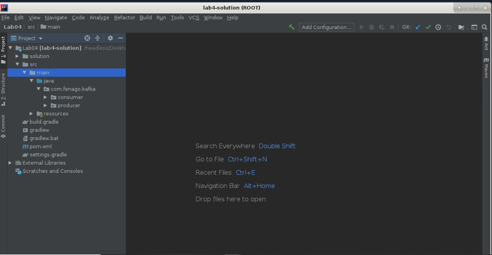

Lab 4. Deep Dive into Kafka Producers & Consumers
--------------------------------------------------


We will cover the following topics in this lab:


-   The Kafka Producer API and its uses
-   Additional configuration for producers
-   An example of a producer
-   Kafka consumer internals
-   Kafka consumer APIs
-   Java Kafka consumer example


### Lab Solution

Complete solution for this lab is available in the following directory:

`~/kafka-advanced/labs/Lab04/solution`




Kafka Producer APIs 
-----------------------------------


Creating a Kafka producer involves the following steps:


1.  Required configuration.
2.  Creating a producer object.
3.  Setting up a producer record.
4.  Creating a custom partition if required.
5.  Additional configuration.

Required configuration: In most applications, we first start with
creating the initial configuration without which we cannot run the
application. The following are three mandatory configuration parameters:


-   `bootstrap.servers`: This contains a list of Kafka brokers
    addresses. The address is specified in terms of
    `hostname:port`. We can specify one or more broker detail,
    but we recommend that you provide at least two so that if one broker
    goes down, producer can use the other one.


### Note

It is not necessary to specify all brokers as the Kafka producer queries
this configured broker for information about other brokers. In older
versions of Kafka, this property was `metadata.broker.list`,
where we used to specify a list of brokers `host:port`.


-   `key.serializer`: The message is sent to Kafka brokers in
    the form of a key-value pair. Brokers expect this key-value to be in
    byte arrays. So we need to tell producer which serializer class is
    to be used to convert this key-value object to a byte array. This
    property is set to tell the producer which class to use to serialize
    the key of the message.


Kafka provides us with three inbuilt serializer classes:
`ByteArraySerializer`, `StringSerializer`, and
`IntegerSerializer`. All these classes are present in the
`org.apache.kafka.common.serialization` package and implement
the serializer interface.

 


-   `value.serializer`: This is similar to the
    `key.serializer` property, but this property tells the
    producer which class to use in order to serialize the value. You can
    implement your own serialize class and assign to this property.


Let\'s see how we do it in a programming context.

Here is how Java works for Producer APIs:

```
Properties producerProps = new Properties();
producerProps.put("bootstrap.servers", "broker1:port,broker2:port");
producerProps.put("key.serializer",
    "org.apache.kafka.common.serialization.StringSerializer");
     producerProps.put("value.serializer",
      "org.apache.kafka.common.serialization.StringSerializer");
KafkaProducer<String, String> producer = new KafkaProducer<String,String>(producerProps);
```


### Producer object and ProducerRecord object


Producer accepts the `ProducerRecord` object to send records
to the `.ProducerRecord` topic. It contains a topic name,
partition number, `timestamp`, key, and value. Partition
number, `timestamp`, and key are optional parameters, but the
topic to which data will be sent and value that contains the data is
mandatory.


-   If the partition number is specified, then the specified partition
    will be used when sending the record
-   If the partition is not specified but a key is specified, a
    partition will be chosen using a hash of the key
-   If both key and partition are not specified, a partition will be
    assigned in a round-robin fashion


Here is the `producerRecord` in Java:

```
ProducerRecord producerRecord = new ProducerRecord<String, String>(topicName, data);
Future<RecordMetadata> recordMetadata = producer.send(producerRecord);
```

Here is an example of `producerRecord` in Scala:

```
val producerRecord = new ProducerRecord<String, String>(topicName, data);
val recordMetadata = producer.send(producerRecord);
```

We have different constructors available for `ProducerRecord`:


-   Here is the first constructor for `producerRecord`:


```
ProducerRecord(String topicName, Integer numberOfpartition, K key, V value)
```


-   The second constructor goes something like this:


```
ProducerRecord(String topicName, Integer numberOfpartition, Long timestamp, K key, V value)
```


-   The third constructor is as follows:


```
ProducerRecord(String topicName, K key, V value)
```


-   The final constructor of our discussion is as follows:


```
ProducerRecord(String topicName, V value)
```

Each record also has a `timestamp` associated with it. If we
do not mention a `timestamp`, the producer will stamp the
record with its current time. The `timestamp` eventually used
by Kafka depends on the `timestamp` type configured for the
particular topic:


-  **CreateTime**: The `timestamp` of
    `ProducerRecord` will be used to append a
    `timestamp` to the data
-  **LogAppendTime**: The Kafka broker will overwrite the
    `timestamp` of `ProducerRecord` to the message
    and add a new `timestamp` when the message is appended to
    the log


Once data is sent using the `send()` method, the broker
persists that message to the partition log and returns
`RecordMetadata`, which contains metadata of the server
response for the record, which includes `offset`,
`checksum`, `timestamp`, `topic`,
`serializedKeySize`, and so on. We previously discussed common
messaging publishing patterns. The sending of messages can be either
synchronous or asynchronous.

**Synchronous messaging**: Producer sends a message and waits
for brokers to reply. The Kafka broker either sends an error or
`RecordMetdata`. We can deal with errors depending on their
type. This kind of messaging will reduce throughput and latency as the
producer will wait for the response to send the next message.

Generally, Kafka retries sending the message in case certain connection
errors occur. However, errors related to serialization, message, and so
on have to be handled by the application, and in such cases, Kafka does
not try to resend the message and throws an exception immediately.

Java:

```
ProducerRecord producerRecord = new ProducerRecord<String, String>(topicName, data);

Object recordMetadata = producer.send(producerRecord).get();
```


**Asynchronous messaging**: Sometimes, we have a scenario
where we do not want to deal with responses immediately or we do not
care about losing a few messages and we want to deal with it after some
time.

Kafka provides us with the callback interface that helps in dealing with
message reply, irrespective of error or successful. `send()`
can accept an object that implements the callback interface.

`send(ProducerRecord<K,V> record,Callbackcallback)`

The callback interface contains the `onCompletion` method,
which we need to override. Let\'s look at the following example:

Here is the example in Java:

```
public class ProducerCallback implements Callback {
public void onCompletion(RecordMetadata recordMetadata, Exception ex) {
if(ex!=null){
//deal with exception here 
}
else{
//deal with RecordMetadata here
}
}
}
```


Once we have the `Callback` class implemented, we can simply
use it in the `send` method as follows:

```
val callBackObject = producer.send(producerRecord,new ProducerCallback());
```

If Kafka has thrown an exception for the message, we will not have a
null exception object. We can also deal with successful and error
messages accordingly in `onCompletion()`.


### Custom partition


Remember that we talked about key serializer and value serializer as
well as partitions used in Kafka producer. As of now, we have just used
the default partitioner and inbuilt serializer. Let\'s see how we can
create a custom partitioner.

Kafka generally selects a partition based on the hash value of the key
specified in messages. If the key is not specified/null, it will
distribute the message in a round-robin fashion. However, sometimes you
may want to have your own partition logic so that records with the same
partition key go to the same partition on the broker. We will see some
best practices for partitions later in this lab. Kafka provides you
with an API to implement your own partition.

In most cases, a hash-based default partition may suffice, but for some
scenarios where a percentage of data for one key is very large, we may
be required to allocate a separate partition for that key. This means
that if key K has 30 percent of total data, it will be allocated to
partition N so that no other key will be assigned to partition N and we
will not run out of space or slow down. There can be other use cases as
well where you may want to write `Custom Partition`. Kafka
provides the partitionerinterface, which helps us create our own
partition.

Here is an example in Java:

```
public class CustomePartition implements Partitioner {
    public int partition(String topicName, Object key, byte[] keyBytes, Object value, byte[] valueByte, Cluster cluster) {
        List<PartitionInfo> partitions = cluster.partitionsForTopic(topicName);

        int numPartitions = partitions.size();
        //Todo: Partition logic here
        return 0;
    }

    public void close() {

    }

    public void configure(Map<String, ?> map) {

    }
}
```


Java Kafka producer example 
-------------------------------------------


We have covered different configurations and APIs in previous sections.
Let\'s start coding one simple Java producer, which will help you create
your own Kafka producer.

**Prerequisite**


-   IDE: IntelliJ Idea.
-   Build tool: Maven, Gradle, or others. We have used Maven to build
    our project.
-   `Pom.xml`: Add Kafka dependency to the `pom` file:


```
<dependency>
    <groupId>org.apache.kafka</groupId>
    <artifactId>kafka_2.11</artifactId>
    <version>0.10.0.0</version>
</dependency>
```

Java:

```
import java.util.Properties;
import java.util.concurrent.Future;
import org.apache.kafka.clients.producer.KafkaProducer;
import org.apache.kafka.clients.producer.ProducerRecord;
import org.apache.kafka.clients.producer.RecordMetadata;

public class DemoProducer {

    public static void main(final String[] args) {
        Properties producerProps = new Properties();
        producerProps.put("bootstrap.servers", "localhost:9092");
        producerProps.put("key.serializer", "org.apache.kafka.common.serialization.StringSerializer");
        producerProps.put("value.serializer", "org.apache.kafka.common.serialization.StringSerializer");
        producerProps.put("acks", "all");
        producerProps.put("retries", 1);
        producerProps.put("batch.size", 20000);
        producerProps.put("linger.ms", 1);
        producerProps.put("buffer.memory", 24568545);
        KafkaProducer<String, String> producer = new KafkaProducer<String, String>(producerProps);

        for (int i = 0; i < 2000; i++) {
           ProducerRecord data = new ProducerRecord<String, String>("test1", "Hello this is record " + i);
           Future<RecordMetadata> recordMetadata = producer.send(data);
        }
     producer.close();
    }
}
```


The preceding example is a simple Java producer where we are producing
string data without a key. We have also hardcoded the topic name, which
probably can be read through configuration file or as an command line
input. To understand producer, we have kept it simple. However, we will
see good examples in upcoming labs where we will follow good coding
practice.


### Consumer configuration


Let\'s see how we set and configure consumer in the real programming world.

Java:

```
Properties consumerProperties = new Properties();
consumerProperties.put("bootstrap.servers", "localhost:9092");
consumerProperties.put("group.id", "Demo");
consumerProperties.put("key.deserializer","org.apache.kafka.common.serialization.StringDeserializer");consumerProperties.put("value.deserializer","org.apache.kafka.common.serialization.StringDeserializer");KafkaConsumer<String, String> consumer = new KafkaConsumer<String, String>(consumerProperties);
```


### Committing and polling


Polling is fetching data from the Kafka topic. Kafka returns the
messages that have not yet been read by consumer. How does Kafka know
that consumer hasn\'t read the messages yet?


Java:

```
while (true) {
    ConsumerRecords<String, String> records = consumer.poll(2);
    for (ConsumerRecord<String, String> record : records)
        System.out.printf("offset = %d, key = %s, value = %sn",
                record.offset(), record.key(), record.value());
    try {
        consumer.commitSync();
    } catch (CommitFailedException ex) {
        //Logger or code to handle failed commit
    }
}
```


-   [**Asynchronous commit**]: The problem with synchronous
    commit is that unless we receive an acknowledgment for a commit
    offset request from the Kafka server, consumer will be blocked. This
    will cost low throughput. It can be done by making commit happen
    asynchronously. However, there is a problem in asynchronous
    commit\--it may lead to duplicate message processing in a few cases
    where the order of the commit offset changes. For example, offset of
    message 10 got committed before offset of message 5. In this case,
    Kafka will again serve message 5-10 to consumer as the latest offset
    10 is overridden by 5.


Java:

```
while (true) {
    ConsumerRecords<String, String> records = consumer.poll(2);
    for (ConsumerRecord<String, String> record : records)
        System.out.printf("offset = %d, key = %s, value = %sn",
                record.offset(), record.key(), record.value());
    consumer.commitAsync(new OffsetCommitCallback() {
        public void onComplete(Map<TopicPartition, OffsetAndMetadata> map, Exception e) {

        }
    });

}
```


You have learned about synchronous and asynchronous calls. However, the
best practice is to use a combination of both. Asynchronous should be
used after every poll call and synchronous should be used for behaviors
such as the triggering of the rebalancer, closing consumer due to some
condition, and so on.

Kafka also provides you with an API to commit a specific offset.


Java Kafka consumer 
-----------------------------------


The following program is a simple Java consumer which consumes data from
topic test. Please make sure data is already available in the mentioned
topic otherwise no record will be consumed.

```
import org.apache.kafka.clients.consumer.*;
import org.apache.kafka.common.TopicPartition;
import org.apache.log4j.Logger;

import java.util.*;

public class DemoConsumer {
    private static final Logger log = Logger.getLogger(DemoConsumer.class);

    public static void main(String[] args) throws Exception {

        String topic = "test1";
        List<String> topicList = new ArrayList<>();
        topicList.add(topic);
        Properties consumerProperties = new Properties();
        consumerProperties.put("bootstrap.servers", "localhost:9092");
        consumerProperties.put("group.id", "Demo_Group");
        consumerProperties.put("key.deserializer",
                "org.apache.kafka.common.serialization.StringDeserializer");
        consumerProperties.put("value.deserializer",
                "org.apache.kafka.common.serialization.StringDeserializer");

        consumerProperties.put("enable.auto.commit", "true");
        consumerProperties.put("auto.commit.interval.ms", "1000");
        consumerProperties.put("session.timeout.ms", "30000");

        KafkaConsumer<String, String> demoKafkaConsumer = new KafkaConsumer<String, String>(consumerProperties);

        demoKafkaConsumer.subscribe(topicList);
        log.info("Subscribed to topic " + topic);
        int i = 0;
        try {
            while (true) {
                ConsumerRecords<String, String> records = demoKafkaConsumer.poll(500);
                for (ConsumerRecord<String, String> record : records)
                    log.info("offset = " + record.offset() + "key =" + record.key() + "value =" + record.value());

                //TODO : Do processing for data here 
                demoKafkaConsumer.commitAsync(new OffsetCommitCallback() {
                    public void onComplete(Map<TopicPartition, OffsetAndMetadata> map, Exception e) {

                    }
                });

            }
        } catch (Exception ex) {
            //TODO : Log Exception Here
        } finally {
            try {
                demoKafkaConsumer.commitSync();

            } finally {
                demoKafkaConsumer.close();
            }
        }
    }
}
```


### Rebalance listeners


We discussed earlier that in case of addition or removal of consumer to
the consumer group, Kafka triggers the rebalancer and consumer loses the
ownership of the current partition. This may lead to duplicate
processing when the partition is reassigned to consumer. There are some
other operations such as database connection operation, file operation,
or caching operations that may be part of consumer; you may want to deal
with this before ownership of the partition is lost.

Kafka provides you with an API to handle such scenarios. It provides the
`ConsumerRebalanceListener` interface that contains the
`onPartitionsRevoked()` and `onPartitionsAssigned()`
methods. We can implement these two methods and pass an object while
subscribing to the topic using the `subscribe` method
discussed earlier:

```
import org.apache.kafka.clients.consumer.ConsumerRebalanceListener;
import org.apache.kafka.common.TopicPartition;

import java.util.Collection;

public class DemoRebalancer implements ConsumerRebalanceListener {
    @Override
    public void onPartitionsRevoked(Collection<TopicPartition> collection) {
        //TODO: Things to Do before your partition got revoked
    }

    @Override
    public void onPartitionsAssigned(Collection<TopicPartition> collection) {
         //TODO : Things to do when  new partition get assigned 
    }
}
```


Summary 
-----------------------


This concludes our section on Kafka producers and consumers. This lab addresses
one of the key functionalities of Kafka message flows.

In the next lab, we will go through an introduction to Spark and
Spark streaming, and then we will look at how Kafka can be used with
Spark for a real-time use case and the different ways to integrate Spark
with Kafka.
