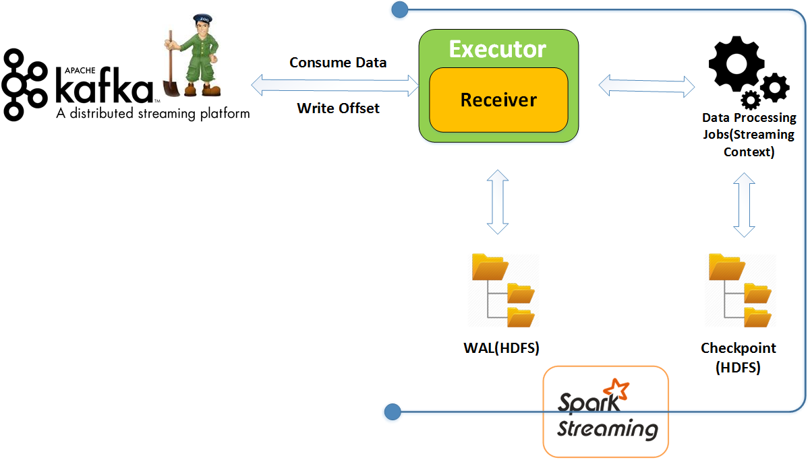

=

Lab 5. Building Spark Streaming Applications with Kafka
--------------------------------------------------------------------


We have gone through all the components of Apache Kafka and different
APIs that can be used to develop an application which can use Kafka. In
the previous lab, we learned about Kafka producer, brokers, and
Kafka consumers, and different concepts related to best practices for
using Kafka as a messaging system.

In this lab, we will cover Apache Spark, which is distributed in
memory processing engines and then we will walk through Spark Streaming
concepts and how we can integrate Apache Kafka with Spark.

In short, we will cover the following topics:


-   Introduction to Spark
-   Internals of Spark such as RDD
-   Spark Streaming
-   Receiver-based approach (Spark-Kafka integration)
-   Direct approach (Spark-Kafka integration)
-   Use case (Log processing)


Introduction to Spark  
--------------------------------------


Apache Spark is distributed in-memory data processing system. It
provides rich set of API in Java, Scala, and Python. Spark API can be
used to develop applications which can do batch and real-time data
processing and analytics, machine learning, and graph processing of huge
volumes of data on a single clustering platform.


### Note

Spark development was started in 2009 by a team at Berkeley\'s AMPLab
for improving the performance of MapReduce framework.


MapReduce is another distributed batch processing framework developed by
Yahoo in context to Google research paper.

What they found was that an application which involves an iterative
approach to solving certain problems can be improvised by reducing disk
I/O. Spark allows us to cache a large set of data in memory and
applications which uses iterative approach of transformation can use
benefit of caching to improve performance. However, the iterative
approach is just a small example of what Spark provides; there are a lot
of features in the current version which can help you solve complex
problems easily. 


### Spark architecture


Like Hadoop, Spark also follows the master/slave architecture, master
daemons called [**Spark drivers**], and multiple slave daemons
called [**executors**].Spark runs on a cluster and uses cluster
resource managers such as YARN, Mesos, or Spark Standalone cluster
manager.

Let\'s walk through each component:


Spark architecture

Spark driver is master in the Spark architecture. It is the entry point
of Spark application.

Spark driver is responsible for the following tasks:


-   [**Spark Context**]: Spark Context is created in Spark
    driver. The Context object is also responsible for
    initializing application configuration.

-   [**DAG creation**]: Spark driver is also responsible for
    creating lineage based on RDD operations and submitting that to DAG
    scheduler. Lineage is [**direct acyclic graph**]
    ([**DAG**]). This graph is now submitted to DAG scheduler.

     

-   [**Stage Creation**]: DAG Scheduler in a driver is
    responsible for creating stages of tasks based on a lineage graph.

-   [**Task Schedule and Execution**]: Once the stage of tasks
    is created, task scheduler in the driver schedule this task using
    cluster manager and control its execution.

-   [**RDD metadata**]: Driver maintains metadata of RDD and
    their partition. In case of partition failure, Spark can easily
    recompute the partition or RDD.


[**Spark workers**]:Spark workers are responsible for managing
executors running on its own machine and making communication with
master node.

They are listed as follows:


-   [**Backend process**]: Each worker node contains one or
    more backend process. Each backend process is responsible for
    launching the executor.
-   [**Executors**]: Each executor consists of a thread pool
    where each thread is responsible for executing tasks in parallel.
    Executors are responsible for reading, processing, and writing data
    to a target location or file.


There is a lot more to the internals of the Spark architecture but they
are beyond the scope of this course. However, we are going to give a basic
overview of Spark.


#### Pillars of Spark


The following are the important pillars of Spark:

[**Resilient Distributed Dataset**] ([**RDD**]): RDD
is the backbone of Spark. RDD is an immutable, distributed, fault
tolerant collection of objects. RDDs are divided into logical partitions
which are computed on different worker machines.

In short, if you read any file in Spark, the data of that file will
together form a single, large RDD. Any filtering operation on this RDD
will produce a new RDD. Remember, RDD is immutable. This means that
every time we modify the RDD, we have a new RDD. This RDD is divided
into logical chunks known as partitions, which is a unit of parallelism
in Spark. Each chunk or partition is processed on a separate distributed
machine.

The following diagram will give you a better idea about partitioning:


RDD partitions

There are two types of operations performed on RDD:


-   [**Transformation**]: Transformation on RDD produces
    another RDD. Transformation means applying some filtering or
    modifying the existing RDD. This produces another RDD.

-   [**Action**]: An action operation is responsible for the
    execution trigger to Spark. Spark lazily evaluates RDD, which means
    unless Spark encounters an action, it does not start execution.
    Action refers to storing the result in a file, dumping the result to
    the console, and so on.


[**Directed acyclic graph (DAG):**] As discussed earlier, RDD
can be transformed and this results in a new RDD, and this process can
go too deep until we execute some action on it. Whenever an action is
encountered, Spark creates a DAG and then submits it to Scheduler.
Let\'s take the following example of a word count in Spark:

```
val conf = new SparkConf().setAppName("wordCount")
val sc = new SparkContext(conf)
val input = sc.textFile(inputFile)
val words = input.flatMap(line => line.split(" "))
val word_counts = words.map(word => (word, 1)).reduceByKey{case (x, y) => x + y}
word_counts.saveAsTextFile(outputFile)
```

Once DAG is submitted, DAG scheduler creates stages of tasks based on
operators. Task scheduler then launches this task with the help of
cluster manager and worker nodes execute it.


#### The Spark ecosystem


As discussed previously, Spark can be used for various purposes, such as
real-time processing, machine learning, graph processing, and so on.
Spark consists of different independent components which can be used
depending on use cases. The following figures give a brief idea about
Spark\'s ecosystem:


Spark ecosystem


-   [**Spark core**]: Spark core is the base and
    generalized layer in Spark ecosystem. It contains basic and common
    functionality which can be used by all the layers preceding it. This
    means that any performance improvement on the core is automatically
    applied to all the components preceding it. RDD, which is main
    abstraction of Spark, is also part of core layer. It also contains
    API which can be used to manipulate RDDs.


Other common functional components such as task scheduler, memory
management, fault tolerance, and the storage interaction layer are also
part of Spark core.


-   [**Spark Streaming**]: Spark Streamingcan be used for
    processing the real-time streaming data. We will be using this while
    discussing integration of Spark with Kafka. Spark Streaming is not
    real-time but its near real-time as it processes data in micro
    batches.
-   [**Spark SQL**]: Spark SQL provides the API that can be
    used to run SQL like queries on a structured RDD, like JSONRDD and
    CSVRDD.
-   [**Spark MLlib**]: MLlib is used to create scalable machine
    learning solutions over Spark. It provides a rich set of machine
    learning algorithms such as regressing, classification, clustering,
    filtering, and so on.
-   [**Spark GraphX**]: GraphX is used to deal with use cases
    where graph processing plays a significant role, such as building a
    recommendation engine for complex social networks. It provides a
    rich set of efficient algorithms and their API which can be used to
    deal with graphs.


Spark Streaming  
--------------------------------


Spark Streaming is built on top of Spark core engine and can be used to
develop a fast, scalable, high throughput, and fault tolerant real-time
system. Streaming data can come from any source, such as production
logs, click-stream data, Kafka, Kinesis, Flume, and many other data
serving systems. Spark streaming provides an API to receive this data
and apply complex algorithms on top of it to get business value out of
this data. Finally, the processed data can be put into any storage
system. We will talk more about Spark Streaming integration with Kafka
in this section.

Basically, we have two approaches to integrate Kafka with Spark and we
will go into detail on each:


-   Receiver-based approach 
-   Direct approach 


The receiver-based approach is the older way of doing integration.
Direct API integration provides lots of advantages over the
receiver-based approach.


### Receiver-based integration


Spark uses Kafka high level consumer API to implement receiver. This is
an old approach and data received from Kafka topic partitions are stored
in Spark executors and processes by streaming jobs. However, Spark
receiver replicates the message across all the executors, so that if one
executor fails, another executor should be able to provide replicated
data for processing. In this way, Spark receiver provides fault
tolerance for data.

The following diagram will give you a good idea about the receiver-based
integration:




Spark receiver based approach

Spark receivers only acknowledge to broker when message is successfully
replicated into executors otherwise it will not commit offset of
messages to Zookeeper and message will be treated as unread. This seems
to handle guaranteed processing but there are still some cases where it
won\'t.


### Note

What would happen if Spark driver fails? When Spark driver fails, it
also kills all the executors, which causes data to be lost which was
available on executor. What if Spark receiver has already sent
acknowledgment for those messages and has successfully committed offset
to Zookeeper? You lose those records because you don\'t know how many of
them have been processed and how many of them have not.


To avoid such problems, we can use a few techniques. Let\'s discuss
them:


-   [**Write-ahead Log (WAL**][**)**]: We have
    discussed data loss scenarios when a driver fails. To avoid data
    loss, Spark introduced write-ahead logs in version 1.2, which allows
    you to save buffered data into a storage system, such as HDFS or S3.
    Once driver is recovered and executors are up, it can simply read
    data from WAL and process it.


However, we need to explicitly enable the write-ahead log while
executing the Spark streaming application and write the logic for
processing the data available in WAL.


-   [**Exactly one Processing**]: WAL may guarantee you no data
    loss but there can be duplicate processing of data by Spark jobs.
    WAL does not guarantee exactly one processing; in other words, it
    does not ensure avoiding duplicate processing of data.


Let\'s take a scenario. Spark reads data from Kafka stores into executor
buffer, replicates it to another executor for fault tolerance. Once the
replication is done, it writes the same message to a write-ahead log and
before sending acknowledgment back to Kafka driver it fails. Now when
the driver recovers from failure, it will first process the data
available in WAL and then will start consuming the messages from Kafka
which will also replay all the messages which have not been acknowledged
by Spark receiver but have been written to WAL and it leads to duplicate
processing of message.


-   [**Checkpoint**]: Spark also provides a way to put
    checkpoints in a streaming application. Checkpoint stores the
    information about what has been executed, what is still in the queue
    to be executed, configuration of application, and so on.


### Note

Enabling checkpoints helps in providing an application\'s important
metadata information which can be useful when driver recovers from
failure to know what it has to process and what it has to with processed
data. Checkpoint data is again stored into persistent systems, such as
HDFS.


#### Disadvantages of receiver-based approach


The following are a few disadvantages of the receiver-based approach:


-   [**Throughput**]: Enabling write-ahead log and checkpoint
    may cause you less throughput because time may be consumed in
    writing data to HDFS. It\'s obvious to have low throughput when
    there is lot of disk I/O involved.
-   [**Storage**]: We store one set of data in Spark executor
    buffer and another set of the same data in write-ahead log HDFS. We
    are using two stores to store the same data and storage needs may
    vary, based on application requirements.
-   [**Data Loss**]: If a write-ahead log is not enabled, there
    is a huge possibility of losing data and it may be very critical for
    some important applications.


#### Java example for receiver-based integration


Let us take an example to be sure:

```
import org.apache.Spark.SparkConf;
import org.apache.Spark.api.java.function.FlatMapFunction;
import org.apache.Spark.api.java.function.Function;
import org.apache.Spark.api.java.function.Function2;
import org.apache.Spark.api.java.function.PairFunction;
import org.apache.Spark.streaming.Duration;
import org.apache.Spark.streaming.api.java.JavaDStream;
import org.apache.Spark.streaming.api.java.JavaPairDStream;
import org.apache.Spark.streaming.api.java.JavaPairReceiverInputDStream;
import org.apache.Spark.streaming.api.java.JavaStreamingContext;
import org.apache.Spark.streaming.kafka.KafkaUtils;
import scala.Tuple2;

import java.util.Arrays;
import java.util.HashMap;
import java.util.Iterator;
import java.util.Map;
import java.util.regex.Pattern;


public class KafkaWordCountJava {
    private static final Pattern WORD_DELIMETER = Pattern.compile(" ");

    public static void main(String[] args) throws Exception {
        String zkQuorum = "localhost:2181";
        String groupName = "stream";
        int numThreads = 3;
        String topicsName = "test";
        SparkConf SparkConf = new SparkConf().setAppName("WordCountKafkaStream");

        JavaStreamingContext javaStreamingContext = new JavaStreamingContext(SparkConf, new Duration(5000));

        Map<String, Integer> topicToBeUsedBySpark = new HashMap<>();
        String[] topics = topicsName.split(",");
        for (String topic : topics) {
            topicToBeUsedBySpark.put(topic, numThreads);
        }

        JavaPairReceiverInputDStream<String, String> streamMessages =
                KafkaUtils.createStream(javaStreamingContext, zkQuorum, groupName, topicToBeUsedBySpark);

        JavaDStream<String> lines = streamMessages.map(new Function<Tuple2<String, String>, String>() {
            @Override
            public String call(Tuple2<String, String> tuple2) {
                return tuple2._2();
            }
        });

        JavaDStream<String> words = lines.flatMap(new FlatMapFunction<String, String>() {
            @Override
            public Iterator<String> call(String x) {
                return Arrays.asList(WORD_DELIMETER.split(x)).iterator();
            }
        });

        JavaPairDStream<String, Integer> wordCounts = words.mapToPair(
                new PairFunction<String, String, Integer>() {
                    @Override
                    public Tuple2<String, Integer> call(String s) {
                        return new Tuple2<>(s, 1);
                    }
                }).reduceByKey(new Function2<Integer, Integer, Integer>() {
            @Override
            public Integer call(Integer i1, Integer i2) {
                return i1 + i2;
            }
        });

        wordCounts.print();
        javaStreamingContext.start();
        javaStreamingContext.awaitTermination();
    }
}
```


#### Scala example for receiver-based integration


Here is an example on Scala:

```
import org.apache.Spark.SparkConf
import org.apache.Spark.streaming.{Minutes, Seconds, StreamingContext}
import org.apache.Spark.streaming.kafka._

object KafkaWordCount {
  def main(args: Array[String]) {
    val zkQuorum:String="localhost:2181"
    val group:String="stream"
    val numThreads:String="3"
    val topics:String="test"

    val SparkConf = new SparkConf().setAppName("KafkaWordCount")
    val ssc = new StreamingContext(SparkConf, Seconds(2))
    ssc.checkpoint("WALCheckpoint")
    val topicMap = topics.split(",").map((_, numThreads.toInt)).toMap
    val lines = KafkaUtils.createStream(ssc, zkQuorum, group, topicMap).map(_._2)
    val words = lines.flatMap(_.split(" "))
    val wordCounts = words.map(x => (x, 1L))
      .reduceByKeyAndWindow(_ + _, _ - _, Minutes(10), Seconds(2), 2)
    wordCounts.print()

    ssc.start()
    ssc.awaitTermination()
  }
}
```


### Direct approach


In receiver-based approach, we saw issues of data loss, costing less
throughput using write-ahead logs and difficulty in achieving exactly
one semantic of data processing. To overcome all these problems, Spark
introduced the direct stream approach of integrating Spark with Kafka.

Spark periodically queries messages from Kafka with a range of offsets,
which in short we call [**batch**]. Spark uses a low level
consumer API and fetches messages directly from Kafka with a defined
range of offsets. Parallelism is defined by a partition in Kafka and the
Spark direct approach takes advantage of partitions.

The following illustration gives a little detail about parallelism:


Direct approach 

Let\'s look at a few features of the direct approach:


-   [**Parallelism and throughput**]: The number of partitions
    in RDD is defined by the number of partitions in a Kafka topic.
    These RDD partitions read messages from Kafka topic partitions in
    parallel. In short, Spark Streaming creates RDD partition equal to
    the number of Kafka partitions available to consume data in parallel
    which increases throughput.
-   [**No write-ahead log**]: Direct approach does not use
    write-ahead log to avoid data loss. Write-ahead log was causing
    extra storage and possibility of leading to duplicate data
    processing in few cases. Direct approach, instead, reads data
    directly from Kafka and commits the offset of processed messages to
    checkpoint. In case of failure, Spark knows where to start.
-   [**No Zookeeper**]: By default, direct approach does not
    use Zookeeper for committing offset consumed by Spark. Spark uses a
    checkpoint mechanism to deal with data loss and to start execution
    from the last execution point in case of failure. However, Zookeeper
    based offset commit can be done using Curator Client.
-   [**Exactly one processing**]: Direct approach provides
    opportunity to achieve exactly one processing, which means that no
    data is processed twice and no data is lost. This is done using
    checkpoint maintained by Spark Streaming application which tells
    Spark Streaming application about where to start in case of failure.


#### Java example for direct approach


Again, let us take a Java example:

```
import java.util.HashMap;
import java.util.HashSet;
import java.util.Arrays;
import java.util.Map;
import java.util.Set;
import java.util.regex.Pattern;

import scala.Tuple2;

import kafka.serializer.StringDecoder;

import org.apache.Spark.SparkConf;
import org.apache.Spark.streaming.api.java.*;
import org.apache.Spark.streaming.kafka.KafkaUtils;
import org.apache.Spark.streaming.Durations;

public class JavaDirectKafkaWordCount {
    private static final Pattern SPACE = Pattern.compile(" ");

    public static void main(String[] args) throws Exception {

        String brokers = "localhost:9092";
        String topics = "test";

        SparkConf SparkConf = new SparkConf().setAppName("DirectKafkaWordCount");
        JavaStreamingContext javaStreamingContext = new JavaStreamingContext(SparkConf, Durations.seconds(2));

        Set<String> topicsSet = new HashSet<>(Arrays.asList(topics.split(",")));
        Map<String, String> kafkaConfiguration = new HashMap<>();
        kafkaConfiguration.put("metadata.broker.list", brokers);

        JavaPairInputDStream<String, String> messages = KafkaUtils.createDirectStream(
                javaStreamingContext,
                String.class,
                String.class,
                StringDecoder.class,
                StringDecoder.class,
                kafkaConfiguration,
                topicsSet
        );

        JavaDStream<String> lines = messages.map(Tuple2::_2);

        JavaDStream<String> words = lines.flatMap(x -> Arrays.asList(SPACE.split(x)).iterator());

        JavaPairDStream<String, Integer> wordCounts = words.mapToPair(s -> new Tuple2<>(s, 1))
                .reduceByKey((i1, i2) -> i1 + i2);

        wordCounts.print();

        javaStreamingContext.start();
        javaStreamingContext.awaitTermination();
    }
}
```


#### Scala example for direct approach


Here is the Scala example for direct approach:

```
import kafka.serializer.StringDecoder
import org.apache.Spark.SparkConf
import org.apache.Spark.streaming.kafka.KafkaUtils
import org.apache.Spark.streaming.{Seconds, StreamingContext}

object DirectKafkaWordCount {
  def main(args: Array[String]) {


    val brokers: String = "localhost:2181"
    val topics: String = "test"

    val SparkConf = new SparkConf().setAppName("DirectKafkaWordCount")
    val ssc = new StreamingContext(SparkConf, Seconds(2))
    val topicsSet = topics.split(",").toSet
    val kafkaParams = Map[String, String]("metadata.broker.list" -> brokers)
    val messages = KafkaUtils.createDirectStream[String, String, StringDecoder, StringDecoder](
      ssc, kafkaParams, topicsSet)

    val lines = messages.map(_._2)
    val words = lines.flatMap(_.split(" "))
    val wordCounts = words.map(x => (x, 1L)).reduceByKey(_ + _)
    wordCounts.print()

    ssc.start()
    ssc.awaitTermination()
  }
}
```


Use case log processing - fraud IP detection 
------------------------------------------------------------


This section will cover a small use case which uses Kafka and Spark
Streaming to detect a fraud IP, and the number of times the IP tried to
hit the server. We will cover the use case in the following:


-    [**Producer**]: We will use Kafka Producer API, which will
    read a log file and publish records to Kafka topic. However, in a
    real case, we may use Flume or producer application, which directly
    takes a log record on a real-time basis and publish to Kafka topic. 
-   [**Fraud IPs list**]: We will maintain a list of predefined
    fraud IP range which can be used to identify fraud IPs. For this
    application we are using in memory IP list which can be replaced by
    fast key based lookup, such as HBase.
-   [**Spark Streaming**]: Spark Streaming application will
    read records from Kafka topic and will detect IPs and domains which
    are suspicious. 


### Maven


[**Maven**] is a build and project management tool and we will
be building this project using Maven. I recommend using Eclipse or
IntelliJ for creating projects. Add the following dependencies and
plugins to your `pom.xml`:

```
<?xml version="1.0" encoding="UTF-8"?>
<project xmlns="http://Maven.apache.org/POM/4.0.0"
         xmlns:xsi="http://www.w3.org/2001/XMLSchema-instance"
         xsi:schemaLocation="http://Maven.apache.org/POM/4.0.0 http://Maven.apache.org/xsd/Maven-4.0.0.xsd">
    <modelVersion>4.0.0</modelVersion>

    <groupId>com.fenago</groupId>
    <artifactId>ip-fraud-detetion</artifactId>
    <version>1.0-SNAPSHOT</version>
    <packaging>jar</packaging>

    <name>kafka-producer</name>

    <properties>
        <project.build.sourceEncoding>UTF-8</project.build.sourceEncoding>
    </properties>


    <dependencies>
        <!-- https://mvnrepository.com/artifact/org.apache.Spark/Spark-streaming-kafka_2.10 -->
        <dependency>
            <groupId>org.apache.Spark</groupId>
            <artifactId>Spark-streaming-kafka_2.10</artifactId>
            <version>1.6.3</version>
        </dependency>


        <!-- https://mvnrepository.com/artifact/org.apache.hadoop/hadoop-common -->
        <dependency>
            <groupId>org.apache.hadoop</groupId>
            <artifactId>hadoop-common</artifactId>
            <version>2.7.2</version>
        </dependency>

        <!-- https://mvnrepository.com/artifact/org.apache.Spark/Spark-core_2.10 -->
        <dependency>
            <groupId>org.apache.Spark</groupId>
            <artifactId>Spark-core_2.10</artifactId>
            <version>2.0.0</version>
            <scope>provided</scope>

        </dependency>
        <!-- https://mvnrepository.com/artifact/org.apache.Spark/Spark-streaming_2.10 -->
        <dependency>
            <groupId>org.apache.Spark</groupId>
            <artifactId>Spark-streaming_2.10</artifactId>
            <version>2.0.0</version>
            <scope>provided</scope>

        </dependency>


        <dependency>
            <groupId>org.apache.kafka</groupId>
            <artifactId>kafka_2.11</artifactId>
            <version>0.10.0.0</version>
        </dependency>
    </dependencies>

    <build>
        <plugins>
            <plugin>
                <groupId>org.apache.Maven.plugins</groupId>
                <artifactId>Maven-shade-plugin</artifactId>
                <version>2.4.2</version>
                <executions>
                    <execution>
                        <phase>package</phase>
                        <goals>
                            <goal>shade</goal>
                        </goals>
                        <configuration>
                            <filters>
                                <filter>
                                    <artifact>junit:junit</artifact>
                                    <includes>
                                        <include>junit/framework/**</include>
                                        <include>org/junit/**</include>
                                    </includes>
                                    <excludes>
                                        <exclude>org/junit/experimental/**</exclude>
                                        <exclude>org/junit/runners/**</exclude>
                                    </excludes>
                                </filter>
                                <filter>
                                    <artifact>*:*</artifact>
                                    <excludes>
                                        <exclude>META-INF/*.SF</exclude>
                                        <exclude>META-INF/*.DSA</exclude>
                                        <exclude>META-INF/*.RSA</exclude>
                                    </excludes>
                                </filter>
                            </filters>
                            <transformers>
                                <transformer
                                        implementation="org.apache.Maven.plugins.shade.resource.ServicesResourceTransformer"/>

                                <transformer
                                        implementation="org.apache.Maven.plugins.shade.resource.ManifestResourceTransformer">
                                    <mainClass>com.fenago.streaming.FraudDetectionApp</mainClass>
                                </transformer>
                            </transformers>
                        </configuration>
                    </execution>
                </executions>
            </plugin>
            <plugin>
                <groupId>org.codehaus.mojo</groupId>
                <artifactId>exec-Maven-plugin</artifactId>
                <version>1.2.1</version>
                <executions>
                    <execution>
                        <goals>
                            <goal>exec</goal>
                        </goals>
                    </execution>
                </executions>
                <configuration>
                    <includeProjectDependencies>true</includeProjectDependencies>
                    <includePluginDependencies>false</includePluginDependencies>
                    <executable>java</executable>
                    <classpathScope>compile</classpathScope>
                    <mainClass>com.fenago.streaming.FraudDetectionApp</mainClass>
                </configuration>
            </plugin>


            <plugin>
                <groupId>org.apache.Maven.plugins</groupId>
                <artifactId>Maven-compiler-plugin</artifactId>
                <configuration>
                    <source>1.8</source>
                    <target>1.8</target>
                </configuration>
            </plugin>
        </plugins>
    </build>
</project>
```


Producer  
-------------------------


You can use IntelliJ or Eclipse to build a producer application. This
producer reads a log file taken from an Apache project which contains
detailed records like:

```
64.242.88.10 - - [08/Mar/2004:07:54:30 -0800] "GET /twiki/bin/edit/Main/Unknown_local_recipient_reject_code?topicparent=Main.ConfigurationVariables HTTP/1.1" 401 12846
```

You can have just one record in the test file and the producer will
produce records by generating random IPs and replace it with existing.
So, we will have millions of distinct records with unique IP addresses.

Record columns are separated by space delimiters, which we change to
commas in producer. The first column represents the IP address or the
domain name which will be used to detect whether the request was from a
fraud client. The following is the Java Kafka producer which remembers
logs.


### Property reader


We preferred to use a property file for some important values such as
topic, Kafka broker URL, and so on. If you want to read more values from
the property file, then feel free to change it in the
code.`streaming.properties` file:

```
topic=ipTest2
broker.list=localhost:9092
appname=IpFraud
group.id=Stream
```

The following is an example of the property reader:

```
import java.io.FileNotFoundException;
import java.io.IOException;
import java.io.InputStream;
import java.util.Properties;

public class PropertyReader {

    private Properties prop = null;

    public PropertyReader() {

        InputStream is = null;
        try {
            this.prop = new Properties();
            is = this.getClass().getResourceAsStream("/streaming.properties");
            prop.load(is);
        } catch (FileNotFoundException e) {
            e.printStackTrace();
        } catch (IOException e) {
            e.printStackTrace();
        }
    }

    public String getPropertyValue(String key) {
        return this.prop.getProperty(key);
    }
}
```


#### Producer code 


A producer application is designed to be like a real-time log producer
where the producer runs every three seconds and produces a new record
with random IP addresses. You can add a few records in
the `IP_LOG.log` file and then the producer will take care of
producing millions of unique records from those three records.

We have also enabled auto creation of topics so you need not create
topic before running your producer application. You can change the topic
name in the `streaming.properties` file mentioned before:

```
import com.fenago.reader.PropertyReader;
import org.apache.kafka.clients.producer.KafkaProducer;
import org.apache.kafka.clients.producer.ProducerRecord;
import org.apache.kafka.clients.producer.RecordMetadata;

import java.io.BufferedReader;
import java.io.File;
import java.io.IOException;
import java.io.InputStreamReader;
import java.util.*;
import java.util.concurrent.Future;


public class IPLogProducer extends TimerTask {
    static String path = "";

    public BufferedReader readFile() {
        BufferedReader BufferedReader = new BufferedReader(new InputStreamReader(
                this.getClass().getResourceAsStream("/IP_LOG.log")));
        return BufferedReader;

    }

    public static void main(final String[] args) {
        Timer timer = new Timer();
        timer.schedule(new IPLogProducer(), 3000, 3000);
    }

    private String getNewRecordWithRandomIP(String line) {
        Random r = new Random();
        String ip = r.nextInt(256) + "." + r.nextInt(256) + "." + r.nextInt(256) + "." + r.nextInt(256);
        String[] columns = line.split(" ");
        columns[0] = ip;
        return Arrays.toString(columns);
    }

    @Override
    public void run() {
        PropertyReader propertyReader = new PropertyReader();

        Properties producerProps = new Properties();
        producerProps.put("bootstrap.servers", propertyReader.getPropertyValue("broker.list"));
        producerProps.put("key.serializer", "org.apache.kafka.common.serialization.StringSerializer");
        producerProps.put("value.serializer", "org.apache.kafka.common.serialization.StringSerializer");
        producerProps.put("auto.create.topics.enable", "true");

        KafkaProducer<String, String> ipProducer = new KafkaProducer<String, String>(producerProps);

        BufferedReader br = readFile();
        String oldLine = "";
        try {
            while ((oldLine = br.readLine()) != null) {
                String line = getNewRecordWithRandomIP(oldLine).replace("[", "").replace("]", "");
                ProducerRecord ipData = new ProducerRecord<String, String>(propertyReader.getPropertyValue("topic"), line);
                Future<RecordMetadata> recordMetadata = ipProducer.send(ipData);
            }
        } catch (IOException e) {
            e.printStackTrace();
        }
        ipProducer.close();
    }
}
```


#### Fraud IP lookup


The following classes will help us as a lookup service which will help
us to identify if request is coming from a fraud IP. We have used
interface before implementing the class so that we can add more NoSQL
databases or any fast lookup service. You can implement this service and
add a lookup service by using HBase or any other fast key lookup
service. We are using in-memory lookup and just added the fraud IP range
in the cache. Add the following code to your project:

```
public interface IIPScanner {

    boolean isFraudIP(String ipAddresses);

}
```

`CacheIPLookup` is the implementation for
the `IIPSCanner` interface which does in memory lookup:

```
import java.io.Serializable;
import java.util.HashSet;
import java.util.Set;


public class CacheIPLookup implements IIPScanner, Serializable {

    private Set<String> fraudIPList = new HashSet<>();

    public CacheIPLookup() {
        fraudIPList.add("212");
        fraudIPList.add("163");
        fraudIPList.add("15");
        fraudIPList.add("224");
        fraudIPList.add("126");
        fraudIPList.add("92");
        fraudIPList.add("91");
        fraudIPList.add("10");
        fraudIPList.add("112");
        fraudIPList.add("194");
        fraudIPList.add("198");
        fraudIPList.add("11");
        fraudIPList.add("12");
        fraudIPList.add("13");
        fraudIPList.add("14");
        fraudIPList.add("15");
        fraudIPList.add("16");
    }


    @Override
    public boolean isFraudIP(String ipAddresses) {

        return fraudIPList.contains(ipAddresses);
    }
}
```


#### Expose hive table


We will create hive table over base directory where a streaming record
is getting pushed on HDFS. This will help us track the number of fraud
records being generated over time:

```
hive> create database fenago;

hive> create external table fenago.teststream (iprecords STRING) LOCATION '/user/fenago/streaming/fraudips';
```

You can also expose hive tables on top of the incoming data which is
being pushed to Kafka topic in order to track the percentage of IPs
being detected as fraud from an overall record. Create one more table
and add the following line to your streaming application explained
later:

```
ipRecords.dstream().saveAsTextFiles("hdfs://localhost:8020/user/fenago/streaming/iprecords", "");
```

Also, create the following table in hive: 

```
create external table fenago.iprecords(iprecords STRING) LOCATION '/user/fenago/streaming/iprecords';
```

Remember, we can also use `SqlContext` to push data to hive,
but for this use case we made it very simple.


#### Streaming code


We haven\'t focused much on modularization in our code. The IP fraud
detection application scans each record and filters those records which
qualify as a the fraud record based on fraud IP lookup service. The
lookup service can be changed to use any fast lookup database. We are
using in memory lookup service for this application:

```
import com.fenago.reader.PropertyReader;
import org.apache.Spark.SparkConf;
import org.apache.Spark.api.java.function.Function;
import org.apache.Spark.streaming.api.java.JavaStreamingContext;
import java.util.Set;
import java.util.regex.Pattern;
import java.util.HashMap;
import java.util.HashSet;
import java.util.Arrays;
import java.util.Map;
import scala.Tuple2;
import kafka.serializer.StringDecoder;
import org.apache.Spark.streaming.api.java.*;
import org.apache.Spark.streaming.kafka.KafkaUtils;
import org.apache.Spark.streaming.Durations;

public class FraudDetectionApp {
    private static final Pattern SPACE = Pattern.compile(" ");

    private static void main(String[] args) throws Exception {
        PropertyReader propertyReader = new PropertyReader();
        CacheIPLookup cacheIPLookup = new CacheIPLookup();
        SparkConf SparkConf = new SparkConf().setAppName("IP_FRAUD").setMaster("local[2]");
        JavaStreamingContext javaStreamingContext = new JavaStreamingContext(SparkConf, Durations.seconds(3));

        Set<String> topicsSet = new HashSet<>(Arrays.asList(propertyReader.getPropertyValue("topic").split(",")));
        Map<String, String> kafkaConfiguration = new HashMap<>();
        kafkaConfiguration.put("metadata.broker.list", propertyReader.getPropertyValue("broker.list"));
        kafkaConfiguration.put("group.id", propertyReader.getPropertyValue("group.id"));

        JavaPairInputDStream<String, String> messages = KafkaUtils.createDirectStream(
                javaStreamingContext,
                String.class,
                String.class,
                StringDecoder.class,
                StringDecoder.class,
                kafkaConfiguration,
                topicsSet
        );
        JavaDStream<String> ipRecords = messages.map(Tuple2::_2);

        JavaDStream<String> fraudIPs = ipRecords.filter(new Function<String, Boolean>() {
            @Override
            public Boolean call(String s) throws Exception {
                String IP = s.split(",")[0];
                String[] ranges = IP.split("\\.");
                String range = null;
                try {
                    range = ranges[0];
                } catch (ArrayIndexOutOfBoundsException ex) {

                }
                return cacheIPLookup.isFraudIP(range);

            }
        });

        fraudIPs.dstream().saveAsTextFiles("hdfs://localhost:8020/user/fenago/streaming/fraudips", "");

        javaStreamingContext.start();
        javaStreamingContext.awaitTermination();
    }
}
```

Run the application using the following command: 

```
Spark-submit --class com.fenago.streaming.FraudDetectionApp --master yarn ip-fraud-detetion-1.0-SNAPSHOT-shaded.jar
```

Once the Spark Streaming application starts, run Kafka producer and
check the records in respective hive tables.


Summary 
-----------------------


In this lab, we learned about Apache Spark, its architecture, and
Spark ecosystem in brief. Our focus was on covering different ways we
can integrate Kafka with Spark and their advantages and disadvantages.
We also covered APIs for the receiver-based approach and direct
approach. Finally, we covered a small use case about IP fraud detection
through the log file and lookup service. You can now create your own
Spark streaming application. In the next lab, we will cover another
real-time streaming application, Apache Heron (successor of Apache
Storm). We will cover how Apache Heron is different from Apache Spark
and when to use which one.
