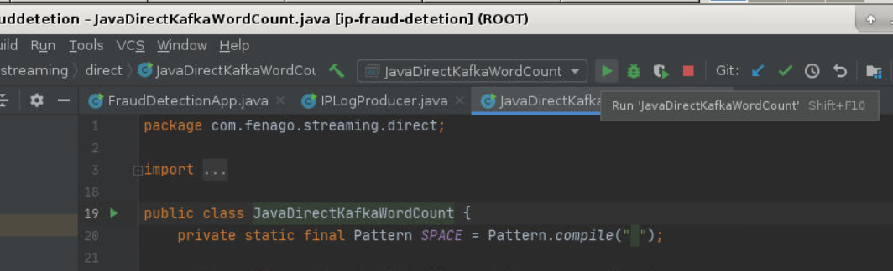
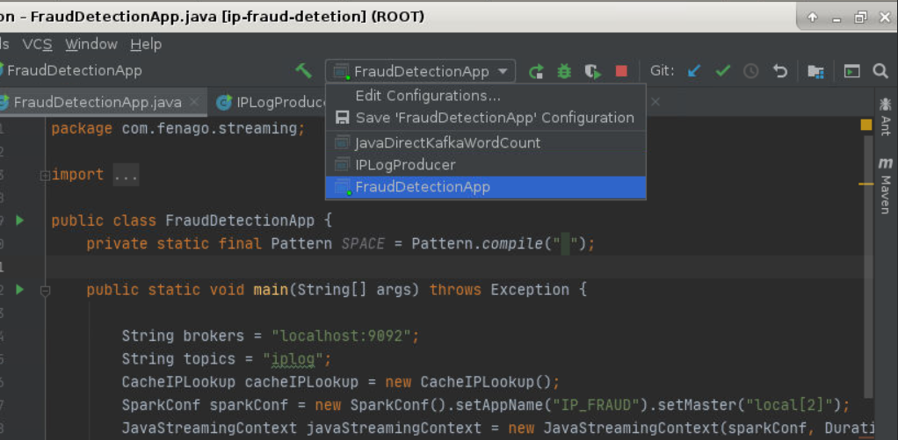
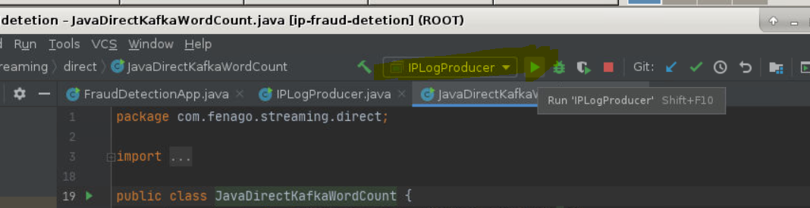

Lab 5. Building Spark Streaming Applications with Kafka
--------------------------------------------------------------------


In this lab, we will cover Apache Spark, which is distributed in
memory processing engines and then we will walk through Spark Streaming
concepts and how we can integrate Apache Kafka with Spark.

In short, we will cover the following topics:


-   Introduction to Spark
-   Direct approach (Spark-Kafka integration)
-   Use case (Log processing)


### Lab Solution

Complete solution for this lab is available in the following directory:

`~/kafka-advanced/labs/Lab05/ipfrauddetetion`


Spark Streaming  
--------------------------------


We have two approaches to integrate Kafka with Spark and we will go into detail on each:


-   Receiver-based approach 
-   Direct approach 


The receiver-based approach is the older way of doing integration.
Direct API integration provides lots of advantages over the
receiver-based approach.


**Apache Spark Installation**

Make sure you have compatible java installed on your machine. You can verify it by typing command:

``` 
java -version
```

Apache spark setup has been downloaded already on the following path and added to $PATH variable:

```
/headless/Downloads/spark-2.4.7-bin-hadoop2.7/
```


#### Start Master


```
cd /headless/Downloads/spark-2.4.7-bin-hadoop2.7/

./sbin/start-master.sh

```


Inspect the response:

``` 
starting org.apache.spark.deploy.master.Master, logging to /headless/Downloads/spark-2.4.7-bin-hadoop2.7/logs/spark--org.apache.spark.deploy.master.Master-1-SandboxHost-637493255759703205.out
```


Once started, the master will print out a spark://HOST:PORT URL for itself, which you can use to connect workers to it, or pass as the “master” argument to SparkContext. You can also find this URL on the master’s web UI, which is http://localhost:8080 by default.

Similarly, you can start one or more workers and connect them to the master via:


#### Start Worker

Start Worker and register the worker with master


Open `http://localhost:8080/` in browser and copy the master url


now start the worker and register it with master using following command (Update <span style="color:red;"> spark://hostname:7077 </span> with the master hostname first):

`./sbin/start-slave.sh spark://hostname:7077`


Worker webUI: `http://localhost:8081`


Once you have started a worker, look at the master’s web UI (http://localhost:8080 by default). You should see the new node listed there, along with its number of CPUs and memory (minus one gigabyte left for the OS).


**Note:** `spark-shell` and `spark-submit` have been added to `PATH` already and also present in following directory:

`/headless/Downloads/spark-2.4.7-bin-hadoop2.7/`

#### Spark Shell

Your cluster on single node is ready now, you can test it using running command **spark-shell**

```
[user@hostname ~]$ spark-shell --master spark://hostname:7077
```


Reload the master webui. You will get one running application:


You can exit the spark shell using typing `:q`  then enter


#### Spark Submit

Now, submit example application using spark-submit. Replace <span style="color:red;"> spark://hostname:7077 </span> with hostname of master node first.


```
spark-submit --class org.apache.spark.examples.SparkPi --master spark://hostname:7077  /headless/Downloads/spark-2.4.7-bin-hadoop2.7/examples/jars/spark-examples_2.11-2.4.7.jar
```


If this example execute successfully, your spark installation is fine. You can see the results in console log:

```
2019-09-12 13:53:27 INFO DAGScheduler:54 - Job 0 finished: reduce at SparkPi.scala:38, took 0.615754 sPi is roughly 3.1416557082785412 2019-09-12 13:53:27 INFO AbstractConnector:318 - Stopped Spark@6914bc2c{HTTP/1.1,[http/1.1]}{0.0.0.0:4040}
```


**Task**

1) Run above spark-submit command but assign '2g' memory. You will get output after running spark-submit command  as shown in the screenshot below:


**Hint:** Add following parameter while running spark-submit `--executor-memory 2g `.


#### Create Kafka Topic
Now, we need to create `test1` in Kafka. To do so, execute the following command:


```
cd ~/kafka-advanced

kafka/bin/kafka-topics.sh --create --zookeeper localhost:2181 --replication-factor 1 --partitions 1 --topic test1
```

#### Direct approach

In receiver-based approach, there are issues of data loss, costing less
throughput using write-ahead logs and difficulty in achieving exactly
one semantic of data processing. To overcome all these problems, Spark
introduced the direct stream approach of integrating Spark with Kafka.


#### Java example for direct approach


Again, let us take a Java example:

```
import java.util.HashMap;
import java.util.HashSet;
import java.util.Arrays;
import java.util.Map;
import java.util.Set;
import java.util.regex.Pattern;

import scala.Tuple2;

import kafka.serializer.StringDecoder;

import org.apache.Spark.SparkConf;
import org.apache.Spark.streaming.api.java.*;
import org.apache.Spark.streaming.kafka.KafkaUtils;
import org.apache.Spark.streaming.Durations;

public class JavaDirectKafkaWordCount {
    private static final Pattern SPACE = Pattern.compile(" ");

    public static void main(String[] args) throws Exception {

        String brokers = "localhost:9092";
        String topics = "test1";

        SparkConf SparkConf = new SparkConf().setAppName("DirectKafkaWordCount").setMaster("local[2]");
        JavaStreamingContext javaStreamingContext = new JavaStreamingContext(SparkConf, Durations.seconds(2));

        Set<String> topicsSet = new HashSet<>(Arrays.asList(topics.split(",")));
        Map<String, String> kafkaConfiguration = new HashMap<>();
        kafkaConfiguration.put("metadata.broker.list", brokers);

        JavaPairInputDStream<String, String> messages = KafkaUtils.createDirectStream(
                javaStreamingContext,
                String.class,
                String.class,
                StringDecoder.class,
                StringDecoder.class,
                kafkaConfiguration,
                topicsSet
        );

        JavaDStream<String> lines = messages.map(Tuple2::_2);

        JavaDStream<String> words = lines.flatMap(x -> Arrays.asList(SPACE.split(x)).iterator());

        JavaPairDStream<String, Integer> wordCounts = words.mapToPair(s -> new Tuple2<>(s, 1))
                .reduceByKey((i1, i2) -> i1 + i2);

        wordCounts.print();

        javaStreamingContext.start();
        javaStreamingContext.awaitTermination();
    }
}
```

#### Edit Configuration


Before running application, check that following checkbox is selected:


#### Run Application
Run the example as shown below:




Use case log processing - fraud IP detection 
------------------------------------------------------------


This section will cover a small use case which uses Kafka and Spark
Streaming to detect a fraud IP, and the number of times the IP tried to
hit the server. We will cover the use case in the following:


- **Producer**: We will use Kafka Producer API, which will
    read a log file and publish records to Kafka topic. However, in a
    real case, we may use Flume or producer application, which directly
    takes a log record on a real-time basis and publish to Kafka topic. 
- **Fraud IPs list**: We will maintain a list of predefined
    fraud IP range which can be used to identify fraud IPs. For this
    application we are using in memory IP list which can be replaced by
    fast key based lookup, such as HBase.
- **Spark Streaming**: Spark Streaming application will
    read records from Kafka topic and will detect IPs and domains which
    are suspicious. 


### Maven


[**Maven**] is a build and project management tool and we will
be building this project using Maven. I recommend using Eclipse or
IntelliJ for creating projects. Add the following dependencies and
plugins to your `pom.xml`:

```
<?xml version="1.0" encoding="UTF-8"?>
<project xmlns="http://Maven.apache.org/POM/4.0.0"
         xmlns:xsi="http://www.w3.org/2001/XMLSchema-instance"
         xsi:schemaLocation="http://Maven.apache.org/POM/4.0.0 http://Maven.apache.org/xsd/Maven-4.0.0.xsd">
    <modelVersion>4.0.0</modelVersion>

    <groupId>com.fenago</groupId>
    <artifactId>ip-fraud-detetion</artifactId>
    <version>1.0-SNAPSHOT</version>
    <packaging>jar</packaging>

    <name>kafka-producer</name>

    <properties>
        <project.build.sourceEncoding>UTF-8</project.build.sourceEncoding>
    </properties>


    <dependencies>
        <!-- https://mvnrepository.com/artifact/org.apache.Spark/Spark-streaming-kafka_2.10 -->
        <dependency>
            <groupId>org.apache.Spark</groupId>
            <artifactId>Spark-streaming-kafka_2.10</artifactId>
            <version>1.6.3</version>
        </dependency>


        <!-- https://mvnrepository.com/artifact/org.apache.hadoop/hadoop-common -->
        <dependency>
            <groupId>org.apache.hadoop</groupId>
            <artifactId>hadoop-common</artifactId>
            <version>2.7.2</version>
        </dependency>

        <!-- https://mvnrepository.com/artifact/org.apache.Spark/Spark-core_2.10 -->
        <dependency>
            <groupId>org.apache.Spark</groupId>
            <artifactId>Spark-core_2.10</artifactId>
            <version>2.0.0</version>
            <scope>provided</scope>

        </dependency>
        <!-- https://mvnrepository.com/artifact/org.apache.Spark/Spark-streaming_2.10 -->
        <dependency>
            <groupId>org.apache.Spark</groupId>
            <artifactId>Spark-streaming_2.10</artifactId>
            <version>2.0.0</version>
            <scope>provided</scope>

        </dependency>


        <dependency>
            <groupId>org.apache.kafka</groupId>
            <artifactId>kafka_2.11</artifactId>
            <version>0.10.0.0</version>
        </dependency>
    </dependencies>

    <build>
        <plugins>
            <plugin>
                <groupId>org.apache.Maven.plugins</groupId>
                <artifactId>Maven-shade-plugin</artifactId>
                <version>2.4.2</version>
                <executions>
                    <execution>
                        <phase>package</phase>
                        <goals>
                            <goal>shade</goal>
                        </goals>
                        <configuration>
                            <filters>
                                <filter>
                                    <artifact>junit:junit</artifact>
                                    <includes>
                                        <include>junit/framework/**</include>
                                        <include>org/junit/**</include>
                                    </includes>
                                    <excludes>
                                        <exclude>org/junit/experimental/**</exclude>
                                        <exclude>org/junit/runners/**</exclude>
                                    </excludes>
                                </filter>
                                <filter>
                                    <artifact>*:*</artifact>
                                    <excludes>
                                        <exclude>META-INF/*.SF</exclude>
                                        <exclude>META-INF/*.DSA</exclude>
                                        <exclude>META-INF/*.RSA</exclude>
                                    </excludes>
                                </filter>
                            </filters>
                            <transformers>
                                <transformer
                                        implementation="org.apache.Maven.plugins.shade.resource.ServicesResourceTransformer"/>

                                <transformer
                                        implementation="org.apache.Maven.plugins.shade.resource.ManifestResourceTransformer">
                                    <mainClass>com.fenago.streaming.FraudDetectionApp</mainClass>
                                </transformer>
                            </transformers>
                        </configuration>
                    </execution>
                </executions>
            </plugin>
            <plugin>
                <groupId>org.codehaus.mojo</groupId>
                <artifactId>exec-Maven-plugin</artifactId>
                <version>1.2.1</version>
                <executions>
                    <execution>
                        <goals>
                            <goal>exec</goal>
                        </goals>
                    </execution>
                </executions>
                <configuration>
                    <includeProjectDependencies>true</includeProjectDependencies>
                    <includePluginDependencies>false</includePluginDependencies>
                    <executable>java</executable>
                    <classpathScope>compile</classpathScope>
                    <mainClass>com.fenago.streaming.FraudDetectionApp</mainClass>
                </configuration>
            </plugin>


            <plugin>
                <groupId>org.apache.Maven.plugins</groupId>
                <artifactId>Maven-compiler-plugin</artifactId>
                <configuration>
                    <source>1.8</source>
                    <target>1.8</target>
                </configuration>
            </plugin>
        </plugins>
    </build>
</project>
```


Producer  
-------------------------


You can use IntelliJ or Eclipse to build a producer application. This
producer reads a log file taken from an Apache project which contains
detailed records like:

```
64.242.88.10 - - [08/Mar/2004:07:54:30 -0800] "GET /twiki/bin/edit/Main/Unknown_local_recipient_reject_code?topicparent=Main.ConfigurationVariables HTTP/1.1" 401 12846
```

You can have just one record in the test file and the producer will
produce records by generating random IPs and replace it with existing.
So, we will have millions of distinct records with unique IP addresses.

Record columns are separated by space delimiters, which we change to
commas in producer. The first column represents the IP address or the
domain name which will be used to detect whether the request was from a
fraud client. The following is the Java Kafka producer which remembers
logs.


### Property reader


We preferred to use a property file for some important values such as
topic, Kafka broker URL, and so on. If you want to read more values from
the property file, then feel free to change it in the
code.`streaming.properties` file:

```
topic=ipTest2
broker.list=localhost:9092
appname=IpFraud
group.id=Stream
```

The following is an example of the property reader:

```
import java.io.FileNotFoundException;
import java.io.IOException;
import java.io.InputStream;
import java.util.Properties;

public class PropertyReader {

    private Properties prop = null;

    public PropertyReader() {

        InputStream is = null;
        try {
            this.prop = new Properties();
            is = this.getClass().getResourceAsStream("/streaming.properties");
            prop.load(is);
        } catch (FileNotFoundException e) {
            e.printStackTrace();
        } catch (IOException e) {
            e.printStackTrace();
        }
    }

    public String getPropertyValue(String key) {
        return this.prop.getProperty(key);
    }
}
```


#### Producer code 


<span style="color:red;">Do not run producer code yet,  we will build and run Spark Streaming application first</span>


A producer application is designed to be like a real-time log producer
where the producer runs every three seconds and produces a new record
with random IP addresses. You can add a few records in
the `IP_LOG.log` file and then the producer will take care of
producing millions of unique records from those three records.

We have also enabled auto creation of topics so you need not create
topic before running your producer application. You can change the topic
name in the `streaming.properties` file mentioned before:

```
import com.fenago.reader.PropertyReader;
import org.apache.kafka.clients.producer.KafkaProducer;
import org.apache.kafka.clients.producer.ProducerRecord;
import org.apache.kafka.clients.producer.RecordMetadata;

import java.io.BufferedReader;
import java.io.File;
import java.io.IOException;
import java.io.InputStreamReader;
import java.util.*;
import java.util.concurrent.Future;


public class IPLogProducer extends TimerTask {
    static String path = "";

    public BufferedReader readFile() {
        BufferedReader BufferedReader = new BufferedReader(new InputStreamReader(
                this.getClass().getResourceAsStream("/IP_LOG.log")));
        return BufferedReader;

    }

    public static void main(final String[] args) {
        Timer timer = new Timer();
        timer.schedule(new IPLogProducer(), 3000, 3000);
    }

    private String getNewRecordWithRandomIP(String line) {
        Random r = new Random();
        String ip = r.nextInt(256) + "." + r.nextInt(256) + "." + r.nextInt(256) + "." + r.nextInt(256);
        String[] columns = line.split(" ");
        columns[0] = ip;
        return Arrays.toString(columns);
    }

    @Override
    public void run() {
        PropertyReader propertyReader = new PropertyReader();

        Properties producerProps = new Properties();
        producerProps.put("bootstrap.servers", propertyReader.getPropertyValue("broker.list"));
        producerProps.put("key.serializer", "org.apache.kafka.common.serialization.StringSerializer");
        producerProps.put("value.serializer", "org.apache.kafka.common.serialization.StringSerializer");
        producerProps.put("auto.create.topics.enable", "true");

        KafkaProducer<String, String> ipProducer = new KafkaProducer<String, String>(producerProps);

        BufferedReader br = readFile();
        String oldLine = "";
        try {
            while ((oldLine = br.readLine()) != null) {
                String line = getNewRecordWithRandomIP(oldLine).replace("[", "").replace("]", "");
                ProducerRecord ipData = new ProducerRecord<String, String>(propertyReader.getPropertyValue("topic"), line);
                Future<RecordMetadata> recordMetadata = ipProducer.send(ipData);
            }
        } catch (IOException e) {
            e.printStackTrace();
        }
        ipProducer.close();
    }
}
```


#### Fraud IP lookup


The following classes will help us as a lookup service which will help
us to identify if request is coming from a fraud IP. We have used
interface before implementing the class so that we can add more NoSQL
databases or any fast lookup service. You can implement this service and
add a lookup service by using HBase or any other fast key lookup
service. We are using in-memory lookup and just added the fraud IP range
in the cache. Add the following code to your project:

```
public interface IIPScanner {

    boolean isFraudIP(String ipAddresses);

}
```

`CacheIPLookup` is the implementation for
the `IIPSCanner` interface which does in memory lookup:

```
import java.io.Serializable;
import java.util.HashSet;
import java.util.Set;


public class CacheIPLookup implements IIPScanner, Serializable {

    private Set<String> fraudIPList = new HashSet<>();

    public CacheIPLookup() {
        fraudIPList.add("212");
        fraudIPList.add("163");
        fraudIPList.add("15");
        fraudIPList.add("224");
        fraudIPList.add("126");
        fraudIPList.add("92");
        fraudIPList.add("91");
        fraudIPList.add("10");
        fraudIPList.add("112");
        fraudIPList.add("194");
        fraudIPList.add("198");
        fraudIPList.add("11");
        fraudIPList.add("12");
        fraudIPList.add("13");
        fraudIPList.add("14");
        fraudIPList.add("15");
        fraudIPList.add("16");
    }


    @Override
    public boolean isFraudIP(String ipAddresses) {

        return fraudIPList.contains(ipAddresses);
    }
}
```


#### Streaming code


We haven\'t focused much on modularization in our code. The IP fraud
detection application scans each record and filters those records which
qualify as a the fraud record based on fraud IP lookup service. The
lookup service can be changed to use any fast lookup database. We are
using in memory lookup service for this application:

```
import com.fenago.reader.PropertyReader;
import org.apache.Spark.SparkConf;
import org.apache.Spark.api.java.function.Function;
import org.apache.Spark.streaming.api.java.JavaStreamingContext;
import java.util.Set;
import java.util.regex.Pattern;
import java.util.HashMap;
import java.util.HashSet;
import java.util.Arrays;
import java.util.Map;
import scala.Tuple2;
import kafka.serializer.StringDecoder;
import org.apache.Spark.streaming.api.java.*;
import org.apache.Spark.streaming.kafka.KafkaUtils;
import org.apache.Spark.streaming.Durations;

public class FraudDetectionApp {
    private static final Pattern SPACE = Pattern.compile(" ");

    private static void main(String[] args) throws Exception {
        PropertyReader propertyReader = new PropertyReader();
        CacheIPLookup cacheIPLookup = new CacheIPLookup();
        SparkConf SparkConf = new SparkConf().setAppName("IP_FRAUD").setMaster("local[2]");
        JavaStreamingContext javaStreamingContext = new JavaStreamingContext(SparkConf, Durations.seconds(3));

        Set<String> topicsSet = new HashSet<>(Arrays.asList(propertyReader.getPropertyValue("topic").split(",")));
        Map<String, String> kafkaConfiguration = new HashMap<>();
        kafkaConfiguration.put("metadata.broker.list", propertyReader.getPropertyValue("broker.list"));
        kafkaConfiguration.put("group.id", propertyReader.getPropertyValue("group.id"));

        JavaPairInputDStream<String, String> messages = KafkaUtils.createDirectStream(
                javaStreamingContext,
                String.class,
                String.class,
                StringDecoder.class,
                StringDecoder.class,
                kafkaConfiguration,
                topicsSet
        );
        JavaDStream<String> ipRecords = messages.map(Tuple2::_2);

        JavaDStream<String> fraudIPs = ipRecords.filter(new Function<String, Boolean>() {
            @Override
            public Boolean call(String s) throws Exception {
                String IP = s.split(",")[0];
                String[] ranges = IP.split("\\.");
                String range = null;
                try {
                    range = ranges[0];
                } catch (ArrayIndexOutOfBoundsException ex) {

                }
                return cacheIPLookup.isFraudIP(range);

            }
        });

        DStream<String> fraudDstream = fraudIPs.dstream();
        fraudDstream.saveAsTextFiles("FraudRecord", "");

        javaStreamingContext.start();
        javaStreamingContext.awaitTermination();
    }
}
```


#### Create Kafka Topic
Now, we need to create `iplog` in Kafka. To do so, execute the following command:


```
cd ~/kafka-advanced

kafka/bin/kafka-topics.sh --create --zookeeper localhost:2181 --replication-factor 1 --partitions 1 --topic iplog
```

#### Run Spark Streaming Application
Once the Spark Streaming application starts, run Kafka producer and check the records.


Before running application, check that following checkbox is selected:


**Step 1:** Run spark streaming code as shown below:




**Step 2:** Run producer code as shown below:




Summary 
-----------------------


In this lab, we learned about Apache Spark. Our focus was on covering different ways we
can integrate Kafka with Spark and their advantages and disadvantages.
We also covered APIs for the receiver-based approach and direct
approach. Finally, we covered a small use case about IP fraud detection
through the log file and lookup service. You can now create your own
Spark streaming application.
