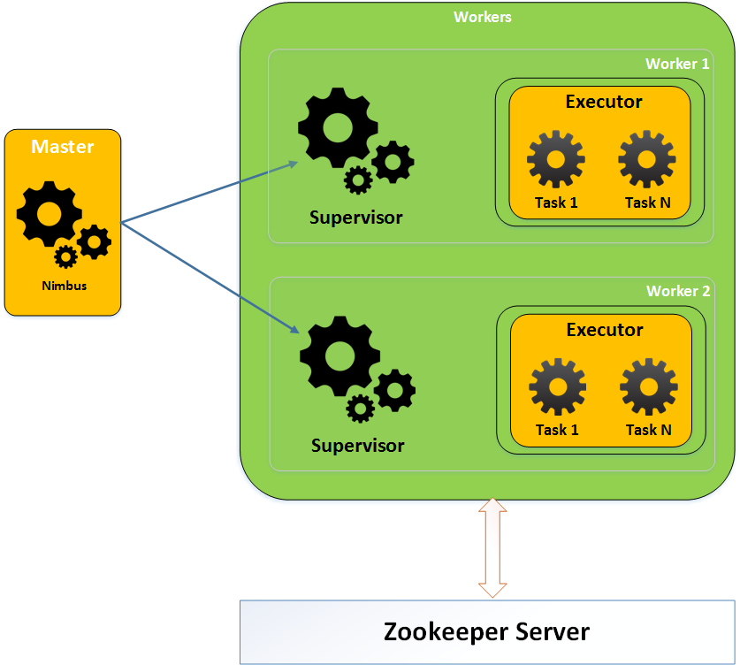
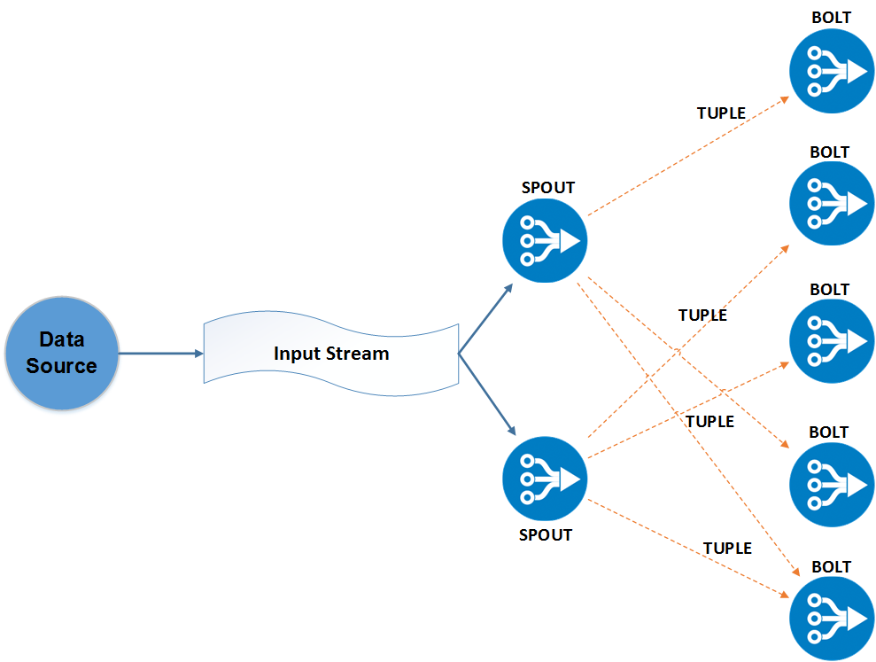
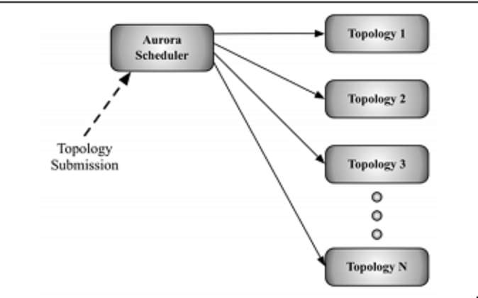
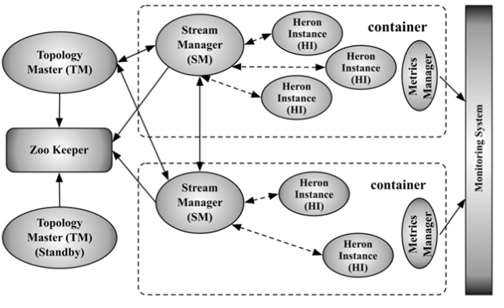

Lab 6. Building Storm Applications with Kafka
----------------------------------------------------------


In the previous lab, we learned about Apache Spark, a near real-time
processing engine which can process data in micro batches. But when it
comes to very low latency applications, where seconds of delay may cause
big trouble, Spark may not be a good fit for you. You would need a
framework which can handle millions of records per second and you would
want to process record by record, instead of processing in batches, for
lower latency. In this lab, we will learn about the real-time
processing engine, Apache Storm. Storm was first designed and developed
by Twitter, which later became an open source Apache project.

In this lab, we will learn about:


-   Introduction to Apache Storm
-   Apache Storm architecture
-   Brief overview of Apache Heron
-   Integrating Apache Storm with Apache Kafka (Java/Scala example)
-   Use case (log processing)


Introduction to Apache Storm 
--------------------------------------------


Apache Storm is used to handle very sensitive applications where even a
delay of 1 second can mean huge losses. There are many companies using
Storm for fraud detection, building recommendation engines, triggering
suspicious activity, and so on. Storm is stateless; it uses Zookeeper
for coordinating purposes, where it maintains important metadata
information.


### Note

Apache Stormis a distributed real-time processing framework which has
the ability to process a single event at a time with millions of records
being processed per second per node. The streaming data can be bounded
or unbounded; in both situations Storm has the capability to reliably
process it.  


### Storm cluster architecture


Storm also follows the master-slave architecture pattern, where Nimbus
is the master and Supervisors are the slaves:


-   [**Nimbus**]: The master node of Storm cluster. All other
    nodes in the cluster are called worker nodes. Nimbus distributes
    data among the worker nodes and also assigns task to worker nodes.
    Nimbus also monitors for worker failure and if a worker fails, it
    reassigns a task to some other worker.
-   [**Supervisors**]: Supervisors are responsible for
    completing tasks assigned by Nimbus and sending available resource
    information. Each worker node has exactly one supervisor and each
    worker node has one or more worker process and each supervisor
    manages multiple worker processes.


 




  Storm architecture 

Remember we said that Storm is stateless; both Nimbus and Supervisor
save its state on Zookeeper. Whenever Nimbus receives a Storm
application execution request, it asks for available resources from
Zookeeper and then schedules the task on available supervisors. It also
saves progress metadata to Zookeeper, so in case of failure, if Nimbus
restarts, it knows where to start again.


### The concept of a Storm application


The Apache Storm application consists of twocomponents: 


-   [**Spout**]: Spout is used to read the stream of data from
    an external source system and pass it to topology for further
    processing. Spout can be either reliable or unreliable.
    
    -   [**Reliable spout**]: Reliable spout is capable of
        replaying the data in case it failed during the processing. In
        such a case, spout waits for acknowledgement for each event it
        has emitted for further processing. Remember this may cost more
        processing time but is extremely helpful for those applications
        for which we cannot manage to lose a single record for
        processing, such as ATM fraud detection applications.
    -   [**Unreliable spout**]: Unreliable spout does not care
        about re-emitting the spout in case of event failure. This can
        be useful where losing 100-200 records does not cause any loss. 
    
-   [**Bolt**]: Processing of records is done in bolts. Stream
    emitted by spout is received by Storm bolt, and after processing,
    the record can be stored in a database, file, or any storage system
    through bolt. 
-   [**Topology: **]Topology is entire flow of an application
    where spout and bolt are bound together to achieve an application
    objective. We create a Storm topology inside a program and then
    submit it to a Storm cluster. Unlike any batch job, Storm topology
    runs forever. If you want to stop a Storm topology, you need to
    handle it separately or kill it forcefully.


Here is a detailed image to help you better understand the different
types of spouts:




Storm topology architecture

One spout can emit data to multiple bolts at a time and can track for an
acknowledgement for all bolts.


### Note

Detailed explanation of the internals of Storm are beyond the scope of
this course. You may refer to Apache Storm documentation at
[http://Storm.apache.org](http://storm.apache.org/). Our focus
will be on how we can leverage Apache Kafka with Apache Storm to build
real-time processing application. 


Introduction to Apache Heron 
--------------------------------------------


Apache Heron is the successor to Apache Storm with backward
compatibility. Apache Heron provides more power in terms of throughput,
latency, and processing capability over Apache Storm as use cases in
Twitter started increasing, they felt of having new stream processing
engine because of the following Storm bottleneck:


-   [**Debugging**]: Twitter faced challenges in debugging due
    to code errors, hardware failures, and so on. The root cause was
    very difficult to detect because of no clear mapping of logical unit
    of computation to physical processing.
-   [**Scale on Demand**]: Storm requires dedicated cluster
    resources, which needs separate hardware resources to run Storm
    topology. This restricts Storm from using cluster resources
    efficiently and limits it to scale on demand. This also limits its
    ability to share cluster resources across different processing
    engines but not just Storm.
-   [**Cluster Manageability**]: Running a new Storm topology
    requires manual isolation of machines. Also killing the topology
    requires decommissioning of machines allocated to that topology.
    Think about doing this in production environment. It will cost you
    more in terms of infrastructure cost, manageability cost, and
    productivity for users.


### Note

Apache Heron is the successor of Apache Storm, with backward
compatibility. Apache Heron provides more power in terms of throughput,
latency, and processing capability over Apache Storm.


Keeping all these limitations as an preference, Twitter decided to build
a new Stream processing engine, which could overcome these limitations
and also run an old Storm production topology efficiently. 


### Heron architecture 


The development of Heron started with Storm\'s compatibility. Heron also
runs topology and all topologies is submitted to the scheduler known as
[**Aurora**][**scheduler**]. Aurora scheduler runs
each topology as an Aurora job on multiple containers. Each job consists
of multiple topology processes discussed in [*Topology
architecture*] section.

Here is an illustration to help you understand better:

 




   Heron architecture 


#### Heron topology architecture


The Heron topology is similar to Storm topology, which consist of spout
and bolt, where spout is responsible for reading the input from source
and bolt is responsible for doing the actual processing. The following
core components of Heron topology are discussed in depth in the sections
as follows:


-   Topology Master
-   Container
-   Stream Manager
-   Heron Instance
-   Metrics Manager
-   Heron Tracker




[**      **]Heron topology architecture 

The concepts are explained as follows:


-   [**Topology Master**]: Similar to Application Master in
    YARN, Heron also creates multiple containers and creates
    a [**Topology Master **]([**TM**]) on first
    container which manages end to end life cycle of topology.Topology
    Master also creates an entry in Zookeeper so that it\'s easily
    discoverable and no other Topology Master exists for the same
    topology.
-   [**Containers**]: The concept of container is similar to
    that of YARN where one machine can have multiple containers running
    on their own JVM. Each container has single [**Stream
    Manager**] ([**SM**]), single Metric Manager, and
    multiple [**Heron Instance**] ([**HI**]). Each
    container communicates with TM to ensure correctness of topology.
-   [**Stream Manager**]: The name itself indicates its
    functionality; it manages the routing of streams within the
    topology. All the Stream Managers are connected with each other to
    ensure back-pressure is handled efficiently. If it finds that any
    bolt is processing streams very slowly, it manages spout serving
    data to that bolt and cuts off input to bolt.
-   [**Heron Instance**]: Each Heron Instance in a container is
    connected to Stream Manager, and they are responsible for running
    the actual spout and bolt of topology. It helps in making the
    debugging process very easy, as each Heron instance is a JVM
    process.
-   [**Metric Manager**]: As discussed previously, each
    container contains one Metric Manager. Stream Manager and all Heron
    instances report their metrics to Metric Manager, which then sends
    these metrics to monitoring system. This makes monitoring of
    topology simple and saves lots of effort and development time.


Integrating Apache Kafka with Apache Storm - Java 
-----------------------------------------------------------------


As discussed previously, we are now familiar with the Storm topology
concept and will now look into how we can integrate Apache Storm with
Apache Kafka. Apache Kafka is most widely used with Apache Storm in
production applications. Let us look into different APIs available for
integration:


-   [**KafkaSpout**]: Spout in Storm is responsible for
    consuming data from the source system and passing it to bolts for
    further processing. KafkaSpout is specially designed for consuming
    data from Kafka as a stream and then passing it to bolts for further
    processing. KafkaSpout accepts `SpoutConfig`, which
    contains information about Zookeeper, Kafka brokers, and topics to
    connect with.


Look at the following code:

```
SpoutConfig spoutConfig = new SpoutConfig(hosts, inputTopic, "/" + zkRootDir, consumerGroup);
spoutConfig.scheme = new SchemeAsMultiScheme(new StringScheme());
spoutConfig.forceFromStart = false;
spoutConfig.startOffsetTime = kafka.api.OffsetRequest.LatestTime();
```


-   Spout acts as a Kafka consumer and therefore it needs to manage
    the offset of records somewhere. Spout uses Zookeeper to store the
    offset, and the last two parameters in `SpoutConfig`
    denote the Zookeeper root directory path and `ID` for this
    particular spout. The offset will be stored as shown next, where
    `0`, `1` are the partition numbers:


```
zkRootDir/consumerID/0
zkRootDir/consumerID/1
zkRootDir/consumerID/2
```


-   [**SchemeAsMultiScheme**]: It indicates how the ByteBuffer
    consumed from Kafka gets transformed into a Storm tuple. We have
    used the `StringScheme` implementation which will convert
    bytebuffer into string.


Now the configuration is passed to `KafkaSpout` and the spout
is set to topology:

```
KafkaSpout kafkaSpout = new KafkaSpout(spoutConfig);
```

We will now take a famous wordcount example and will run our Storm
topology. 


### Example


We will be taking the famous wordcount example for Storm Kafka
integration, where `KafkaSpout` will read input from kafka
topic and it will be processed by split bolt and count bolt. Let\'s
start with topology class.

[**Topology Class**]: The flow connection of spouts and bolts
together forms a topology. In the following code, we have
the `TopologyBuilder` class which allows us to set the
connection flow: 

```
TopologyBuilder topologyBuilder = new TopologyBuilder();
 topologyBuilder.setSpout("kafkaspout", new KafkaSpout(kafkaSpoutConfig));
 topologyBuilder.setBolt("stringsplit", new StringToWordsSpliterBolt()).shuffleGrouping("kafkaspout");
 topologyBuilder.setBolt("counter", new WordCountCalculatorBolt()).shuffleGrouping("stringsplit"); 
```

In the preceding code, we can see that spout is set to
`KafkaSpout` and then `kafkaspout` is passed an
input to string split bolt and splitbolt is passed to wordcount bolt. In
this way, end to end topology pipeline gets created.

```
import org.apache.Storm.Config;
import org.apache.Storm.LocalCluster;
import org.apache.Storm.StormSubmitter;
import org.apache.Storm.kafka.*;
import org.apache.Storm.spout.SchemeAsMultiScheme;
import org.apache.Storm.topology.TopologyBuilder;

public class KafkaStormWordCountTopology {
    public static void main(String[] args) throws Exception {

        String zkConnString = "localhost:2181";
        String topic = "words";
        BrokerHosts hosts = new ZkHosts(zkConnString);

        SpoutConfig kafkaSpoutConfig = new SpoutConfig(hosts, topic, "/" + topic,
                "wordcountID");
        kafkaSpoutConfig.startOffsetTime = kafka.api.OffsetRequest.EarliestTime();
        kafkaSpoutConfig.scheme = new SchemeAsMultiScheme(new StringScheme());

        TopologyBuilder topologyBuilder = new TopologyBuilder();
        topologyBuilder.setSpout("kafkaspout", new KafkaSpout(kafkaSpoutConfig));
        topologyBuilder.setBolt("stringsplit", new StringToWordsSpliterBolt()).shuffleGrouping("kafkaspout");
        topologyBuilder.setBolt("counter", new WordCountCalculatorBolt()).shuffleGrouping("stringsplit");

        Config config = new Config();
        config.setDebug(true);
        if (args != null && args.length > 1) {
            config.setNumWorkers(3);
            StormSubmitter.submitTopology(args[1], config, topologyBuilder.createTopology());
        } else {
            // Cap the maximum number of executors that can be spawned
            // for a component to 3
            config.setMaxTaskParallelism(3);
            // LocalCluster is used to run locally
            LocalCluster cluster = new LocalCluster();
            cluster.submitTopology("KafkaLocal", config, topologyBuilder.createTopology());
            // sleep
            try {
                Thread.sleep(10000);
            } catch (InterruptedException e) {
                // TODO Auto-generated catch block
                cluster.killTopology("KafkaToplogy");
                cluster.shutdown();
            }

            cluster.shutdown();
        }
    }
}
```

[**String Split Bolt:**] This is responsible for splitting
lines into words and then transferring it to the next bolt in the
topology pipeline:

```
import org.apache.Storm.task.OutputCollector;
import org.apache.Storm.task.TopologyContext;
import org.apache.Storm.topology.IRichBolt;
import org.apache.Storm.topology.OutputFieldsDeclarer;
import org.apache.Storm.tuple.Fields;
import org.apache.Storm.tuple.Tuple;
import org.apache.Storm.tuple.Values;

import java.util.Map;

public class StringToWordsSpliterBolt implements IRichBolt {
    private OutputCollector collector;


    public void prepare(Map StormConf, TopologyContext context,
                        OutputCollector collector) {
        this.collector = collector;
    }


    public void execute(Tuple input) {
        String line = input.getString(0);
        String[] words = line.split(" ");

        for(String word: words) {
            if(!word.isEmpty()) {
                collector.emit(new Values(word));
            }

        }

        collector.ack(input);
    }

    public void declareOutputFields(OutputFieldsDeclarer declarer) {
        declarer.declare(new Fields("word"));
    }

    @Override
    public void cleanup() {}

    @Override
    public Map<String, Object> getComponentConfiguration() {
        return null;
    }
```

[**Wordcount Calculator Bolt**]: It takes the input emitted by
split bolt and then stores its count in Map, which finally gets dumped
into console:

```
import org.apache.Storm.task.OutputCollector;
import org.apache.Storm.task.TopologyContext;
import org.apache.Storm.topology.IRichBolt;
import org.apache.Storm.topology.OutputFieldsDeclarer;
import org.apache.Storm.tuple.Tuple;
import java.util.HashMap;
import java.util.Map;

public class WordCountCalculatorBolt implements IRichBolt {
    Map<String, Integer> wordCountMap;
    private OutputCollector collector;


    public void prepare(Map StormConf, TopologyContext context,
                        OutputCollector collector) {
        this.wordCountMap = new HashMap<String, Integer>();
        this.collector = collector;
    }


    public void execute(Tuple input) {
        String str = input.getString(0);
        str = str.toLowerCase().trim();
        if (!wordCountMap.containsKey(str)) {
            wordCountMap.put(str, 1);
        } else {
            Integer c = wordCountMap.get(str) + 1;
            wordCountMap.put(str, c);
        }

        collector.ack(input);
    }


    public void cleanup() {
        for (Map.Entry<String, Integer> entry : wordCountMap.entrySet()) {
            System.out.println(entry.getKey() + " : " + entry.getValue());
        }
    }

    @Override
    public void declareOutputFields(OutputFieldsDeclarer declarer) {

    }

    @Override
    public Map<String, Object> getComponentConfiguration() {
        return null;
    }
}
```


Integrating Apache Kafka with Apache Storm - Scala 
------------------------------------------------------------------


This section contains the Scala version of the wordcount program
discussed previously.[**Topology Class**]: Let us try the
topology class with Scala:

```
import org.apache.Storm.Config
import org.apache.Storm.LocalCluster
import org.apache.Storm.StormSubmitter
import org.apache.Storm.kafka._
import org.apache.Storm.spout.SchemeAsMultiScheme
import org.apache.Storm.topology.TopologyBuilder

object KafkaStormWordCountTopology {

  def main(args: Array[String]): Unit = {
    val zkConnString: String = "localhost:2181"
    val topic: String = "words"
    val hosts: BrokerHosts = new ZkHosts(zkConnString)
    val kafkaSpoutConfig: SpoutConfig =
      new SpoutConfig(hosts, topic, "/" + topic, "wordcountID")
    kafkaSpoutConfig.startOffsetTime = kafka.api.OffsetRequest.EarliestTime()
    kafkaSpoutConfig.scheme = new SchemeAsMultiScheme(new StringScheme())
    val topologyBuilder: TopologyBuilder = new TopologyBuilder()
    topologyBuilder.setSpout("kafkaspout", new KafkaSpout(kafkaSpoutConfig))
    topologyBuilder
      .setBolt("stringsplit", new StringToWordsSpliterBolt())
      .shuffleGrouping("kafkaspout")
    topologyBuilder
      .setBolt("counter", new WordCountCalculatorBolt())
      .shuffleGrouping("stringsplit")
    val config: Config = new Config()
    config.setDebug(true)
    if (args != null && args.length > 1) {
      config.setNumWorkers(3)
      StormSubmitter.submitTopology(args(1),
                                    config,
                                    topologyBuilder.createTopology())
    } else {
// for a component to 3
      config.setMaxTaskParallelism(3)
// LocalCluster is used to run locally
      val cluster: LocalCluster = new LocalCluster()
      cluster.submitTopology("KafkaLocal",
                             config,
                             topologyBuilder.createTopology())
// sleep
      try Thread.sleep(10000)
      catch {
        case e: InterruptedException => {
          cluster.killTopology("KafkaToplogy")
          cluster.shutdown()
        }

      }
      cluster.shutdown()
    }
// Cap the maximum number of executors that can be spawned
// Cap the maximum number of executors that can be spawned
  }

}
```

[**String Split Bolt**]: The same String Split Bolt on Scala:

```
import org.apache.Storm.task.OutputCollector
import org.apache.Storm.task.TopologyContext
import org.apache.Storm.topology.IRichBolt
import org.apache.Storm.topology.OutputFieldsDeclarer
import org.apache.Storm.tuple.Fields
import org.apache.Storm.tuple.Tuple
import org.apache.Storm.tuple.Values
import java.util.Map


class StringToWordsSpliterBolt extends IRichBolt {

  private var collector: OutputCollector = _

  def prepare(StormConf: Map[_, _],
              context: TopologyContext,
              collector: OutputCollector): Unit = {
    this.collector = collector
  }

  def execute(input: Tuple): Unit = {
    val line: String = input.getString(0)
    val words: Array[String] = line.split(" ")
    for (word <- words if !word.isEmpty) {
      collector.emit(new Values(word))
    }
    collector.ack(input)
  }

  def declareOutputFields(declarer: OutputFieldsDeclarer): Unit = {
    declarer.declare(new Fields("fraudIP"))
  }

  override def cleanup(): Unit = {}

  override def getComponentConfiguration(): Map[String, Any] = null

}
```

[**Wordcount Bolt**]: Example of Wordcount Bolt is given next:

```
import org.apache.Storm.task.OutputCollector
import org.apache.Storm.task.TopologyContext
import org.apache.Storm.topology.IRichBolt
import org.apache.Storm.topology.OutputFieldsDeclarer
import org.apache.Storm.tuple.Tuple
import java.util.HashMap
import java.util.Map

class WordCountCalculatorBolt extends IRichBolt {

  var wordCountMap: Map[String, Integer] = _

  private var collector: OutputCollector = _

  def prepare(StormConf: Map[_, _],
              context: TopologyContext,
              collector: OutputCollector): Unit = {
    this.wordCountMap = new HashMap[String, Integer]()
    this.collector = collector
  }

  def execute(input: Tuple): Unit = {
    var str: String = input.getString(0)
    str = str.toLowerCase().trim()
    if (!wordCountMap.containsKey(str)) {
      wordCountMap.put(str, 1)
    } else {
      val c: java.lang.Integer = wordCountMap.get(str) + 1
      wordCountMap.put(str, c)
    }
    collector.ack(input)
  }

  def cleanup(): Unit = {
    for ((key, value) <- wordCountMap) {
      println(key + " : " + value)
    }
  }

  override def declareOutputFields(declarer: OutputFieldsDeclarer): Unit = {}

  override def getComponentConfiguration(): Map[String, Any] = null

}
```


Use case -- log processing in Storm, Kafka, Hive 
----------------------------------------------------------------


We will use the same use case of IP Fraud Detection which we used in Lab 5. Let us begin with
the code and how it works. Copy the following classes from Lab 5,
[*Building Spark Streaming Applications with Kafka*], into
your Storm Kafka use case:

`pom.xml`:

```
<?xml version="1.0" encoding="UTF-8"?>
<project xmlns="http://maven.apache.org/POM/4.0.0"
         xmlns:xsi="http://www.w3.org/2001/XMLSchema-instance"
         xsi:schemaLocation="http://maven.apache.org/POM/4.0.0 http://maven.apache.org/xsd/maven-4.0.0.xsd">
    <modelVersion>4.0.0</modelVersion>

    <groupId>com.fenago</groupId>
    <artifactId>lab6</artifactId>
    <version>1.0-SNAPSHOT</version>

    <properties>
        <project.build.sourceEncoding>UTF-8</project.build.sourceEncoding>
    </properties>

    <dependencies>

        <!-- https://mvnrepository.com/artifact/org.apache.Storm/Storm-hive -->
        <dependency>
            <groupId>org.apache.Storm</groupId>
            <artifactId>Storm-hive</artifactId>
            <version>1.0.0</version>
            <exclusions>
                <exclusion><!-- possible scala confilict -->
                    <groupId>jline</groupId>
                    <artifactId>jline</artifactId>
                </exclusion>
            </exclusions>
        </dependency>


        <dependency>
            <groupId>junit</groupId>
            <artifactId>junit</artifactId>
            <version>3.8.1</version>
            <scope>test</scope>
        </dependency>

        <dependency>
            <groupId>org.apache.hadoop</groupId>
            <artifactId>hadoop-hdfs</artifactId>
            <version>2.6.0</version>
            <scope>compile</scope>
        </dependency>

        <!-- https://mvnrepository.com/artifact/org.apache.Storm/Storm-kafka -->
        <dependency>
            <groupId>org.apache.Storm</groupId>
            <artifactId>Storm-kafka</artifactId>
            <version>1.0.0</version>
        </dependency>
        <!-- https://mvnrepository.com/artifact/org.apache.Storm/Storm-core -->
        <dependency>
            <groupId>org.apache.Storm</groupId>
            <artifactId>Storm-core</artifactId>
            <version>1.0.0</version>
            <scope>provided</scope>
        </dependency>
        <dependency>
            <groupId>org.apache.kafka</groupId>
            <artifactId>kafka_2.10</artifactId>
            <version>0.8.1.1</version>
            <exclusions>
                <exclusion>
                    <groupId>org.apache.zookeeper</groupId>
                    <artifactId>zookeeper</artifactId>
                </exclusion>
                <exclusion>
                    <groupId>log4j</groupId>
                    <artifactId>log4j</artifactId>
                </exclusion>
            </exclusions>
        </dependency>

        <dependency>
            <groupId>commons-collections</groupId>
            <artifactId>commons-collections</artifactId>
            <version>3.2.1</version>
        </dependency>
        <dependency>
            <groupId>com.google.guava</groupId>
            <artifactId>guava</artifactId>
            <version>15.0</version>
        </dependency>

    </dependencies>

    <build>
        <plugins>

            <plugin>
                <groupId>org.apache.maven.plugins</groupId>
                <artifactId>maven-shade-plugin</artifactId>
                <version>2.4.2</version>
                <executions>
                    <execution>
                        <phase>package</phase>
                        <goals>
                            <goal>shade</goal>
                        </goals>
                        <configuration>
                            <filters>
                                <filter>
                                    <artifact>junit:junit</artifact>
                                    <includes>
                                        <include>junit/framework/**</include>
                                        <include>org/junit/**</include>
                                    </includes>
                                    <excludes>
                                        <exclude>org/junit/experimental/**</exclude>
                                        <exclude>org/junit/runners/**</exclude>
                                    </excludes>
                                </filter>
                                <filter>
                                    <artifact>*:*</artifact>
                                    <excludes>
                                        <exclude>META-INF/*.SF</exclude>
                                        <exclude>META-INF/*.DSA</exclude>
                                        <exclude>META-INF/*.RSA</exclude>
                                    </excludes>
                                </filter>
                            </filters>
                            <transformers>
                                <transformer
                                        implementation="org.apache.maven.plugins.shade.resource.ServicesResourceTransformer"/>

                                <transformer
                                        implementation="org.apache.maven.plugins.shade.resource.ManifestResourceTransformer">
                                    <mainClass>com.fenago.Storm.ipfrauddetection.IPFraudDetectionTopology</mainClass>
                                </transformer>
                            </transformers>
                        </configuration>
                    </execution>
                </executions>
            </plugin>
            <plugin>
                <groupId>org.codehaus.mojo</groupId>
                <artifactId>exec-maven-plugin</artifactId>
                <version>1.2.1</version>
                <executions>
                    <execution>
                        <goals>
                            <goal>exec</goal>
                        </goals>
                    </execution>
                </executions>
                <configuration>
                    <includeProjectDependencies>true</includeProjectDependencies>
                    <includePluginDependencies>false</includePluginDependencies>
                    <executable>java</executable>
                    <classpathScope>compile</classpathScope>
                    <mainClass>com.fenago.Storm.ipfrauddetection.IPFraudDetectionTopology</mainClass>
                </configuration>
            </plugin>
            <plugin>
                <groupId>org.apache.maven.plugins</groupId>
                <artifactId>maven-compiler-plugin</artifactId>
                <configuration>
                    <source>1.6</source>
                    <target>1.6</target>
                </configuration>
            </plugin>
        </plugins>
    </build>
</project>
```


### Producer


We will be reusing the producer code from the previous lab.

`streaming.properties` file:

```
topic=iprecord
broker.list=10.200.99.197:6667
appname=IpFraud
group.id=Stream
```

Property Reader:

```
import java.io.FileNotFoundException;
import java.io.IOException;
import java.io.InputStream;
import java.util.Properties;

public class PropertyReader {

    private Properties prop = null;

    public PropertyReader() {

        InputStream is = null;
        try {
            this.prop = new Properties();
            is = this.getClass().getResourceAsStream("/streaming.properties");
            prop.load(is);
        } catch (FileNotFoundException e) {
            e.printStackTrace();
        } catch (IOException e) {
            e.printStackTrace();
        }
    }

    public String getPropertyValue(String key) {
        return this.prop.getProperty(key);
    }
}
```


#### Producer code 


Our producer application is designed like a real-time log producer,
where the producer runs every three seconds and produces a new record
with random IP addresses. You can add a few records in the
`IP_LOG.log` file and then the producer will take care of
producing millions of unique records from those three records.

We have also enabled auto creation of topics, so you need not create a
topic before running your producer application. You can change the topic
name in the `streaming.properties` file mentioned previously.

```
import com.fenago.reader.PropertyReader;
import org.apache.kafka.clients.producer.KafkaProducer;
import org.apache.kafka.clients.producer.ProducerRecord;
import org.apache.kafka.clients.producer.RecordMetadata;

import java.io.BufferedReader;
import java.io.File;
import java.io.IOException;
import java.io.InputStreamReader;
import java.util.*;
import java.util.concurrent.Future;


public class IPLogProducer extends TimerTask {
    static String path = "";

    public BufferedReader readFile() {
        BufferedReader BufferedReader = new BufferedReader(new InputStreamReader(
                this.getClass().getResourceAsStream("/IP_LOG.log")));
        return BufferedReader;

    }

    public static void main(final String[] args) {
        Timer timer = new Timer();
        timer.schedule(new IPLogProducer(), 3000, 3000);
    }

    private String getNewRecordWithRandomIP(String line) {
        Random r = new Random();
        String ip = r.nextInt(256) + "." + r.nextInt(256) + "." + r.nextInt(256) + "." + r.nextInt(256);
        String[] columns = line.split(" ");
        columns[0] = ip;
        return Arrays.toString(columns);
    }

    @Override
    public void run() {
        PropertyReader propertyReader = new PropertyReader();

        Properties producerProps = new Properties();
        producerProps.put("bootstrap.servers", propertyReader.getPropertyValue("broker.list"));
        producerProps.put("key.serializer", "org.apache.kafka.common.serialization.StringSerializer");
        producerProps.put("value.serializer", "org.apache.kafka.common.serialization.StringSerializer");
        producerProps.put("auto.create.topics.enable", "true");

        KafkaProducer<String, String> ipProducer = new KafkaProducer<String, String>(producerProps);

        BufferedReader br = readFile();
        String oldLine = "";
        try {
            while ((oldLine = br.readLine()) != null) {
                String line = getNewRecordWithRandomIP(oldLine).replace("[", "").replace("]", "");
                ProducerRecord ipData = new ProducerRecord<String, String>(propertyReader.getPropertyValue("topic"), line);
                Future<RecordMetadata> recordMetadata = ipProducer.send(ipData);
            }
        } catch (IOException e) {
            e.printStackTrace();
        }
        ipProducer.close();
    }
}
```


##### Fraud IP lookup


The following classes will help us to identify if requests are coming
from a fraudulent IP. We have used interface before implementing the
class so that we can add more NoSQL databases or any fast lookup
services. You can implement this service and add a lookup service by
using HBase or any other fast key lookup service.

We are using `InMemoryLookup` and have just added the fraud IP
range in the cache. Add the following code to your project:

```
public interface IIPScanner {

    boolean isFraudIP(String ipAddresses);

}
```

`CacheIPLookup`is one implementation for
the `IIPScanner` interface which does in-memory lookup.

```
import java.io.Serializable;
import java.util.HashSet;
import java.util.Set;


public class CacheIPLookup implements IIPScanner, Serializable {

    private Set<String> fraudIPList = new HashSet<>();

    public CacheIPLookup() {
        fraudIPList.add("212");
        fraudIPList.add("163");
        fraudIPList.add("15");
        fraudIPList.add("224");
        fraudIPList.add("126");
        fraudIPList.add("92");
        fraudIPList.add("91");
        fraudIPList.add("10");
        fraudIPList.add("112");
        fraudIPList.add("194");
        fraudIPList.add("198");
        fraudIPList.add("11");
        fraudIPList.add("12");
        fraudIPList.add("13");
        fraudIPList.add("14");
        fraudIPList.add("15");
        fraudIPList.add("16");
    }


    @Override
    public boolean isFraudIP(String ipAddresses) {

        return fraudIPList.contains(ipAddresses);
    }
}
```


###  Storm application


This section will help you create IP Fraud detection application with
the help of Apache Kafka and Apache Storm. Storm will read data from
Kafka topic, which contains IP log records, and then will do the
necessary detection processing and dump the records into hive and Kafka
simultaneously. Our Topology consist of following component:


-   [**Kafka Spout**]: It will read a Stream of records from
    Kafka and will send it to two bolts
-   [**Fraud Detector Bolt**]: This bolt will process the
    record emitted by Kafka spout and will emit fraud records to Hive
    and Kafka bolt
-   [**Hive Bolt**]: This bolt will read the data emitted by
    fraud detector bolt and will process and push those records to hive
    table
-   [**Kafka Bolt**]: This bolt will do the same processing as
    Hive bolt, but will push the resulting data to a different Kafka
    topic


`iptopology.properties`:

```
zkhost = localhost:2181
inputTopic =iprecord
outputTopic=fraudip
KafkaBroker =localhost:6667
consumerGroup=id7
metaStoreURI = thrift://localhost:9083
dbName = default
tblName = fraud_ip
```

[**Hive Table**]: Create the following table in hive; this
table will store the records emitted by Hive bolt:

```
DROP TABLE IF EXISTS fraud_ip;
CREATE TABLE fraud_ip(
ip String,
date String,
request_url String,
protocol_type String,
status_code String
)
PARTITIONED BY (col1 STRING)
CLUSTERED BY (col3) into 5 buckets
STORED AS ORC;
```

`IPFraudDetectionTopology`: This class will build the topology
which indicates how spout and bolts are connected together to form Storm
topology. This is the main class of our application and we will use it
while submitting our topology to Storm cluster.

```
import com.fenago.Storm.example.StringToWordsSpliterBolt;
import com.fenago.Storm.example.WordCountCalculatorBolt;
import org.apache.log4j.Logger;
import org.apache.Storm.Config;
import org.apache.Storm.LocalCluster;
import org.apache.Storm.StormSubmitter;
import org.apache.Storm.generated.AlreadyAliveException;
import org.apache.Storm.generated.AuthorizationException;
import org.apache.Storm.generated.InvalidTopologyException;
import org.apache.Storm.hive.bolt.HiveBolt;
import org.apache.Storm.hive.bolt.mapper.DelimitedRecordHiveMapper;
import org.apache.Storm.hive.common.HiveOptions;
import org.apache.Storm.kafka.*;
import org.apache.Storm.spout.SchemeAsMultiScheme;
import org.apache.Storm.topology.TopologyBuilder;
import org.apache.Storm.tuple.Fields;

import java.io.FileInputStream;
import java.io.IOException;
import java.io.InputStream;
import java.util.Properties;


public class IPFraudDetectionTopology {

    private static String zkhost, inputTopic, outputTopic, KafkaBroker, consumerGroup;
    private static String metaStoreURI, dbName, tblName;
    private static final Logger logger = Logger.getLogger(IPFraudDetectionTopology.class);

    public static void Intialize(String arg) {
        Properties prop = new Properties();
        InputStream input = null;

        try {
            logger.info("Loading Configuration File for setting up input");
            input = new FileInputStream(arg);
            prop.load(input);
            zkhost = prop.getProperty("zkhost");
            inputTopic = prop.getProperty("inputTopic");
            outputTopic = prop.getProperty("outputTopic");
            KafkaBroker = prop.getProperty("KafkaBroker");
            consumerGroup = prop.getProperty("consumerGroup");
            metaStoreURI = prop.getProperty("metaStoreURI");
            dbName = prop.getProperty("dbName");
            tblName = prop.getProperty("tblName");

        } catch (IOException ex) {
            logger.error("Error While loading configuration file" + ex);

        } finally {
            if (input != null) {
                try {
                    input.close();
                } catch (IOException e) {
                    logger.error("Error Closing input stream");

                }
            }
        }

    }

    public static void main(String[] args) throws AlreadyAliveException, InvalidTopologyException, AuthorizationException {
        Intialize(args[0]);
        logger.info("Successfully loaded Configuration ");


        BrokerHosts hosts = new ZkHosts(zkhost);
        SpoutConfig spoutConfig = new SpoutConfig(hosts, inputTopic, "/" + KafkaBroker, consumerGroup);
        spoutConfig.scheme = new SchemeAsMultiScheme(new StringScheme());
        spoutConfig.startOffsetTime = kafka.api.OffsetRequest.EarliestTime();
        KafkaSpout kafkaSpout = new KafkaSpout(spoutConfig);
        String[] partNames = {"status_code"};
        String[] colNames = {"date", "request_url", "protocol_type", "status_code"};

        DelimitedRecordHiveMapper mapper = new DelimitedRecordHiveMapper().withColumnFields(new Fields(colNames))
                .withPartitionFields(new Fields(partNames));


        HiveOptions hiveOptions;
        //make sure you change batch size and all paramtere according to requirement
        hiveOptions = new HiveOptions(metaStoreURI, dbName, tblName, mapper).withTxnsPerBatch(250).withBatchSize(2)
                .withIdleTimeout(10).withCallTimeout(10000000);

        logger.info("Creating Storm Topology");
        TopologyBuilder builder = new TopologyBuilder();

        builder.setSpout("KafkaSpout", kafkaSpout, 1);

        builder.setBolt("frauddetect", new FraudDetectorBolt()).shuffleGrouping("KafkaSpout");
        builder.setBolt("KafkaOutputBolt",
                new IPFraudKafkaBolt(zkhost, "kafka.serializer.StringEncoder", KafkaBroker, outputTopic), 1)
                .shuffleGrouping("frauddetect");

        builder.setBolt("HiveOutputBolt", new IPFraudHiveBolt(), 1).shuffleGrouping("frauddetect");
        builder.setBolt("HiveBolt", new HiveBolt(hiveOptions)).shuffleGrouping("HiveOutputBolt");

        Config conf = new Config();
        if (args != null && args.length > 1) {
            conf.setNumWorkers(3);
            logger.info("Submiting  topology to Storm cluster");

            StormSubmitter.submitTopology(args[1], conf, builder.createTopology());
        } else {
            // Cap the maximum number of executors that can be spawned
            // for a component to 3
            conf.setMaxTaskParallelism(3);
            // LocalCluster is used to run locally
            LocalCluster cluster = new LocalCluster();
            logger.info("Submitting  topology to local cluster");
            cluster.submitTopology("KafkaLocal", conf, builder.createTopology());
            // sleep
            try {
                Thread.sleep(10000);
            } catch (InterruptedException e) {
                // TODO Auto-generated catch block
                logger.error("Exception ocuured" + e);
                cluster.killTopology("KafkaToplogy");
                logger.info("Shutting down cluster");
                cluster.shutdown();
            }
            cluster.shutdown();

        }

    }
}
```

[**Fraud Detector Bolt**]: This bolt will read the tuples
emitted by Kafka spout and will detect which record is fraud by using an
in memory IP lookup service. It will then emit the fraud records to
`hivebolt` and `kafkabolt` simultaneously: 

```
package com.fenago.Storm.ipfrauddetection;

import com.fenago.Storm.utils.CacheIPLookup;
import com.fenago.Storm.utils.IIPScanner;
import org.apache.Storm.task.OutputCollector;
import org.apache.Storm.task.TopologyContext;
import org.apache.Storm.topology.IRichBolt;
import org.apache.Storm.topology.OutputFieldsDeclarer;
import org.apache.Storm.topology.base.BaseRichBolt;
import org.apache.Storm.tuple.Fields;
import org.apache.Storm.tuple.Tuple;
import org.apache.Storm.tuple.Values;

import java.util.Map;

public class FraudDetectorBolt extends BaseRichBolt {
    private IIPScanner cacheIPLookup = new CacheIPLookup();
    private OutputCollector collector;


    @Override
    public void prepare(Map map, TopologyContext topologyContext, OutputCollector outputCollector) {
        this.collector = outputCollector;
    }

    @Override
    public void execute(Tuple input) {
        String ipRecord = (String) input.getValue(0);
        String[] columns = ipRecord.split(",");

        String IP = columns[0];
        String[] ranges = IP.split("\\.");
        String range = null;
        try {
            range = ranges[0];
        } catch (ArrayIndexOutOfBoundsException ex) {

        }
        boolean isFraud = cacheIPLookup.isFraudIP(range);

        if (isFraud) {
            Values value = new Values(ipRecord);
            collector.emit(value);
            collector.ack(input);
        }
    }


    @Override
    public void declareOutputFields(OutputFieldsDeclarer outputFieldsDeclarer) {
        outputFieldsDeclarer.declare(new Fields("fraudip"));
    }
}
```

`IPFraudHiveBolt`: This call will process the records emitted
by fraud detector bolt and will push the data to Hive using a thrift
service: 

```
package com.fenago.Storm.ipfrauddetection;

import com.fenago.Storm.utils.CacheIPLookup;
import com.fenago.Storm.utils.IIPScanner;
import org.apache.log4j.Logger;
import org.apache.Storm.task.OutputCollector;
import org.apache.Storm.task.TopologyContext;
import org.apache.Storm.topology.OutputFieldsDeclarer;
import org.apache.Storm.topology.base.BaseRichBolt;
import org.apache.Storm.tuple.Fields;
import org.apache.Storm.tuple.Tuple;
import org.apache.Storm.tuple.Values;

import java.util.Map;


public class IPFraudHiveBolt extends BaseRichBolt {
    private static final long serialVersionUID = 1L;
    private static final Logger logger = Logger.getLogger(IPFraudHiveBolt.class);
    OutputCollector _collector;
    private IIPScanner cacheIPLookup = new CacheIPLookup();

    public void prepare(Map StormConf, TopologyContext context, OutputCollector collector) {
        _collector = collector;
    }

    public void execute(Tuple input) {
        String ipRecord = (String) input.getValue(0);
        String[] columns = ipRecord.split(",");
        Values value = new Values(columns[0], columns[3], columns[4], columns[5], columns[6]);
        _collector.emit(value);
        _collector.ack(input);


    }

    public void declareOutputFields(OutputFieldsDeclarer ofDeclarer) {
        ofDeclarer.declare(new Fields("ip", "date", "request_url", "protocol_type", "status_code"));
    }
}
```

`IPFraudKafkaBolt`: This uses the Kafka Producer API to push
the processed fraud IP to another Kafka topic:

```
package com.fenago.Storm.ipfrauddetection;

import com.fenago.Storm.utils.CacheIPLookup;
import com.fenago.Storm.utils.IIPScanner;
import org.apache.kafka.clients.producer.KafkaProducer;
import org.apache.kafka.clients.producer.Producer;
import org.apache.kafka.clients.producer.ProducerRecord;
import org.apache.kafka.clients.producer.RecordMetadata;
import org.apache.log4j.Logger;
import org.apache.Storm.task.OutputCollector;
import org.apache.Storm.task.TopologyContext;
import org.apache.Storm.topology.OutputFieldsDeclarer;
import org.apache.Storm.topology.base.BaseRichBolt;
import org.apache.Storm.tuple.Fields;
import org.apache.Storm.tuple.Tuple;

import java.util.HashMap;
import java.util.Map;
import java.util.Properties;
import java.util.concurrent.Future;


public class IPFraudKafkaBolt extends BaseRichBolt {
    private static final long serialVersionUID = 1L;
    private Producer<String, String> producer;
    private String zkConnect, serializerClass, topic, brokerList;
    private static final Logger logger = Logger.getLogger(IPFraudKafkaBolt.class);
    private Map<String, String> valueMap = new HashMap<String, String>();
    private String dataToTopic = null;
    OutputCollector _collector;
    private IIPScanner cacheIPLookup = new CacheIPLookup();


    public IPFraudKafkaBolt(String zkConnect, String serializerClass, String brokerList, String topic) {
        this.zkConnect = zkConnect;
        this.serializerClass = serializerClass;
        this.topic = topic;
        this.brokerList = brokerList;
    }

    public void prepare(Map StormConf, TopologyContext context, OutputCollector collector) {
        logger.info("Intializing Properties");
        _collector = collector;
        Properties props = new Properties();
        props.put("zookeeper.connect", zkConnect);
        props.put("serializer.class", serializerClass);
        props.put("metadata.broker.list", brokerList);
        KafkaProducer<String, String> producer = new KafkaProducer<String, String>(props);


    }

    public void execute(Tuple input) {

        dataToTopic = (String) input.getValue(0);
        ProducerRecord data = new ProducerRecord<String, String>(topic, this.dataToTopic);
        Future<RecordMetadata> recordMetadata = producer.send(data);
        _collector.ack(input);

    }

    public void declareOutputFields(OutputFieldsDeclarer declarer) {
        declarer.declare(new Fields("null"));
    }
}
```


### Running the project


Execute the following permission before running the project:

```
sudo su - hdfs -c "hdfs dfs -chmod 777 /tmp/hive"           
 sudo chmod 777 /tmp/hive  
```


-   To run in cluster mode, we need to execute as:


```
Storm jar /home/ldap/chanchals/kafka-Storm-integration-0.0.1-SNAPSHOT.jar com.fenago.Storm.ipfrauddetection.IPFraudDetectionTopology iptopology.properties TopologyName
```


-   To run in local mode, we need to execute as:


```
Storm jar kafka-Storm-integration-0.0.1-SNAPSHOT.jar com.fenago.Storm.ipfrauddetection.IPFraudDetectionTopology iptopology.properties 
```


Summary 
-----------------------


In this lab, we learned about Apache Storm architecture in brief and
we also went through the limitations of Storm which motivated Twitter to
develop Heron. We also discussed Heron architecture and its components.
Later, we went through the API and an example of Storm Kafka
integration. We also covered IP Fraud detection use cases and learned
how to create a topology. In the next lab, we will learn about the
Confluent Platform for Apache Kafka, which provides lots of advanced
tools and features which we can use with Kafka. 
