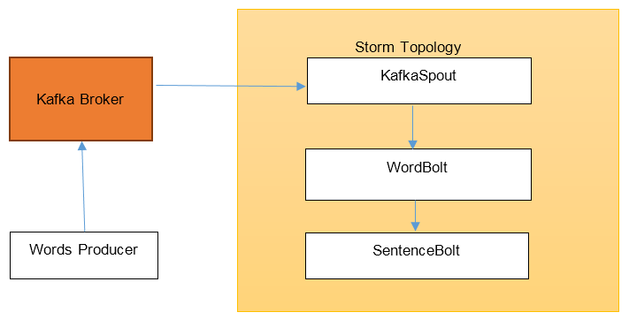
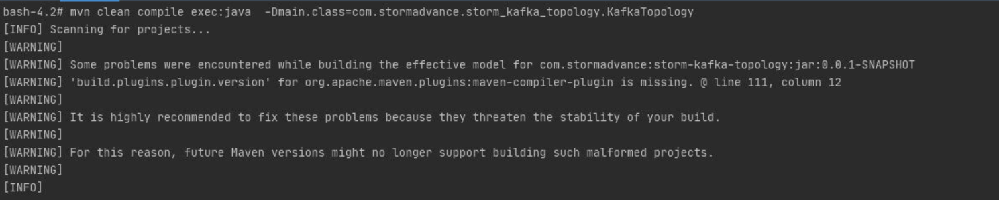

Lab 6. Building Storm Applications with Kafka
----------------------------------------------------------

In this lab, we will be covering the following topics:

- Kafka producers and publishing data into Kafka
- Kafka Storm integration


**Note:** Make sure that zookeeper and kafka are running before proceeding.


<h3><span style="color:red;">Task 1: Kafka producers and publishing data into Kafka</span></h3>

In this section we are writing a Kafka producer that will publish events into the Kafka topic. Complete solution for this task is available in the following directory:

`~/kafka-advanced/labs/Lab06/kafka-producer`


Open project in IntelliJ as shown below:


Wait for import to be completed and then run kafka producer application:


You will get following output:


Perform the following step to create the producer:

1.  Create a Maven project by using `com.stormadvance` as
    `groupId` and `kafka-producer` as
    `artifactId`.
2.  Add the following dependencies for Kafka in the `pom.xml` file:


```
<dependency> 
  <groupId>org.apache.kafka</groupId> 
  <artifactId>kafka_2.10</artifactId> 
  <version>0.9.0.1</version> 
  <exclusions> 
    <exclusion> 
      <groupId>com.sun.jdmk</groupId> 
      <artifactId>jmxtools</artifactId> 
    </exclusion> 
    <exclusion> 
      <groupId>com.sun.jmx</groupId> 
      <artifactId>jmxri</artifactId> 
    </exclusion> 
  </exclusions> 
</dependency> 
<dependency> 
  <groupId>org.apache.logging.log4j</groupId> 
  <artifactId>log4j-slf4j-impl</artifactId> 
  <version>2.0-beta9</version> 
</dependency> 
<dependency> 
  <groupId>org.apache.logging.log4j</groupId> 
  <artifactId>log4j-1.2-api</artifactId> 
  <version>2.0-beta9</version> 
</dependency>  
```


3.  Add the following `build` plugins to
    the `pom.xml` file. It will let us execute the producer
    using Maven:
    
```
<build> 
  <plugins> 
    <plugin> 
      <groupId>org.codehaus.mojo</groupId> 
      <artifactId>exec-maven-plugin</artifactId> 
      <version>1.2.1</version> 
      <executions> 
        <execution> 
          <goals> 
            <goal>exec</goal> 
          </goals> 
        </execution> 
      </executions> 
      <configuration> 
        <executable>java</executable
        <includeProjectDependencies>true</includeProjectDependencies
        <includePluginDependencies>false</includePluginDependencies> 
        <classpathScope>compile</classpathScope> 
        <mainClass>com.stormadvance.kafka_producer.KafkaSampleProducer 
        </mainClass> 
      </configuration> 
    </plugin> 
  </plugins> 
</build> 
```


4.  Now we will create the `KafkaSampleProducer` class in the
    `com.stormadvance.kafka_producer` package. This class will
    produce each word from the first paragraph of Franz Kafka\'s
    Metamorphosis into the `new_topic` topic in Kafka as
    single message. The following is the code for the
    `KafkaSampleProducer` class with explanations:

```
public class KafkaSampleProducer { 
  public static void main(String[] args) { 
    // Build the configuration required for connecting to Kafka 
    Properties props = new Properties(); 
 
    // List of kafka borkers. Complete list of brokers is not required as 
    // the producer will auto discover the rest of the brokers. 
    props.put("bootstrap.servers", "Broker1-IP:9092"); 
    props.put("batch.size", 1); 
    // Serializer used for sending data to kafka. Since we are sending string, 
    // we are using StringSerializer. 
    props.put("key.serializer", "org.apache.kafka.common.serialization.StringSerializer"); 
    props.put("value.serializer", "org.apache.kafka.common.serialization.StringSerializer"); 
 
    props.put("producer.type", "sync"); 
          
    // Create the producer instance 
    Producer<String, String> producer = new KafkaProducer<String, String>(props); 
 
    // Now we break each word from the paragraph 
    for (String word : METAMORPHOSIS_OPENING_PARA.split("\\s")) { 
      System.out.println("word : " + word); 
      // Create message to be sent to "new_topic" topic with the word 
      ProducerRecord<String, String> data = new ProducerRecord<String, String>("new_topic",word, word); 
      // Send the message 
      producer.send(data); 
    } 
 
    // close the producer 
    producer.close(); 
    System.out.println("end : "); 
  } 
 
  // First paragraph from Franz Kafka's Metamorphosis 
  private static String METAMORPHOSIS_OPENING_PARA = "One morning, when Gregor Samsa woke from troubled dreams, he found " 
               + "himself transformed in his bed into a horrible vermin.  He lay on " 
               + "his armour-like back, and if he lifted his head a little he could " 
               + "see his brown belly, slightly domed and divided by arches into stiff " 
               + "sections.  The bedding was hardly able to cover it and seemed ready " 
               + "to slide off any moment.  His many legs, pitifully thin compared " 
               + "with the size of the rest of him, waved about helplessly as he " 
               + "looked."; 
 
}  
```


5.  Now, before running the producer, we need to create `new_topic` in Kafka. To do so, execute the following command:


```
cd ~/kafka-advanced
```

```
kafka/bin/kafka-topics.sh --create --zookeeper localhost:2181 --replication-factor 1 --partitions 1 --topic new_topic
```


6.  Now we can run the producer as shown below:


7.  Now let us verify that the message has been produced by using Kafka\'s console consumer and executing the following command:


```
cd ~/kafka-advanced

kafka/bin/kafka-console-consumer.sh --bootstrap-server localhost:9092 --topic new_topic --from-beginning
```


So, we are able to produce messages into Kafka. In the next section, we
will see how we can use `KafkaSpout` to read messages from
Kafka and process them inside a Storm topology.


<h3><span style="color:red;">Task 2: Kafka Storm integration</span></h3>


Now we will create a Storm topology that will consume messages from the
Kafka topic `new_topic` and aggregate words into sentences.

The complete message flow is shown as follows:




We have already seen `KafkaSampleProducer`, which produces
words into the Kafka broker. Now we will create a Storm topology that
will read those words from Kafka to aggregate them into sentences. For
this, we will have one `KafkaSpout` in the application that
will read the messages from Kafka and two bolts, `WordBolt`
that receive words from `KafkaSpout` and then aggregate them
into sentences, which are then passed onto the `SentenceBolt`,
which simply prints them on the output stream. We will be running this
topology in a local mode.

#### Lab Solution

Complete solution for this task is available in the following directory:

`~/kafka-advanced/labs/Lab06/storm-kafka-topology`

Open Folder in vscode or intellij, we will run this examples using mavan cli. Compile and run java code as shown below:



You will get following output:


Follow the steps to create the Storm topology:


1.  Create a new Maven project with `groupId`
    as `com.stormadvance` and `artifactId`
    as `kafka-storm-topology`.
  
2.  Add the following dependencies for Kafka-Storm and Storm in the `pom.xml` file:

```
<dependency> 
  <groupId>org.apache.storm</groupId> 
  <artifactId>storm-kafka</artifactId> 
  <version>1.0.2</version> 
  <exclusions> 
    <exclusion> 
      <groupId>org.apache.kafka</groupId> 
      <artifactId>kafka-clients</artifactId> 
    </exclusion> 
  </exclusions> 
</dependency> 
 
<dependency> 
  <groupId>org.apache.kafka</groupId> 
  <artifactId>kafka_2.10</artifactId> 
  <version>0.9.0.1</version> 
  <exclusions> 
    <exclusion> 
      <groupId>com.sun.jdmk</groupId> 
      <artifactId>jmxtools</artifactId> 
    </exclusion> 
    <exclusion> 
      <groupId>com.sun.jmx</groupId> 
      <artifactId>jmxri</artifactId> 
    </exclusion> 
  </exclusions> 
</dependency> 
 
<dependency> 
  <groupId>org.apache.storm</groupId> 
  <artifactId>storm-core</artifactId> 
  <version>1.0.2</version> 
  <scope>provided</scope> 
</dependency> 
<dependency> 
  <groupId>commons-collections</groupId> 
  <artifactId>commons-collections</artifactId> 
  <version>3.2.1</version> 
</dependency> 
 
<dependency> 
  <groupId>com.google.guava</groupId> 
  <artifactId>guava</artifactId> 
  <version>15.0</version> 
</dependency>  
```

3.  Add the following Maven plugins to the `pom.xml` file so
    that we are able to run it from the command-line and also to package
    the topology to be executed in Storm:

```
<build> 
  <plugins> 
    <plugin> 
      <artifactId>maven-assembly-plugin</artifactId> 
      <configuration> 
        <descriptorRefs> 
          descriptorRef>jar-with-dependencies</descriptorRef> 
        </descriptorRefs> 
        <archive> 
          <manifest> 
            <mainClass></mainClass> 
          </manifest> 
        </archive> 
      </configuration> 
      <executions> 
        <execution> 
          <id>make-assembly</id> 
          <phase>package</phase> 
          <goals> 
            <goal>single</goal> 
          </goals> 
        </execution> 
      </executions> 
    </plugin> 
 
    <plugin> 
      <groupId>org.codehaus.mojo</groupId> 
      <artifactId>exec-maven-plugin</artifactId> 
      <version>1.2.1</version> 
      <executions> 
        <execution> 
          <goals> 
            <goal>exec</goal> 
          </goals> 
        </execution> 
      </executions> 
      <configuration> 
        <executable>java</executable
        <includeProjectDependencies>true</includeProjectDependencies
        <includePluginDependencies>false</includePluginDependencies> 
        <classpathScope>compile</classpathScope> 
        <mainClass>${main.class}</mainClass> 
      </configuration> 
    </plugin> 
 
    <plugin> 
      <groupId>org.apache.maven.plugins</groupId> 
      <artifactId>maven-compiler-plugin</artifactId> 
    </plugin> 
 
  </plugins> 
</build> 
```


4.  Now we will first create the `WordBolt` that will
    aggregate the words into sentences. For this, create a class called
    `WordBolt` in the `com.stormadvance.storm_kafka_topology` package. The code for
    `WordBolt` is as follows, complete with explanation:
```
public class WordBolt extends BaseBasicBolt { 
 
  private static final long serialVersionUID = -5353547217135922477L; 
 
  // list used for aggregating the words 
  private List<String> words = new ArrayList<String>(); 
 
  public void execute(Tuple input, BasicOutputCollector collector) { 
    System.out.println("called"); 
    // Get the word from the tuple 
    String word = input.getString(0); 
 
    if (StringUtils.isBlank(word)) { 
      // ignore blank lines 
      return; 
    } 
 
    System.out.println("Received Word:" + word); 
 
    // add word to current list of words 
    words.add(word); 
 
    if (word.endsWith(".")) { 
      // word ends with '.' which means this is // the end of the sentence 
      // publish a sentence tuple 
      collector.emit(ImmutableList.of((Object) StringUtils.join(words, ' '))); 
 
      // reset the words list. 
      words.clear(); 
    } 
  } 
 
  public void declareOutputFields(OutputFieldsDeclarer declarer) { 
    // here we declare we will be emitting tuples with 
    // a single field called "sentence" 
    declarer.declare(new Fields("sentence")); 
  } 
} 
```


5.  Next is `SentenceBolt`, which just prints the sentences
    that it receives. Create `SentenceBolt` in
    the `com.stormadvance.storm_kafka_topology` package. The code is as
    follows, with explanations:

```
public class SentenceBolt extends BaseBasicBolt { 
 
  private static final long serialVersionUID = 7104400131657100876L; 
 
  public void execute(Tuple input, BasicOutputCollector collector) { 
    // get the sentence from the tuple and print it 
    System.out.println("Recieved Sentence:"); 
    String sentence = input.getString(0); 
    System.out.println("Recieved Sentence:" + sentence); 
  } 
 
  public void declareOutputFields(OutputFieldsDeclarer declarer) { 
         // we don't emit anything 
  } 
} 
```

 


6.  Now we will create the `KafkaTopology` that will define
    the `KafkaSpout` and wire it with `WordBolt` and
    `SentenceBolt`. Create a new class
    called `KafkaTopology` in
    the `com.stormadvance.storm_kafka_topology` package. The code is as
    follows, with explanations:

```
public class KafkaTopology { 
  public static void main(String[] args) { 
    try { 
      // ZooKeeper hosts for the Kafka cluster 
      BrokerHosts zkHosts = new ZkHosts("ZKIP:PORT"); 
 
      // Create the KafkaSpout configuartion 
      // Second argument is the topic name 
      // Third argument is the zookeepr root for Kafka 
      // Fourth argument is consumer group id 
      SpoutConfig kafkaConfig = new SpoutConfig(zkHosts, "new_topic", "", "id1"); 
 
      // Specify that the kafka messages are String 
      // We want to consume all the first messages in the topic everytime 
      // we run the topology to help in debugging. In production, this 
      // property should be false 
      kafkaConfig.scheme = new SchemeAsMultiScheme(new StringScheme()); 
      kafkaConfig.startOffsetTime = kafka.api.OffsetRequest.EarliestTime(); 
 
      // Now we create the topology 
      TopologyBuilder builder = new TopologyBuilder(); 
 
      // set the kafka spout class 
      builder.setSpout("KafkaSpout", new KafkaSpout(kafkaConfig), 2); 
 
      // set the word and sentence bolt class 
      builder.setBolt("WordBolt", new WordBolt(), 1).globalGrouping("KafkaSpout"); 
      builder.setBolt("SentenceBolt", new SentenceBolt(), 1).globalGrouping("WordBolt"); 
 
      // create an instance of LocalCluster class for executing topology 
      // in local mode. 
      LocalCluster cluster = new LocalCluster(); 
      Config conf = new Config(); 
      conf.setDebug(true); 
      if (args.length > 0) { 
        conf.setNumWorkers(2); 
        conf.setMaxSpoutPending(5000); 
        StormSubmitter.submitTopology("KafkaToplogy1", conf, builder.createTopology()); 
 
      } else { 
        // Submit topology for execution 
        cluster.submitTopology("KafkaToplogy1", conf, builder.createTopology()); 
        System.out.println("called1"); 
        Thread.sleep(1000000); 
        // Wait for sometime before exiting 
        System.out.println("Waiting to consume from kafka"); 
 
        System.out.println("called2"); 
        // kill the KafkaTopology 
        cluster.killTopology("KafkaToplogy1"); 
        System.out.println("called3"); 
        // shutdown the storm test cluster 
        cluster.shutdown(); 
      } 
 
    } catch (Exception exception) { 
      System.out.println("Thread interrupted exception : " + exception); 
    } 
  } 
} 
```


7.  Now we will the run the topology. Make sure the Kafka cluster is
    running and you have executed the producer in the last section so
    that there are messages in Kafka for consumption.

8.  Run the topology by executing following commands:

```
cd ~/kafka-advanced/labs/Lab06/storm-kafka-topology

mvn clean compile exec:java -Dmain.class=com.stormadvance.storm_kafka_topology.KafkaTopology
```

This will execute the topology. You should see messages similar to the
following in your output:

```
Recieved Word:OneRecieved Word:morning,Recieved Word:whenRecieved Word:GregorRecieved Word:SamsaRecieved Word:wokeRecieved Word:fromRecieved Word:troubledRecieved Word:dreams,Recieved Word:heRecieved Word:foundRecieved Word:himselfRecieved Word:transformedRecieved Word:inRecieved Word:hisRecieved Word:bedRecieved Word:intoRecieved Word:aRecieved Word:horribleRecieved Word:vermin.Recieved Sentence:One morning, when Gregor Samsa woke from              troubled dreams, he found himself transformed in his bed                   into a horrible vermin.
```

We are able to consume messages from Kafka and process them in a Storm topology. In the next lanb, we will learn about using Kafka with Confluent Platform.
