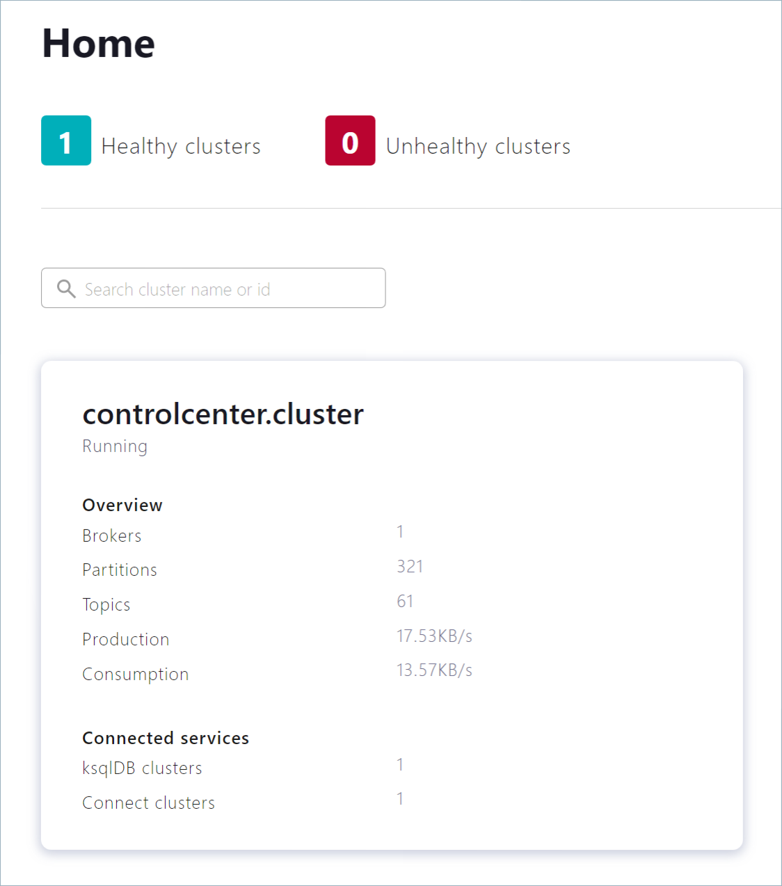
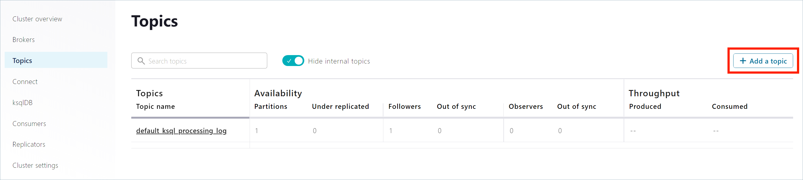
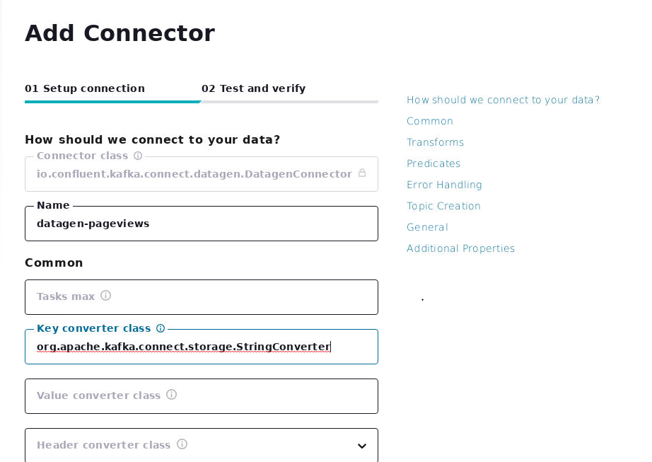
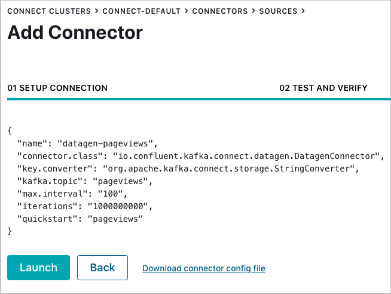
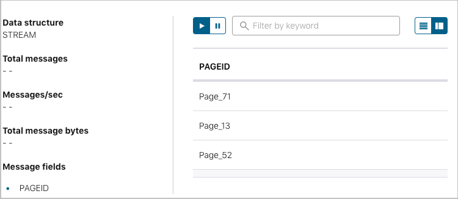
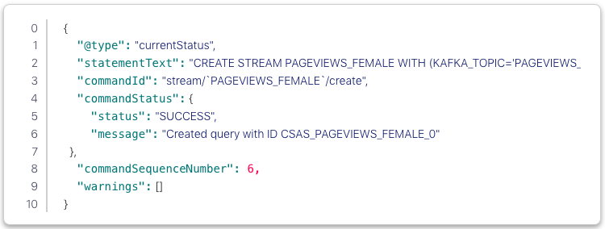
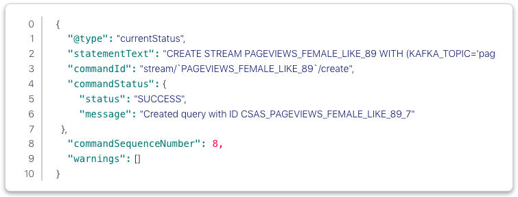
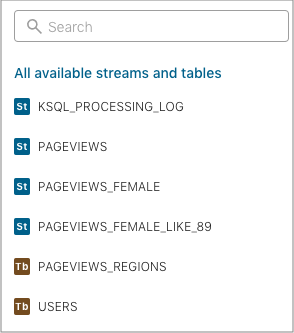

Lab 7-1. Using Kafka with Confluent Platform
---------------------------------------------


Use this quick start to get up and running with Confluent Platform and
its main components in a development environment. This quick start uses
Confluent Control Center included in Confluent Platform for topic
management and event stream processing using ksqlDB.

In this quick start, you create Apache Kafka® topics, use Kafka Connect
to generate mock data to those topics, and create ksqlDB streaming
queries on those topics. You then go to Control Center to monitor and
analyze the streaming queries.


<h4><span style="color:red;"> Zookeeper and Kafka services should be stopped before proceeding.</span></h4>


Step 1: Start Confluent Platform
----------------------------------


1.  Open new terminal and go to following directory:

```
cd /headless/kafka-advanced/confluent-6.1.1/bin
```

2.  Set the environment variable for the Confluent Platform directory.

`export CONFLUENT_HOME=/headless/kafka-advanced/confluent-6.1.1`


3.  Install the Kafka Connect Datagen
    source connector using the Confluent Hub client. This connector
    generates mock data for demonstration purposes and is not suitable
    for production. ConfluentHub
    is an online library of pre-packaged and ready-to-install extensions
    or add-ons for Confluent Platform and Kafka.
	
```
./confluent-hub install --no-prompt confluentinc/kafka-connect-datagen:latest
```

4.  Start Confluent Platform using the Confluent CLI confluent local
    services start command. This command starts all of the Confluent Platform
    components, including Kafka, ZooKeeper, Schema Registry, HTTP REST
    Proxy for Kafka, Kafka Connect, ksqlDB, and Control Center.


```
./confluent local services start
```

<span style="color:red;">Run above command again if any of the following services fail to start first time.</span>


Your output should resemble:

```
        Starting Zookeeper
        Zookeeper is [UP]
        Starting Kafka
        Kafka is [UP]
        Starting Schema Registry
        Schema Registry is [UP]
        Starting Kafka REST
        Kafka REST is [UP]
        Starting Connect
        Connect is [UP]
        Starting KSQL Server
        KSQL Server is [UP]
        Starting Control Center
        Control Center is [UP]

```


Step 2: Create Kafka Topics
-----------------------------------------------------------------------------

In this step, you create Kafka topics using Confluent Control Center.
Confluent Control Center provides the functionality for building and
monitoring production data pipelines and event streaming applications.

1.  Navigate to the Control Center web interface at
    [http://localhost:9021](http://localhost:9021/).

    If you installed Confluent Platform on a different host, replace
    `localhost` with the host name in
    the address.

    It may take a minute or two for Control Center to come online.

    Note

    Control Center won’t connect to ksqlDB if Control Center isn’t open
    and running in a `localhost` browser session.

2.  Click the **controlcenter.cluster** tile.



3.  In the navigation bar, click **Topics** to open the topics list, and
    then click **Add a topic**.



4.  In the Topic name field, specify `pageviews` and click **Create with defaults**.

    Note that topic names are case-sensitive.


5.  In the navigation bar, click **Topics** to open the topics list, and
    then click **Add a topic**.

6.  In the Topic name field, specify `users` and click **Create with defaults**.

Step 3: Install a Kafka Connector and Generate Sample Data
-------------------------------------------------------------

In this step, you use Kafka Connect to run a demo source connector
called `kafka-connect-datagen` that
creates sample data for the Kafka topics `pageviews` and `users`.


1.  Run the first instance of the Kafka Connect Datagen
    connector to produce Kafka data to the `pageviews` topic in AVRO format.

    1.  In the navigation bar, click **Connect**.

    2.  Click the `connect-default`
        cluster in the **Connect Clusters** list.

    3.  Click **Add connector**.

    4.  Select the `DatagenConnector` tile.

    5.  In the **Name** field, enter `datagen-pageviews` as the name of the connector.

    6.  Enter the following configuration values: (Scroll down browser screen to view all fields and also leave other fields empty)

        -   **Key converter class:**
            `org.apache.kafka.connect.storage.StringConverter`.
        -   **kafka.topic:** `pageviews`.
        -   **max.interval:** `100`.
        -   **quickstart:** `pageviews`.
    

    7.  Click **Continue**.

    8.  Review the connector configuration and click **Launch**.



2.  Run the second instance of the [Kafka Connect
    Datagen]
    connector to produce Kafka data to the `users` topic in AVRO format.

    1.  In the navigation bar, click **Connect**.

    2.  Click the `connect-default`
        cluster in the **Connect Clusters** list.

    3.  Click **Add connector**.

    4.  Select the `DatagenConnector` tile.

    5.  In the **Name** field, enter `datagen-users` as the name of the connector.

    6.  Enter the following configuration values:

        -   **Key converter class:** `org.apache.kafka.connect.storage.StringConverter`
        -   **kafka.topic:** `users`
        -   **max.interval:** `1000`
        -   **quickstart:** `users`

    7.  Click **Continue**.

    8.  Review the connector configuration and click **Launch** (Scroll at bottom of screen).


Step 4: Create and Write to a Stream and Table using ksqlDB
--------------------------------------------------------------


Tip

You can also run these commands using the ksqlDB CLI from your terminal with this command:

`/headless/kafka-advanced/confluent-6.1.1/bin/ksql http://localhost:8088`.

### Create Streams and Tables

In this step, you use ksqlDB to create a stream for the
`pageviews` topic and a table for the
`users` topic.

1.  In the navigation bar, click **ksqlDB**.

2.  Select the `ksqlDB` application.

3.  Copy the following code into the editor window and click **Run query** to create the `PAGEVIEWS`
    stream. Stream names are not case-sensitive.


```
        CREATE STREAM PAGEVIEWS
           (VIEWTIME BIGINT, USERID VARCHAR, PAGEID varchar)
           WITH (KAFKA_TOPIC='pageviews', VALUE_FORMAT='AVRO');

```

4.  Copy the following code into the editor window and click **Run query** to create the `USERS`
    table. Table names are not case-sensitive.


```
        CREATE TABLE USERS
           (USERID VARCHAR PRIMARY KEY, REGISTERTIME BIGINT, GENDER VARCHAR, REGIONID VARCHAR)
           WITH (KAFKA_TOPIC='users', VALUE_FORMAT='AVRO');

```


### Write Queries

In this step, you create ksqlDB queries against the stream and the table
you created above.

1.  In the **Editor** tab, click **Add query properties** to add a
    custom query property.

2.  Set the `auto.offset.reset`
    parameter to `Earliest`.

    The setting instructs ksqlDB queries to read all available topic
    data from the beginning. This configuration is used for each
    subsequent query.

3.  Create the following queries.

    1.  Click **Stop** to stop the current running query.

    2.  Create a non-persistent query that returns data from a stream
        with the results limited to a maximum of three rows:

        Enter the following query in the editor:
            `SELECT PAGEID FROM PAGEVIEWS EMIT CHANGES LIMIT 3;`


3.  Click **Run query**. Your output should resemble:



Click the **Card view** or **Table view** icon to change the output layout.

4.  Create a persistent query (as a stream) that filters the
        `PAGEVIEWS` stream for female
        users. The results from this query are written to the Kafka
        `PAGEVIEWS_FEMALE` topic:

        Enter the following query in the editor:

```
            CREATE STREAM PAGEVIEWS_FEMALE
               AS SELECT USERS.USERID AS USERID, PAGEID, REGIONID
               FROM PAGEVIEWS LEFT JOIN USERS ON PAGEVIEWS.USERID = USERS.USERID
               WHERE GENDER = 'FEMALE'
               EMIT CHANGES;

```

5.  Click **Run query**. Your output should resemble:



    6.  Create a persistent query where `REGIONID` ends with `8` or
        `9`. Results from this query
        are written to the Kafka topic named
        `pageviews_enriched_r8_r9` as
        explicitly specified in the query:

Enter the following query in the editor:
```
            CREATE STREAM PAGEVIEWS_FEMALE_LIKE_89
               WITH (kafka_topic='pageviews_enriched_r8_r9', value_format='AVRO')
               AS SELECT * FROM PAGEVIEWS_FEMALE
               WHERE REGIONID LIKE '%_8' OR REGIONID LIKE '%_9'
               EMIT CHANGES;

```

7.  Click **Run query**. Your output should resemble:




8.  Create a persistent query that counts the `PAGEVIEWS` for each `REGION` and `GENDER`
        combination in a tumbling window
        of 30 seconds when the count is greater than 1. Because the
        procedure is grouping and counting, the result is now a table,
        rather than a stream. Results from this query are written to a
        Kafka topic called `PAGEVIEWS_REGIONS`:

Enter the following query in the editor:

```
            CREATE TABLE PAGEVIEWS_REGIONS
               AS SELECT GENDER, REGIONID , COUNT(*) AS NUMUSERS
               FROM PAGEVIEWS LEFT JOIN USERS ON PAGEVIEWS.USERID = USERS.USERID
               WINDOW TUMBLING (size 30 second)
               GROUP BY GENDER, REGIONID
               HAVING COUNT(*) > 1
               EMIT CHANGES;

```

9.  Click **Run query**. Your output should resemble:


10. Click the **Running queries** tab. You should see the following persisted queries:

    -   PAGEVIEWS\_FEMALE
    -   PAGEVIEWS\_FEMALE\_LIKE\_89
    -   PAGEVIEWS\_REGIONS

11. Click the **Editor** tab. The **All available streams and
        tables** pane shows all of the streams and tables that you can
        access.



12. In the **All available streams and tables** section, click **KSQL\_PROCESSING\_LOG** to view the stream’s schema, including nested data structures.

### Run Queries

In this step, you run the ksqlDB queries you save as streams and tables
above in the previous section.

1.  In the **Streams** tab, select the `PAGEVIEWS_FEMALE` stream.

2.  Click **Query stream**.

    The editor opens, and streaming output of the query displays.

3.  Click **Stop** to stop the output generation.

4.  In the **Tables** tab, select `PAGEVIEWS_REGIONS` table.

5.  Click **Query table**.

    The editor opens, and streaming output of the query displays.

6.  Click **Stop** to stop the output generation.


Step 5: Monitor Consumer Lag
-------------------------------

1.  In the navigation bar, click **Consumers** to view the consumers
    created by ksqlDB.

2.  Click the consumer group ID to view details for the
    `_confluent-ksql-default_query_CSAS_PAGEVIEWS_FEMALE_5` consumer group.

    From the page, you can see the consumer lag and consumption values for your streaming query.

