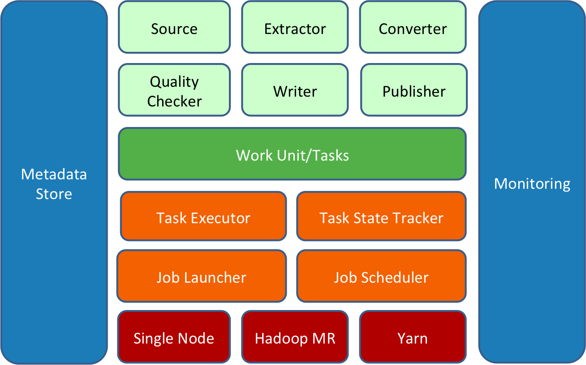

Lab 7. Using Kafka with Confluent Platform
-------------------------------------------------------


In the last lab, we learned about Apache Storm and Apache Heron. We
also went through Integrating Kafka with Storm. In this lab, we will
focus on [**Confluent Platform**], which is specially designed
to make Kafka more efficient to use in production application.

We will walk through the following topics in this lab:


-   Introduction to Confluent Platform
-   Confluent architecture
-   Kafka Connectors and Kafka Streams
-   Schema Registry and REST proxy
-   Camus - moving Kafka data to HDFS


Introduction to Confluent Platform 
--------------------------------------------------


So far, we have walked through learning internal concepts. We also went
through a few programs that helped us use Apache Kafka. Confluent
Platform is developed by the creator of Kafka in order to improve
usability of Kafka in production applications.

The following are a few reasons to introduce Confluent Platform:


-   [**Integration with Kafka**]: We have seen integration of
    Spark, Storm with Kafka in the previous lab. However, these
    frameworks come with additional rich APIs, and having such Stream
    processing available in a single platform with Kafka will avoid
    maintaining other distributed execution engines separately. 
-   [**In-built Connectors**]: We saw that writing a Kafka
    producer or consumer application is very easy using API that Kafka
    provides. We have seen in many application architectures where Kafka
    is being used, that the type of source of data remains common, which
    means it may be the database, server logs, any data generator
    application server, and so on. 


We have also seen that the final consumption layer where data is stored
for drawing some analysis is also common. The data can be used in
Elasticsearch, it can be put on HDFS and so on. What if we can provide a
platform where we just provide configuration, data is available in
Kafka, we provide another configuration, and the data is pushed to a
destination such as Elasticsearch, HDFS and so on.


-    [**Client**]:[** **]We can use Java, Scala client
    to write Kafka producer or consumer application using Kafka API.
    People may need to write the same in PHP, .NET, Perl, and so on.
    This is very much necessary to extend the use of Kafka to a variety
    of application clients so that users who are comfortable in a
    particular language can easily develop the Kafka application.
-    [**Accessibility**]:[** **]What if an application
    wants to access Kafka using the RESTful web services? We don\'t have
    anything which can do this for applications which need data from
    Kafka topics using REST calls. 


Exposing REST services to Kafka will simplify the usability of Kafka
across many REST clients, who can simply call the REST services exposed
to Kafka and serve their application purpose without writing any
consumer applications.


-   [**Storage format**]:[** **]A common challenge
    that may occur where the producer and consumer of an application are
    loosely coupled with each other is data format. We may want to have
    a contract wherein we say any change in the data on the producer
    side should not affect all downstream consumer applications, or the
    producer should not accidentally produce data in a format that is
    not consumable by the consumer application.


Both producer and consumer should agree on the contract clauses, which
ensures that this type of problem should not affect any of them in case
there is any change in the type of data. 


-   [**Monitoring and controlling Kafka performance**]: We also
    want to have a mechanism where we can see the performance of the
    Kafka cluster, which should provide us with all the valuable
    metadata information with a good interface. we may want to see the
    performance of the topic, or we may want to see the CPU utilization
    of the Kafka cluster which may give us information about consumers
    at a deep level. All this information may help us optimize our
    application to a great extent.


All these features are integrated into a single platform called
[**Confluent Platform**]. It allows us to integrate different
data sources and manage this data with a reliable and high-performance
system. The Confluent Platform provides us with a very simple way to
connect many data sources to Kafka, building streaming applications with
Kafka. It also provides the ability to secure, monitor, and manage our
Kafka cluster efficiently. 


Deep driving into Confluent architecture 
--------------------------------------------------------


In this section, we will discuss the architecture of Confluent Platform
and its components in detail. The Confluent Platform provides you with
underlying built-in Connectors and components that help you focus on the
business use case and how to get value out of it. It takes care of the
integration of data from multiple sources and its consumption by the
target system. The Confluent Platform provides a trusted way of
securing, monitoring, and managing the entire Kafka cluster
infrastructure. Let\'s talk about its components one-by-one.

The following image will give a concise idea of the Confluent
architecture:


Confluent architecture 

In the preceding figure, we can see the three colored components. The
dark and light blue represent the enterprise and open source version of
the Confluent Platform respectively. Simply put, there are two versions
of the Confluent Platform:


-   One is an open source version, which they offer for free, and it
    includes all the components available in light blue color.
-   The other is an enterprise version of the Confluent Platform, which
    contains some advanced components that can be useful in managing and
    controlling the overall Kafka infrastructure.


Let\'s look at each component in brief:


-   [**Supported Connectors**]: Connectors are used to move
    data in and out of Kafka. This is also known as Kafka Connect.
    Confluent provides the following Connectors:
    
    -   [**JDBC Connector**]: You may want to bring data from a
        relational database into Kafka, or you may want to export Kafka
        data into a relational database or any database supporting JDBC.
        Confluent provides the JDBC Connector to make life easy for us. 
    -   [**HDFS Connector**]: In most cases, you may want to
        store Kafka data into HDFS for batch analytics processing or to
        store historical records for later processing.
    -   [**Elasticsearch Connector: **]It helps you move the
        Kafka data to Elasticsearch. Use cases that require a quick
        adhoc search on data in Kafka can use this Connector to move
        data from Kafka to Elasticsearch and do their job.
    -   [**File Connector**]: Confluent also provides you with
        a Connector that can help you read data from a file and write it
        into Kafka or export Kafka data into a file. It is also known as
        a FileSource Connector and FileSink Connector.
    -   [**S3 Connector**]: Similar to HDFS Connector, it helps
        you export Kafka data into S3 storage.
    
-   [**Client**]: The Confluent Platform also provides you with
    an open source Kafka client library that helps you write Kafka
    producer and consumer applications in different languages such as C,
    C++, .NET, Python, and many more. It makes Kafka developer-friendly,
    where developers can build applications in languages they are more
    comfortable with. 
-   [**Schema Registry**]: We discussed the data format issue
    when both producers and consumers are loosely coupled with each
    other. Confluent provides a Schema Registry based on Avro
    Serialization, which maintains all versions of the schema of each
    Kafka topic that has registered its schema with it. Developers can
    modify the schema without worrying about their impact on underlying
    dependent systems. 
-   [**REST Proxy**]: It provides a REST-based API to interact
    with the Kafka cluster. It provides REST services for writing,
    reading, and metadata access. Application in any language can make a
    REST-based request to the Kafka cluster. This allows developers to
    replace their existing components to take advantage of a
    high-performing messaging system.


All the components discussed in the preceding section are available in
the open source Confluent Platform. The following four components are an
addition to the enterprise version of the Confluent Platform, which
provides a lot of useful functionality:


-   [**Control Center**]: The Confluent platform provides a
    rich GUI for managing and monitoring the Kafka cluster. It also
    provides a GUI interface to create your own Kafka pipeline, where
    you need not write any code, just need to provide some
    configuration. It also lets you measure the performance of your
    Kafka producer and consumer at a very deep level by collecting
    different metrics from the Kafka cluster. All these metrics are very
    important to effectively monitor and maintain your Kafka cluster and
    always give high-performance results.
-   [**Multi-Datacenter replication**]: The Confluent Platform
    provides you with the ability to replicate Kafka data across
    multiple data centers, or it can allow you to aggregate data from
    multiple Kafka data centers to another data center without affecting
    data in the source data center.


The Kafka data center replicator does this job for us. The control
center provides a nice GUI to do this job. However, confluent also
provides a command-line-based interface to use data center replication.
It provides the ability to replicate the Kafka topic with similar
configuration across multiple data centers.


-   [**Auto Data Balancing**]:[** **]Kafka is scalable
    with growing business and application requirements, we need to scale
    our Kafka cluster. We may create more topics and partitions. We may
    add more brokers or remove some brokers. This may create a situation
    wherein one broker will have more workload than other brokers, and
    this may decrease the performance of the Kafka cluster. The
    Confluent Auto Data Balancing tool allows you to trigger auto
    balancing, whenever needed, by reducing the impact of rebalancing on
    the production workload.
-   [**24\*7 Support**]: This feature is auto-enabled in the
    enterprise confluent version, which collects and reports cluster
    metrics to the confluent, and then their team helps you by providing
    regular support on various issues. 


Understanding Kafka Connect and Kafka Stream 
------------------------------------------------------------


[**Kafka Connect**] is a tool that provides the ability to move
data into and out of the Kafka system. Thousands of use cases use the
same kind of source and target system while using Kafka. Kafka Connect
is comprised of Connectors for those common source or target systems.

Kafka Connect consists of a set of Connectors, and the Connectors are of
two types:


-   [**Import Connectors**]: Import Connectors are used to
    bring data from the source system into Kafka topics. These
    Connectors accept configuration through property files and bring
    data into a Kafka topic in any way you wish. You don\'t need to
    write your own producer to do such jobs. A few of the popular
    Connectors are JDBC Connector, file Connector, and so on.
-   [**Export Connectors**]: Unlike Import Connectors, Export
    Connectors are used to copy data from Kafka topics to the target
    system. This also works based on the configuration property file,
    which can vary based on which Connector you are using. Some popular
    Export Connectors are HDFS, S3, Elasticsearch, and so on.


Kafka Connect does not perform any advanced processing over data
available in Kafka, it is just used for ingestion purposes. Kafka
Connect can be used in an ETL pipeline wherein it can perform the job of
extracting and loading data from and to the source and target system. We
will cover Kafka Connect in detail in the next lab.


### Kafka Streams


We have seen Stream processing engines such as Apache Spark and Apache
Storm in the previous labs. These processing engines require
separate installation and maintenance efforts. Kafka Streams is a tool
to process and analyze data stored in Kafka topics. The Kafka Stream
library is built based on popular Stream processing concepts that allow
you to run your streaming application on the Kafka cluster itself. 

We will look into the terminology used in Kafka Streams; however, a
detailed walk-through of Kafka Stream is covered in the upcoming
lab. Kafka Streams has a few concepts similar to what we had in
Apache Storm; they are listed as follows:


-   [**Streams**]: Streams is an unbounded set of records that
    can be used for processing. Stream API consists of a Stream
    partition, and a Stream partition is a key-value pair of data
    records. Streams are re-playable and fault tolerant in nature.
-   [**Stream processing application**]: Any application build
    using Kafka Stream API is said to be a Stream processing
    application. 
-   [**Topology**]: Topology is the logical plan of application
    computation where Stream processors are connected together to
    achieve the application objective. 
-   [**Stream processors**]: Stream processors are connected
    together to form a topology, and each processor is responsible for
    performing some task. Kafka Stream processors also include two
    special Stream processors: 
    
    -   [**Source Stream processor**]: Source Stream processors
        are responsible for reading Stream data from Kafka topic and
        passing this data to the down Stream processor. It is the first
        processor in streaming topology.
    -   [**Sink Stream processor**]: A Sink processor is the
        last processor in streaming topology, which receives Stream data
        from the processor above it and stores it into the target Kafka
        topic.
    


Kafka Streams API also provides a client API to perform aggregation,
filtering over a Stream of data. It also allows you to save the state of
an application and handles fault tolerant in an effective way.

The Kafka Stream application does not require any special framework to
be installed other than Kafka. It can be treated as a simple Java
application similar to those of producers and consumers. We will look
into the details of Kafka streaming in the upcoming lab.


Playing with Avro using Schema Registry 
-------------------------------------------------------


Schema Registry allows you to store Avro schemas for both producers and
consumers. It also provides a RESTful interface for accessing this
schema. It stores all the versions of Avro schema, and each schema
version is assigned a schema ID. 

When the producer sends a record to Kafka topic using Avro
Serialization, it does not send an entire schema, instead, it sends the
schema ID and record. The Avro serializer keeps all the versions of the
schema in cache and stores data with the schemas matching the schema ID.

The consumer also uses the schema ID to read records from Kafka topic,
wherein the Avro deserializer uses the schema ID to deserialize the
record. 


### Note

The Schema Registry also supports schema compatibility where we can
modify the setting of schema compatibility to support forward and
backward compatibility. 


Here is an example of Avro schema and producer:

```
kafka-avro-console-producer \
 --broker-list localhost:9092 --topic test \
 --property value.schema='{"type":"record","name":"testrecord","fields":[{"name":"country","type":"string"}]}'
```

Similarly, an example of Avro schema on consumer:

```
kafka-avro-console-consumer --topic test\
         --Zookeeper localhost:2181 \
         --from-beginning
```

Remember that if the Schema Registry is up and running, the consumer
will be able to deserialize the record. Any attempt to push invalid or
non-compatible records to Kafka topic will result in an exception.

The schema can also be registered using a REST request as follows:

```
 curl -X POST -H "Content-Type: application/vnd.schemaregistry.v1+json" \
 --data '{"schema": "{\"type\": \"string\"}"}' \
 http://localhost:8081/test/Kafka-test/versions
 {"id":1}
```

The ability of the Schema Registry to keep all the versions of the
schema and configure their compatibility settings makes Schema
Registry more special. Schema registry is very easy to use, and it also
removes bottlenecks of the data format issue in a loosely coupled
producer and consumer environment.


Moving Kafka data to HDFS 
-----------------------------------------


We have discussed the integration of Apache Kafka with various
frameworks, which can be used for real-time or near-real-time streaming.
Apache Kafka can store data for a configured time of retention period;
the default is seven days.

Data will be removed from Kafka when the retention period expires. The
organization does not want to lose data, and in many cases, they need
data for some batch processing to generate monthly, weekly, or yearly
reports. We can store historical records for further processing into a
cheap and fault-tolerant storage system such as HDFS.

Kafka data can be moved to HDFS and can be used for different purposes.
We will talk about the following four ways of moving data from Kafka to
HDFS:


-   Using Camus
-   Using Gobblin
-   Using Kafka Connect
-   Using Flume


### Camus 


LinkedIn first created Kafka for its own log processing use case. As
discussed, Kafka stores data for a configured period of time, and the
default is seven days. The LinkedIn team felt the need to store data for
any batch-reporting purpose or to use it later. Now, to store data in
HDFS, which is a distributed storage file system, they started
developing a tool that can use a distributed system capability to fetch
data from Kafka. They developed Camus, a tool developed using map reduce
API to copy data from Kafka to HDFS. 


### Note

Camus is just a map-reduce job that has the capability of performing
incremental copying of data. It means it will not copy the data from the
last committed offset. 


The following image gives a good idea of the Camus architecture:


 Camus architecture

The preceding figure shows a clear picture of how Camus works. It starts
with the Camus setup, which requires Zookeeper to read Kafka metadata.
The Camus job is a set of map-reduce jobs that can run on multiple data
nodes at a time, resulting in distributed copying of data from Kafka.


#### Running Camus


Camus mainly consists of two tasks: 


-   [**Reading data from Kafka**]: Camus acts as a consumer
    while reading data from Kafka, and it requires the message decoder
    class, which can be used to read data from Kafka topics. The
    `decoder` class must implement
    `com.linkedin.Camus.coders.MessageDecoder class`. A few
    default decoders are available, such as
    `StringMessageDecoder`.
-   [**Writing data to HDFS**]: Camus then writes data read
    from Kafka into HDFS. To write data into HDFS, it must have a record
    writer class. The record reader class must
    implement `com.linkedin.Camus.etl.RecordWriterProvider`.


Running Camus requires the Hadoop cluster. As discussed, Camus is
nothing but a map-reduce job, and it can be run using normal Hadoop jobs
as in the following case:

```
hadoop jar Camus.jar com.linkedin.Camus.etl.kafka.CamusJob -P Camus.properties
```


### Gobblin


[**Gobblin**] is an advanced version of Apache Camus. Apache
Camus is only capable of copying data from Kafka to HDFS; however,
Gobblin can connect to multiple sources and bring data to HDFS. LinkedIn
had more than 10 data sources, and all were using different tools to
ingest data for processing. In the shot term, they realized that
maintaining all these tools and their metadata was getting complex and
required more effort and maintenance resources.

They felt the need to have a single system that can connect to all
sources and ingest data to Hadoop. This motivation helped them build
Gobblin.


#### Gobblin architecture


The following image gives a good idea of the Gobblin architecture:




 Gobblin architecture

The architecture of Gobblin is built in such a way that a user can
easily add new Connectors for new sources, or they can modify existing
sources. We can divide the overall architecture into four parts:


-   [**Gobblin Constructs**]: These are responsible for the
    overall processing of the Gobblin ingestion work. It consists of
    following:
    
    -   [**Source**]: This is responsible for acting as a
        Connector between the data source and Gobblin. It also divides
        the work into smaller work units, and each work unit is
        responsible for bringing a few parts of the data. 
    -   [**Extractor**]: This is responsible for extracting
        data from the data source. The source creates an extractor for
        each work unit, and each extractor fetches a portion of data
        from the data source. Gobblin also has some prebuilt popular
        sources and extractors already available for you.
    -   [**Converters**]: These are responsible for converting
        input records to output records. One or more converter can be
        connected together to achieve the objective.
    -   [**Quality checkers**]: These are optional constructs,
        and they are responsible for checking the data quality of each
        record or all records together.
    -   [**Writer**]: This is associated with the sink, and it
        is responsible for writing data to the sink it is connected to.
    -   [**Publisher**]: This is responsible for collecting
        data from each work unit task and storing data in the final
        directory.
    
-   [**Gobblin runtime**]: This is responsible for the actual
    running of Gobblin jobs. It manages job scheduling and resource
    negotiation to execute these jobs. Gobblin runtime also does error
    handling and retries the job in case of failure.
-   [**Supported deployment**]:[** **]Goblin runtime
    runs jobs based on the deployment mode. Gobblin can be run on
    standalone or map reduce mode. It will also support YARN-based
    deployment soon. 
-   [**Gobblin utility**]: Gobblin utility consists of two
    parts - one is metadata management, and the other is monitoring of
    Gobblin jobs. This utility allows Gobblin to store metadata in a
    single place rather than using a third-party tool to do such jobs.
    It also collects different matrics which can be useful for managing
    or optimizing Gobblin jobs.


The following configuration file
(`kafka_to_hdfs.conf`) contains information about connection
URLs, Sink type, output directory, and so on which will be read by
Gobblin job to fetch data from Kafka to HDFS:

```
job.name=kafkatohdfs 
job.group=Kafka 
job.description=Kafka to hdfs using goblin 
job.lock.enabled=false 

kafka.brokers=localhost:9092 source.class=Gobblin.source.extractor.extract.kafka.KafkaSimpleSource
extract.namespace=Gobblin.extract.kafka writer.builder.class=Gobblin.writer.SimpleDataWriterBuilder

writer.file.path.type=tablename 
writer.destination.type=HDFS 
writer.output.format=txt 
data.publisher.type=Gobblin.publisher.BaseDataPublisher

mr.job.max.mappers=1
metrics.reporting.file.enabled=true 
metrics.log.dir=/Gobblin-kafka/metrics 
metrics.reporting.file.suffix=txt 

bootstrap.with.offset=earliest 
fs.uri=hdfs://localhost:8020
writer.fs.uri=hdfs://localhost:8020
state.store.fs.uri=hdfs://localhost:8020

mr.job.root.dir=/Gobblin-kafka/working 
state.store.dir=/Gobblin-kafka/state-store task.data.root.dir=/jobs/kafkaetl/Gobblin/Gobblin-kafka/task-data data.publisher.final.dir=/Gobblintest/job-output
```

Run `Gobblin-MapReduce.sh`:

```
Gobblin-MapReduce.sh --conf kafka_to_hdfs.conf
```

Running a Gobblin job is very easy. They have already done everything
you need. We would recommend you visit the Gobblin documentation for
more details. 


### Kafka Connect


We already discussed Kafka Connect in the preceding sections. Kafka
Connect refers to the Connectors that can be used to import or export
data from Kafka. Kafka HDFS export Connector can be used to copy data
from Kafka topic to HDFS.

HDFS Connector polls data from Kafka and writes them to HDFS. We can
also specify the partition to be used, and it will divide the data into
smaller chunks, where each chunk will represent a file in HDFS. Let\'s
look into how to use this Connector.

Here is an example of Kafka Connect with producer:

```
kafka-avro-console-producer --broker-list localhost:9092 --topic test \
--property value.schema='{"type":"record","name":"peoplerecord","fields":[{"name":"f1","type":"string"}]}'
```

Run `kafka_to_hdfs.properties`:

```
name=hdfs-sinkConnector.class=io.confluent.connect.hdfs.HdfsSinkConnectortasks.max=1topics=testhdfs.url=hdfs://localhost:8020flush.size=3
```

Run the following:

```
connect-standalone etc/schema-registry/connect-avro-standalone.properties \
 kafka_to_hdfs.properties
```

You can verify at the HDFS location that if data is available in the
Kafka topic, it will be there at the HDFS location.


### Flume


[**Apache Flume**] is a distributed, reliable, and
fault-tolerant system for collecting large volumes of data from
different sources to one or more target systems.

It mainly consists of three components:


-   Source
-   Channel
-   Sink


Flume Agent 

The three components can be expanded as follows:


-   [**Source**] is responsible for connecting with the source
    system and bringing data to the channel. Flume can be connected to
    different sources such as server logs, Twitter, Facebook, and so on.
    It also provides us the flexibility to connect to Kafka topics and
    bring data to the Flume channel.
-   [**Channel**] is a temporary storage for data where data is
    pushed by the source based on the configuration. Source can push
    data to one or more channel, which can later be consumed by
    the sink.
-   [**Sink**] is responsible for reading data from the Flume
    channel and storing it in the permanent storage system or passing it
    for further processing to some other system. It can be connected to
    a single channel at a time. Once the data read is acknowledged by
    sink, Flume removes the data from the channel.


Now you can visualize how to copy Kafka data using Flume and copy data
to HDFS. Yes, we need Kafka source, channel, and HDFS sink. Kafka source
will read data from Kafka topics, and HDFS sink will read data from the
channel and store it to the configured HDFS location. Let\'s go through
the following configuration:

Let us first look into `flumekafka.conf`:

```
pipeline.sources = kafka1
pipeline.channels = channel1
pipeline.sinks = hdfssink

pipeline.sources.kafka1.type = org.apache.flume.source.kafka.KafkaSource
pipeline.sources.kafka1.ZookeeperConnect = zk01.example.com:2181
pipeline.sources.kafka1.topic = test
pipeline.sources.kafka1.groupId = kafkaflume
pipeline.sources.kafka1.channels = channel1
pipeline.sources.kafka1.interceptors = i1
pipeline.sources.kafka1.interceptors.i1.type = timestamp
pipeline.sources.kafka1.kafka.consumer.timeout.ms = 100

pipeline.channels.channel1.type = memory
pipeline.channels.channel1.capacity = 100000
pipeline.channels.channel1.transactionCapacity = 10000

pipeline.sinks.hdfssink.type = hdfs
pipeline.sinks.hdfssink.hdfs.path = /user/hdfspath
pipeline.sinks.hdfssink.hdfs.rollInterval = 10
pipeline.sinks.hdfssink.hdfs.rollSize = 0
pipeline.sinks.hdfssink.hdfs.rollCount = 0
pipeline.sinks.hdfssink.hdfs.fileType = DataStream
pipeline.sinks.hdfssink.channel = channel1
```

If you look at the aforementioned configuration, we have provided
configuration for source, channel, and sink. Source will read data from
the topic test, and Flume will use it in the memory channel to store
data. Sink will connect to the in-memory channel and move data to HDFS.

The following configuration connects the source with the channel:

```
pipeline.sources.kafka1.channels = channel1
```

The following configuration connects the sink with the channel:

```
pipeline.sinks.hdfssink.channel = channel1
```

`pipeline` is an agent name, which you can change according to
your wish. Once the agent configuration is ready, we can run Flume using
the following command:

```
flume-ng agent -c pathtoflume/etc/flume-ng/conf -f flumekafka.conf -n pipeline
```

The in-depth overall architecture of Flume is beyond the scope of this
lab. Our intention is to let you know how we can copy Kafka data to
HDFS using Flume.


Summary 
-----------------------


This lab has given us a brief understanding of Confluent Platform
and it uses. You learned about the architecture of Confluent Platform
and how Connectors can make our job of transporting data in and out of
Kafka simpler. We also learned about how the Schema Registry solves data
format issues and supports schema resolution. We have covered different
ways of copying data from Kafka to HDFS and their examples.

In the next lab, we will cover Kafka Connect in detail and will also
look into how we can build a big data pipeline using Kafka and Kafka
Connect.
