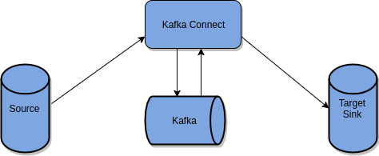
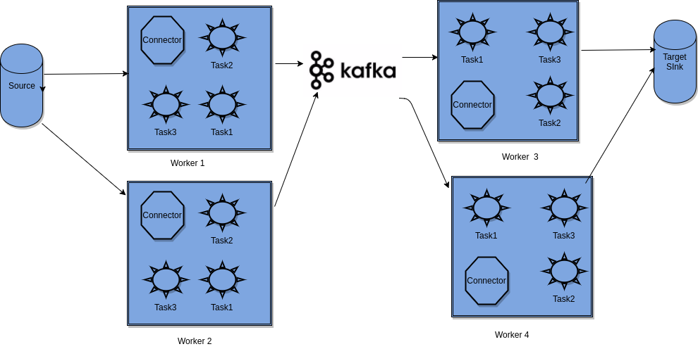

Lab 8. Building ETL Pipelines Using Kafka
------------------------------------------------------


In the previous lab, we learned about Confluent Platform. We covered
its architecture in detail and discussed its components. You also
learned how to export data from Kafka to HDFS using different tools. We
went through Camus, Goblin, Flume, and Kafka Connect to cover different
ways of bringing data to HDFS. We also recommend you try all the tools
discussed in the last lab to understand how they work. Now we will
look into creating an ETL pipeline using these tools and  look more
closely at Kafka Connect use cases and examples. 

In this lab, we will cover Kafka Connect in detail. The following
are the topics we will cover:


-   Use of Kafka in the ETL pipeline
-   Introduction to Kafka Connect
-   Kafka Connect architecture
-   Deep dive into Kafka Connect
-   Introductory example of Kafka Connect 
-   Common use cases


Considerations for using Kafka in ETL pipelines 
---------------------------------------------------------------


[**ETL**] is a process of [**Extracting**],
[**Transforming**], and [**Loading**] data into the
target system, which is explained next. It is followed by a large number
of organizations to build their data pipelines. 


-   [**Extraction**]: Extraction is the process of ingesting
    data from the source system and making it available for further
    processing. Any prebuilt tool can be used to extract data from the
    source system. For example, to extract server logs or Twitter data,
    you can use Apache Flume, or to extract data from the database, you
    can use any JDBC-based application, or you can build your own
    application. The objective of the application that will be used for
    extraction is that it should not affect the performance of the
    source system in any manner. 

-   [**Transformation**]: Transformation refers to processing
    extracted data and converting it into some meaningful form. The
    application can consume data in two forms: one could be a pull-based
    approach where data is stored into some intermediate storage by the
    extractor and the application pulls data from here, the other could
    be a push-based approach where the extractor directly pushes data to
    transformers and the application processes it.

-   [**Loading**]: Once data is transformed into a meaningful
    form, it has to be loaded into a target system for further use. The
    loading phase generally comprises the loading of meaningful data
    into the target system. The target system could be any database or
    file or any system capable of storing data.


Organizations are exploring many analytics opportunities on data. They
want to do real-time analysis on some data, and on the same data, they
also want to do batch analytics to generate other reports.

There are many frameworks that have been built for real-time stream
processing and batch processing and all of them come with some new
features, and some of them are similar, but the big challenge lies in
the fact that there are no such frameworks that can do all the jobs for
you, Ingestion, processing, and exporting it to multiple destinations
for further processing have to be run using different frameworks for
different phases of ETL, and this requires maintenance, cost, and effort
to be put in.


### Note

Kafka is a centralized publish-subscribe messaging system that comes
with the support of performing ETL operations without using any other
framework or tool.


Let\'s look into how we can use Kafka in an ETL operation:


-   [**Working of extracting**][**operation of ETL**]:
    Apache Kafka has introduced the concept of Kafka Connect, which
    comes with Source and Sink Connectors. Source Connectors can extract
    data from sources and put them into HDFS. Connectors are easy to
    use; they can be used by just changing some configuration
    parameters. 
-   [**Working of transforming**][**operation of
    ETL**]: Apache Kafka has become more powerful with the
    stream processing feature being added to it. It comes with Kafka
    Stream, which is capable of handling streams of data and performing
    operations such as aggregation, filtering, and so on.


Data from Kafka topic can be exported to HDFS to perform some batch
processing. Kafka also provides export tools to do such jobs. 


-   [**Working of loading**][**operation of ETL**]:
    Kafka Connect also comes with Export Connectors, which can be used
    to load data into the target system. For example, the JDBC Connector
    can be used to push data into a JDBC-supported database, the Elastic
    Search Connector can be used to push data into elastic search, the
    HDFS Connector can be used to push data into HDFS on which you can
    create a Hive table for further processing or for generating
    reports.


We will see how we can extract and load data from the source to the
target system using Kafka Connect in the next section. Introducing Kafka
Connect using Kafka also ensures that we do not need to create a
separate serving layer to serve data to the consumer. All consumers
maintain an offset of Kafka messages and can read messages from the
topic in any manner they want. It simplifies the ETL pipeline problem,
where the number of producers and consumers increases over time. With
all the capabilities of extracting, transforming, and loading data into
the target system, Kafka remains the first choice for lots of
organizations today.


Introducing Kafka Connect 
-----------------------------------------


Kafka Connect is used to copy data into and out of Kafka. There are
already a lot of tools available to move data from one system to another
system. You would find many use cases where you want to do real-time
analytics and batch analytics on the same data. Data can come from
different sources but finally may land into the same category or type.

We may want to bring this data to Kafka topics and then pass it to a
real-time processing engine or store it for batch processing. If you
closely look at the following figure, there are different processes
involved:




Kafka Connect 

Let\'s look into each component in detail:


-   [**Ingestion in Kafka**]: Data is inserted into Kafka topic
    from different sources, and most of the time, the type of sources
    are common. For example you may want to insert server logs into
    Kafka topics, or insert all records from the database table into
    topic, or insert records from file to Kafka, and so on. You will use
    Kafka Producer, which will do this job for you, or you may use some
    already available tools. 
-   [**Processing**]: Data available in Kafka topic needs to be
    processed to extract business meaning out of it. Data can be
    consumed by real-time processing engines such as Apache Spark,
    Apache Storm, and many more. It can be stored to HDFS, Hbase, or
    some other storage for later processing. 
-   [**Copying Kafka data**]: Data available in Kafka can be
    exported to multiple systems, depending on the use case. It can be
    exported to Elasticsearch for ad hoc analysis. It can be stored in
    HDFS for batch processing. Kafka also has a retention period after
    which data available in Kafka will be removed. You may want to keep
    a backup of data available in Kafka. The backup can be either HDFS
    or some other file system.


### Note

Kafka Connect is nothing but a prebuilt set of tools that can be used to
bring data into Kafka topic and copy data from Kafka topic to different
external systems. It provides API to build your own tool for import or
export. It also uses parallel processing capability wherein it copies
data in parallel. It also uses the offset commit mechanism to ensure it
starts from last left point in case of failure. 


Deep dive into Kafka Connect 
--------------------------------------------


Let\'s get into the architecture of Kafka Connect. The following figure
gives a good idea of Kafka Connect:




Kafka Connect architecture 

Kafka Connect has three major models in its design:


-   [**Connector**]: A Connector is configured by defining the
    Connector class and configuration. The Connector class is defined
    based on the source or target of the data, which means that it will
    be different for the Database source and File source. It is then
    followed by setting up the configuration for these classes. For
    example, configuration for the Database source could be the IP of
    the database, the username and password to connect to the database,
    and so on. The Connector creates a set of tasks, which is actually
    responsible for copying data from the source or copying data to the
    target. Connectors are of two types:
    
    -   [**Source Connector**]: This is responsible for
        ingesting data from the source system into Kafka
    -   [**Sink Connector:**] This is responsible for exporting
        data from Kafka to an external system such as HDFS,
        Elasticsearch, and so on
    
-   [**Worker**]: Workers are responsible for the execution of
    Connector tasks. They acts as a container for the Connector and
    task. Workers are actual JVM processes that coordinate with each
    other to distribute the work and guarantee scalability and fault
    tolerance. The Worker does not manage processes. However, it
    distributes tasks to any available processes. Processes are managed
    by resource management tools such as YARN and Mesos. 
-   [**Data**]: Connectors are responsible for copying streams
    of data from one system to another system. We discussed two types of
    Connectors\--source Connector and target Connector. In any case, we
    may have Kafka as one of the systems to be used with Connectors.
    This means that Connectors are tightly coupled with Kafka. Kafka
    Connect also manages the offset of streams. In case of task failure,
    the offset allows the Connector to resume operation from the last
    failure point. The offset type can vary based on the type of
    Connector we use. For example, the offset for the database can be
    some unique record identifier, the offset for file can be a
    delimiter, and so on. Kafka Connect also provides data format
    converters, which allow you to convert data from one format to
    other. It also supports integration with the Schema Registry.


Introductory examples of using Kafka Connect 
------------------------------------------------------------


Kafka Connect provides us with various Connectors, and we can use the
Connectors based on our use case requirement. It also provides an API
that can be used to build your own Connector. We will go through a few
basic examples in this section. We have tested the code on the Ubuntu
machine. Download the Confluent Platform tar file from the Confluent
website:


-   [**Import or Source Connector**]: This is used to ingest
    data from the source system into Kafka. There are already a few
    inbuilt Connectors available in the Confluent Platform.
-   [**Export or Sink Connector**]: This is used to export data
    from Kafka topic to external sources. Let\'s look at a few
    Connectors available for real-use cases.
-   [**JDBC Source Connector**]: The JDBC Connector can be used
    to pull data from any JDBC-supported system to Kafka.


Let\'s see how to use it:


1.  Install `sqllite`:


```
sudo apt-get install sqlite3
```


2.  Start console:


```
sqlite3 fenago.db
```


3.  Create a database table, and insert records:


```
sqlite> CREATE TABLE authors(id INTEGER PRIMARY KEY AUTOINCREMENT NOT NULL, name VARCHAR(255));

sqlite> INSERT INTO authors(name) VALUES('Manish');

sqlite> INSERT INTO authors(name) VALUES('Chanchal');
```


4.  Make the following changes in
    the `source-quickstart-sqlite.properties` file:


```
name=jdbc-testConnector.class=io.confluent.connect.jdbc.JdbcSourceConnectortasks.max=1connection.url=jdbc:sqlite:fenago.dbmode=incrementingincrementing.column.name=idtopic.prefix=test-
```


5.  In `connection.url`, the `fenago.db` value is the
    path to your `fenago.db` file. Provide the full path to
    the `.db` file. Once everything is ready, run the
    following command to execute the Connector script:


```
 ./bin/connect-standalone etc/schema-registry/connect-avro-standalone.properties etc/kafka-connect-jdbc/source-quickstart-sqlite.properties
```


6.  Once the script is successfully executed, you can check the output
    using the following command:


```
bin/kafka-avro-console-consumer --new-consumer --bootstrap-server localhost:9092 --topic test-authors --from-beginning
```

You will see the following output:


### Note

Make sure you have already started Zookeeper, Kafka server, and Schema
Registry before running this demo. 


[**JDBC Sink Connector**]: This Connector is used to export
data from Kafka topic to any JDBC-supported external system.

Let\'s see how to use it:


1.  Configure `sink-quickstart-sqlite.properties`:


```
name=test-jdbc-sinkConnector.class=io.confluent.connect.jdbc.JdbcSinkConnectortasks.max=1topics=authors_sinkconnection.url=jdbc:sqlite:fenago_authors.dbauto.create=true
```


2.  Run the producer:


```
bin/kafka-avro-console-producer \
 --broker-list localhost:9092 --topic authors_sink \
 --property value.schema='{"type":"record","name":"authors","fields":[{"name":"id","type":"int"},{"name":"author_name", "type": "string"}, {"name":"age", "type": "int"}, {"name":"popularity_percentage",
 "type": "float"}]}'
```


3.  Run the Kafka Connect Sink: 


```
./bin/connect-standalone etc/schema-registry/connect-avro-standalone.properties etc/kafka-connect-jdbc/sink-quickstart-sqlite.properties
```


4.  Insert the record into the producer:


```
{"id": 1, "author_name": "Chanchal", "age": 26, "popularity_percentage": 60}

{"id": 2, "author_name": "Manish", "age": 32, "popularity_percentage": 80}
```


5.  Run `sqlite`: 


```
sqlite3 fenago_authors.db

select * from authors_sink;
```

You will see following output in the table:


Now we know how Kafka Connect can be used to extract and load data from
Kafka to the database and from the database to Kafka.


### Note

Kafka Connect is not an ETL framework in itself, but it can be part of
an ETL pipeline where Kafka is being used. Our intention was to focus on
how Kafka Connect can be used in the ETL pipeline and how you can use it
to import or export data from Kafka.


Kafka Connect common use cases 
----------------------------------------------


You have learned about Kafka Connect in detail. We know Kafka Connect is
used for copying data in and out of Kafka.

Let\'s understand a few common use cases of Kafka Connect:


-   [**Copying data to HDFS**]: User wants to copy data from
    Kafka topics to HDFS for various reasons. A few want to copy it to
    HDFS just to take a backup of the history data, others may want to
    copy it to HDFS for batch processing. However, there are already
    many open source tools available, such as Camus, Gobblin, Flume, and
    so on, but maintaining, installing, and running these jobs takes
    more effort than what Kafka Connect provides. Kafka Connect copies
    data from topics in parallel and is capable of scaling up more if
    required. 
-   [**Replication**]: Replicating Kafka topics from one
    cluster to another cluster is also a popular feature offered by
    Kafka Connect. You may want to replicate topics for various reasons,
    such as moving from on-premises to cloud or vice versa, changing
    from one vendor to another, upgrading Kafka cluster, decommissioning
    the old Kafka cluster, handling disaster management, and so on. One
    more use case could be you wanting to bring data from many Kafka
    clusters to a single centralized Kafka cluster for better management
    and optimal use of data.
-   [**Importing database records**]: Records available in the
    database can be used for various analytics purposes. We discussed
    earlier that the same records can be used for real-time analysis and
    batch analysis. Database records are stored in the topic with the
    same table name. These records are then passed to the processing
    engine for further processing.
-   [**Exporting Kafka records**]: In some cases, the data
    stored in Kafka is already processed, and people want to do some
    aggregation or sum kind of job on the data. In such cases, they want
    to store these records in the database for utilizing the powerful
    features offered by RDBMS. Kafka records can be exported to fast ad
    hoc search engines such as Elasticsearch for better use cases.


You can also use Kafka Connect to develop your own Connector to import
or export data from Kafka. Building Connectors using API is out of the
scope of this course.


Summary  
------------------------


In this lab, we learned about Kafka Connect in detail. We also
learned about how we can explore Kafka for an ETL pipeline. We covered
examples of JDBC import and export Connector to give you a brief idea of
how it works. We expect you to run this program practically to get more
insight into what happens when you run Connectors.

In the next lab, you will learn about Kafka Stream in detail, and we
will also see how we can use Kafka stream API to build our own streaming
application. We will explore the Kafka Stream API in detail and focus on
its advantages.
