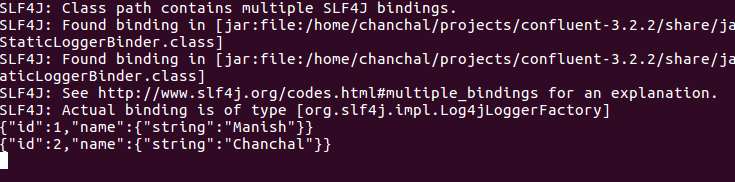
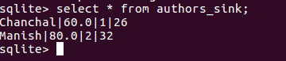

Lab 8. Building ETL Pipelines Using Kafka
------------------------------------------------------


In the previous lab, we learned about Confluent Platform. We covered
its architecture in detail and discussed its components. You also
learned how to export data from Kafka to HDFS using different tools. We
went through Camus, Goblin, Flume, and Kafka Connect to cover different
ways of bringing data to HDFS. We also recommend you try all the tools
discussed in the last lab to understand how they work. Now we will
look into creating an ETL pipeline using these tools and  look more
closely at Kafka Connect use cases and examples. In this lab, we will cover Kafka Connect in detail.


Using Kafka Connect 
--------------------


Kafka Connect provides us with various Connectors, and we can use the
Connectors based on our use case requirement. It also provides an API
that can be used to build your own Connector. We will go through a few
basic examples in this section. We have tested the code on the Ubuntu
machine. Download the Confluent Platform tar file from the Confluent
website:


-   [**Import or Source Connector**]: This is used to ingest
    data from the source system into Kafka. There are already a few
    inbuilt Connectors available in the Confluent Platform.
-   [**Export or Sink Connector**]: This is used to export data
    from Kafka topic to external sources. Let\'s look at a few
    Connectors available for real-use cases.
-   [**JDBC Source Connector**]: The JDBC Connector can be used
    to pull data from any JDBC-supported system to Kafka.


Let\'s see how to use it:


1.  Install `sqllite`:


```
sudo apt-get install sqlite3
```


2.  Start console:


```
sqlite3 fenago.db
```


3.  Create a database table, and insert records:


```
sqlite> CREATE TABLE authors(id INTEGER PRIMARY KEY AUTOINCREMENT NOT NULL, name VARCHAR(255));

sqlite> INSERT INTO authors(name) VALUES('Manish');

sqlite> INSERT INTO authors(name) VALUES('Chanchal');
```


4.  Make the following changes in
    the `source-quickstart-sqlite.properties` file:


```
name=jdbc-testConnector.class=io.confluent.connect.jdbc.JdbcSourceConnectortasks.max=1connection.url=jdbc:sqlite:fenago.dbmode=incrementingincrementing.column.name=idtopic.prefix=test-
```


5.  In `connection.url`, the `fenago.db` value is the
    path to your `fenago.db` file. Provide the full path to
    the `.db` file. Once everything is ready, run the
    following command to execute the Connector script:


```
 ./bin/connect-standalone etc/schema-registry/connect-avro-standalone.properties etc/kafka-connect-jdbc/source-quickstart-sqlite.properties
```


6.  Once the script is successfully executed, you can check the output
    using the following command:


```
bin/kafka-avro-console-consumer --new-consumer --bootstrap-server localhost:9092 --topic test-authors --from-beginning
```

You will see the following output:





### Note

Make sure you have already started Zookeeper, Kafka server, and Schema
Registry before running this demo. 


[**JDBC Sink Connector**]: This Connector is used to export
data from Kafka topic to any JDBC-supported external system.

Let\'s see how to use it:


1.  Configure `sink-quickstart-sqlite.properties`:


```
name=test-jdbc-sinkConnector.class=io.confluent.connect.jdbc.JdbcSinkConnectortasks.max=1topics=authors_sinkconnection.url=jdbc:sqlite:fenago_authors.dbauto.create=true
```


2.  Run the producer:


```
bin/kafka-avro-console-producer \
 --broker-list localhost:9092 --topic authors_sink \
 --property value.schema='{"type":"record","name":"authors","fields":[{"name":"id","type":"int"},{"name":"author_name", "type": "string"}, {"name":"age", "type": "int"}, {"name":"popularity_percentage",
 "type": "float"}]}'
```


3.  Run the Kafka Connect Sink: 


```
./bin/connect-standalone etc/schema-registry/connect-avro-standalone.properties etc/kafka-connect-jdbc/sink-quickstart-sqlite.properties
```


4.  Insert the record into the producer:


```
{"id": 1, "author_name": "Chanchal", "age": 26, "popularity_percentage": 60}

{"id": 2, "author_name": "Manish", "age": 32, "popularity_percentage": 80}
```


5.  Run `sqlite`: 


```
sqlite3 fenago_authors.db

select * from authors_sink;
```

You will see following output in the table:




Now we know how Kafka Connect can be used to extract and load data from
Kafka to the database and from the database to Kafka.


Summary  
------------------------


In this lab, we learned about Kafka Connect in detail. In the next lab, you will learn about Kafka Stream in detail, and we
will also see how we can use Kafka stream API to build our own streaming
application. We will explore the Kafka Stream API in detail and focus on
its advantages.
