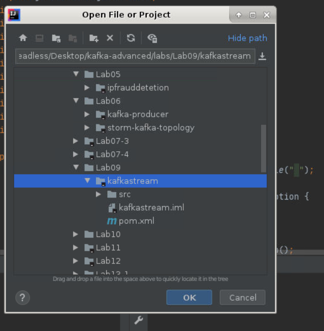
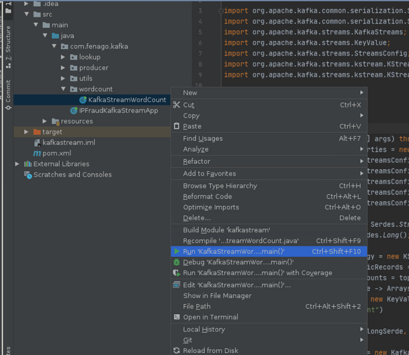
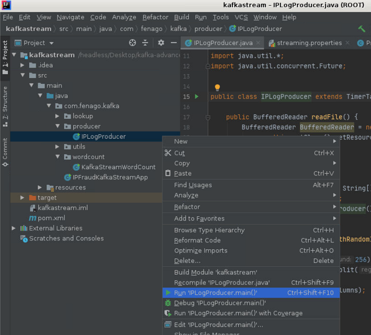
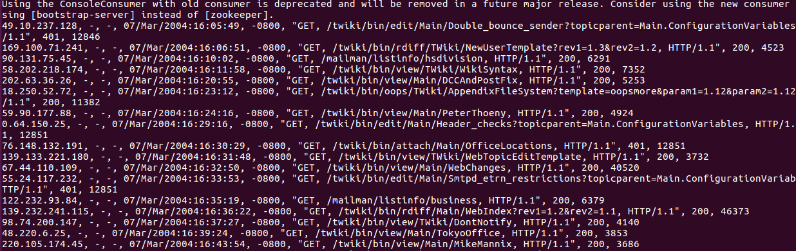
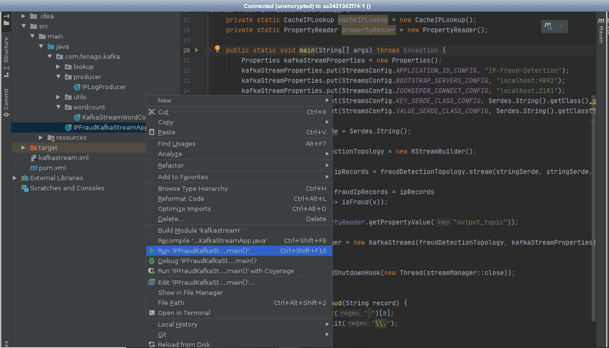

Lab 9. Building Streaming Applications Using Kafka Streams
-----------------------------------------------------------------------


In this lab, we will cover Kafka Streams in detail.


Understanding tables and Streams together 
---------------------------------------------------------

Before we start discussing tables and Streams, let\'s understand the
following simple code of a word count program written in Java using a
Kafka Stream API.


### Lab Solution

Complete solution for this lab is available in the following directory:

`~/kafka-advanced/labs/Lab09/kafkastream`




### Maven dependency

The Kafka Stream application can be run from anywhere. You just need to
add library dependency and start developing your program. We are using
Maven to build our application. Add the following dependency into your
project:

```
<dependency>
    <groupId>org.apache.Kafka</groupId>
    <artifactId>Kafka-Streams</artifactId>
    <version>0.10.0.0</version>
</dependency>
```


### Kafka Stream word count


The following code is a simple word count program built using a Stream
API. We will go through the important APIs used in this program, and
will talk about their uses:

```
package com.fenago.Kafka;

import org.apache.Kafka.common.serialization.Serde;
import org.apache.Kafka.common.serialization.Serdes;
import org.apache.Kafka.Streams.KafkaStreams;
import org.apache.Kafka.Streams.KeyValue;
import org.apache.Kafka.Streams.StreamsConfig;
import org.apache.Kafka.Streams.kStream.KStream;
import org.apache.Kafka.Streams.kStream.KStreamBuilder;

import java.util.Arrays;
import java.util.Properties;

public class KafkaStreamWordCount {
    public static void main(String[] args) throws Exception {
        Properties KafkaStreamProperties = new Properties();
// Stream configuration 
        KafkaStreamProperties.put(StreamsConfig.APPLICATION_ID_CONFIG, "Kafka-Stream-wordCount");
        KafkaStreamProperties.put(StreamsConfig.BOOTSTRAP_SERVERS_CONFIG, "localhost:9092");
        KafkaStreamProperties.put(StreamsConfig.ZOOKEEPER_CONNECT_CONFIG, "localhost:2181");
        KafkaStreamProperties.put(StreamsConfig.KEY_SERDE_CLASS_CONFIG, Serdes.String().getClass().getName());
        KafkaStreamProperties.put(StreamsConfig.VALUE_SERDE_CLASS_CONFIG, Serdes.String().getClass().getName());

        Serde<String> stringSerde = Serdes.String();
        Serde<Long> longSerde = Serdes.Long();

        KStreamBuilder StreamTopology = new KStreamBuilder();

//Kstream to read input data from input topic
        KStream<String, String> topicRecords = StreamTopology.Stream(stringSerde, stringSerde, "input");
        KStream<String, Long> wordCounts = topicRecords
                .flatMapValues(value -> Arrays.asList(value.toLowerCase().split("\\W+")))
                .map((key, word) -> new KeyValue<>(word, word))
                .countByKey("Count")
                .toStream();

//Store wordcount result in wordcount topic
        wordCounts.to(stringSerde, longSerde, "wordCount");

        KafkaStreams StreamManager = new KafkaStreams(StreamTopology, KafkaStreamProperties);
//Running Stream job
        StreamManager.start();

        Runtime.getRuntime().addShutdownHook(new Thread(StreamManager::close));
    }

}
```

#### Run WordCount Example 


Run wordcount code as shown below:




Use case example of Kafka Streams 
-------------------------------------------------


### Maven dependency of Kafka Streams


The best part of Kafka Stream is that it does not require any extra
dependency apart from Stream libraries. Add the dependency to your
`pom.xml`:

```
<?xml version="1.0" encoding="UTF-8"?>
<project xmlns="http://Maven.apache.org/POM/4.0.0"
         xmlns:xsi="http://www.w3.org/2001/XMLSchema-instance"
         xsi:schemaLocation="http://Maven.apache.org/POM/4.0.0 http://Maven.apache.org/xsd/Maven-4.0.0.xsd">
    <modelVersion>4.0.0</modelVersion>

    <groupId>com.fenago</groupId>
    <artifactId>KafkaStream</artifactId>
    <version>1.0-SNAPSHOT</version>
    <build>
        <plugins>
            <plugin>
                <groupId>org.apache.Maven.plugins</groupId>
                <artifactId>Maven-compiler-plugin</artifactId>
                <configuration>
                    <source>1.8</source>
                    <target>1.8</target>
                </configuration>
            </plugin>
        </plugins>
    </build>
    <dependencies>
        <!-- https://mvnrepository.com/artifact/org.apache.Kafka/Kafka-Streams -->
        <dependency>
            <groupId>org.apache.Kafka</groupId>
            <artifactId>Kafka-Streams</artifactId>
            <version>0.10.0.1</version>
        </dependency>

    </dependencies>

</project>
```


### Property reader


We are going to use the same property file and property reader that we
used in Lab 6 with a few
changes. Kafka Stream will read the record from the `iprecord`
topic and will produce the output to the `fraudIp` topic: 

```
topic=iprecord
broker.list=localhost:9092
output_topic=fraudIp
```

Here is the property reader class:

```
package com.fenago.Kafka.utils;


import java.io.FileNotFoundException;
import java.io.IOException;
import java.io.InputStream;
import java.util.Properties;

public class PropertyReader {

    private Properties prop = null;

    public PropertyReader() {

        InputStream is = null;
        try {
            this.prop = new Properties();
            is = this.getClass().getResourceAsStream("/Streaming.properties");
            prop.load(is);
        } catch (FileNotFoundException e) {
            e.printStackTrace();
        } catch (IOException e) {
            e.printStackTrace();
        }
    }

    public String getPropertyValue(String key) {
        return this.prop.getProperty(key);
    }
}
```


### IP record producer


Again, the producer is the same as we used in Lab 5 and Lab 6 which generates
records with random IPs. The producer will auto-create the topic if it
does not exist. Here is how the code goes:

```
package com.fenago.Kafka.producer;

import com.fenago.Kafka.utils.PropertyReader;
import org.apache.Kafka.clients.producer.KafkaProducer;
import org.apache.Kafka.clients.producer.ProducerRecord;
import org.apache.Kafka.clients.producer.RecordMetadata;

import java.io.BufferedReader;
import java.io.IOException;
import java.io.InputStreamReader;
import java.util.*;
import java.util.concurrent.Future;


public class IPLogProducer extends TimerTask {

    public BufferedReader readFile() {
        BufferedReader BufferedReader = new BufferedReader(new InputStreamReader(
                this.getClass().getResourceAsStream("/IP_LOG.log")));
        return BufferedReader;

    }

    public static void main(final String[] args) {
        Timer timer = new Timer();
        timer.schedule(new IPLogProducer(), 3000, 3000);
    }

    private String getNewRecordWithRandomIP(String line) {
        Random r = new Random();
        String ip = r.nextInt(256) + "." + r.nextInt(256) + "." + r.nextInt(256) + "." + r.nextInt(256);
        String[] columns = line.split(" ");
        columns[0] = ip;
        return Arrays.toString(columns);
    }

    @Override
    public void run() {
        PropertyReader propertyReader = new PropertyReader();

        Properties producerProps = new Properties();
        producerProps.put("bootstrap.servers", propertyReader.getPropertyValue("broker.list"));
        producerProps.put("key.serializer", "org.apache.Kafka.common.serialization.StringSerializer");
        producerProps.put("value.serializer", "org.apache.Kafka.common.serialization.StringSerializer");
        producerProps.put("auto.create.topics.enable", "true");

        KafkaProducer<String, String> ipProducer = new KafkaProducer<String, String>(producerProps);

        BufferedReader br = readFile();
        String oldLine = "";
        try {
            while ((oldLine = br.readLine()) != null) {
                String line = getNewRecordWithRandomIP(oldLine).replace("[", "").replace("]", "");
                ProducerRecord ipData = new ProducerRecord<String, String>(propertyReader.getPropertyValue("topic"), line);
                Future<RecordMetadata> recordMetadata = ipProducer.send(ipData);
            }
        } catch (IOException e) {
            e.printStackTrace();
        }
        ipProducer.close();
    }
}
```


#### Run IPFraudKafkaStreamApp Example 

Run kafka producer code as shown below:




Verify the producer record using the console producer. Run the following
command on the Kafka cluster:

```
cd ~/kafka-advanced

kafka/bin/kafka-console-consumer.sh \
    --bootstrap-server localhost:9092 \
    --topic iprecord \
    --from-beginning
```

Remember that we are producing multiple records by changing the IP
address randomly. You\'ll be able to see the records as shown in the
following figure:





### IP lookup service


As mentioned earlier, the lookup service is reused from Lab 5 and Lab 6,
[*Building Storm Application with Kafka*]. Note that this is
in the memory lookup created over the interface, so you can add your own
lookup service by simply providing implementation for
`isFraud()`, and you are done. 

The [**IP scanner interface**] looks like this:

```
package com.fenago.Kafka.lookup;

public interface IIPScanner {

    boolean isFraudIP(String ipAddresses);

}
```

We have kept the in-memory IP lookup very simple for an interactive
execution of the application. The lookup service will scan the IP
address and detect whether the record is a fraud or not by comparing the
first 8 bits of the IP address:

```
package com.fenago.Kafka.lookup;

import java.io.Serializable;
import java.util.HashSet;
import java.util.Set;


public class CacheIPLookup implements IIPScanner, Serializable {

    private Set<String> fraudIPList = new HashSet<>();

    public CacheIPLookup() {
        fraudIPList.add("212");
        fraudIPList.add("163");
        fraudIPList.add("15");
        fraudIPList.add("224");
        fraudIPList.add("126");
        fraudIPList.add("92");
        fraudIPList.add("91");
        fraudIPList.add("10");
        fraudIPList.add("112");
        fraudIPList.add("194");
        fraudIPList.add("198");
        fraudIPList.add("11");
        fraudIPList.add("12");
        fraudIPList.add("13");
        fraudIPList.add("14");
        fraudIPList.add("15");
        fraudIPList.add("16");
    }


    @Override
    public boolean isFraudIP(String ipAddresses) {
        return fraudIPList.contains(ipAddresses);
    }
}
```


### Fraud detection application


The fraud detection application will be running continuously, and you
can run as many instances as you want; Kafka will do the load balancing
for you. Let\'s look at the following code that reads the input from
the `iprecord` topic and then filters out records that are
fraud using the lookup service:

```
package com.fenago.Kafka;


import com.fenago.Kafka.lookup.CacheIPLookup;
import com.fenago.Kafka.utils.PropertyReader;
import org.apache.Kafka.common.serialization.Serde;
import org.apache.Kafka.common.serialization.Serdes;
import org.apache.Kafka.Streams.KafkaStreams;
import org.apache.Kafka.Streams.StreamsConfig;
import org.apache.Kafka.Streams.kStream.KStream;
import org.apache.Kafka.Streams.kStream.KStreamBuilder;

import java.util.Properties;

public class IPFraudKafkaStreamApp {
    private static CacheIPLookup cacheIPLookup = new CacheIPLookup();
    private static PropertyReader propertyReader = new PropertyReader();

    public static void main(String[] args) throws Exception {
        Properties KafkaStreamProperties = new Properties();
        KafkaStreamProperties.put(StreamsConfig.APPLICATION_ID_CONFIG, "IP-Fraud-Detection");
        KafkaStreamProperties.put(StreamsConfig.BOOTSTRAP_SERVERS_CONFIG, "localhost:9092");
        KafkaStreamProperties.put(StreamsConfig.ZOOKEEPER_CONNECT_CONFIG, "localhost:2181");
        KafkaStreamProperties.put(StreamsConfig.KEY_SERDE_CLASS_CONFIG, Serdes.String().getClass().getName());
        KafkaStreamProperties.put(StreamsConfig.VALUE_SERDE_CLASS_CONFIG, Serdes.String().getClass().getName());

        Serde<String> stringSerde = Serdes.String();

        KStreamBuilder fraudDetectionTopology = new KStreamBuilder();
//Reading fraud record from topic configured in configuration file

        KStream<String, String> ipRecords = fraudDetectionTopology.Stream(stringSerde, stringSerde, propertyReader.getPropertyValue("topic"));
//Checking if record is fraud using in memory lookup service

        KStream<String, String> fraudIpRecords = ipRecords
                .filter((k, v) -> isFraud(v));
//Storing fraud IP’s to topic 
        fraudIpRecords.to(propertyReader.getPropertyValue("output_topic"));

        KafkaStreams StreamManager = new KafkaStreams(fraudDetectionTopology, KafkaStreamProperties);
        StreamManager.start();

        Runtime.getRuntime().addShutdownHook(new Thread(StreamManager::close));
    }

//Fraud ip lookup method
    private static boolean isFraud(String record) {
        String IP = record.split(" ")[0];
        String[] ranges = IP.split("\\.");
        String range = null;
        try {
            range = ranges[0] + "." + ranges[1];
        } catch (ArrayIndexOutOfBoundsException ex) {
                 //handling here
        }
        return cacheIPLookup.isFraudIP(range);
    }
}
```


#### Run IPFraudKafkaStreamApp Example 

Run kafka streaming application as shown below:




Summary 
-----------------------


In this lab, you learned about Kafka Stream and how it makes sense
to use Kafka Stream to do transformation when we have Kafka in our
pipeline. We also went through the architecture, internal working, and
integrated framework advantages of Kafka Streams.

In the next lab, we will cover the internals of Kafka clusters,
capacity planning, single-cluster and multi-cluster deployment,
and adding and removing brokers.
