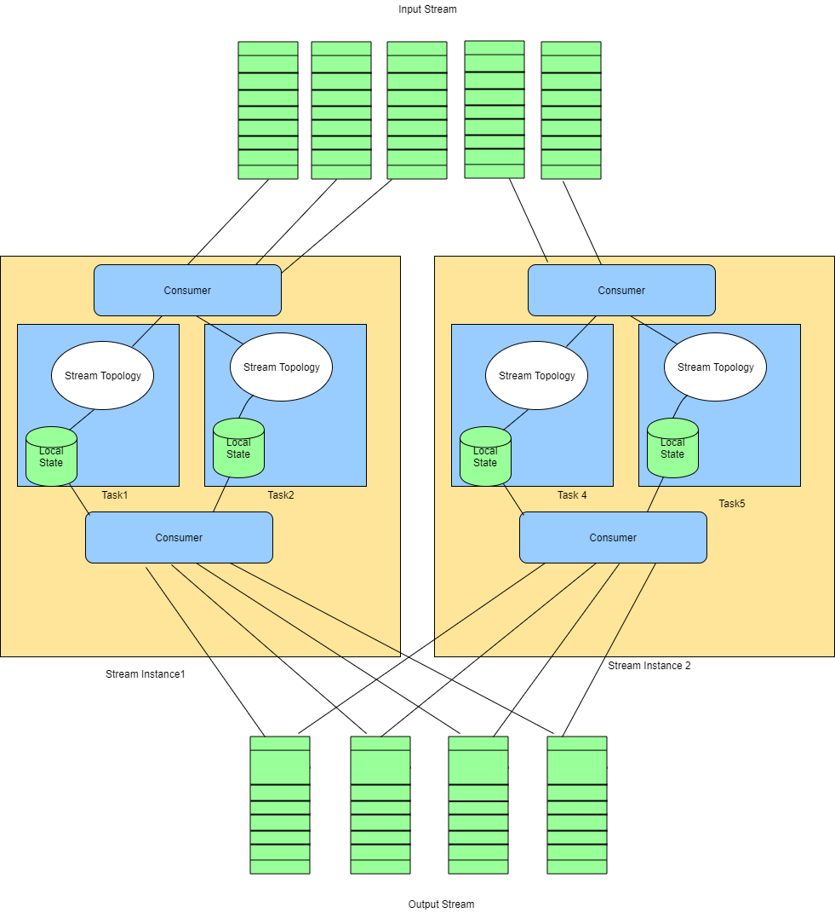
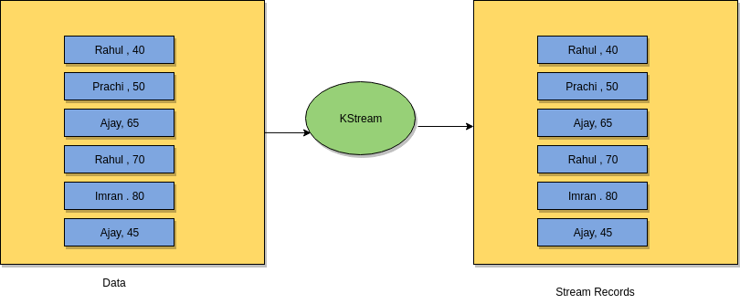
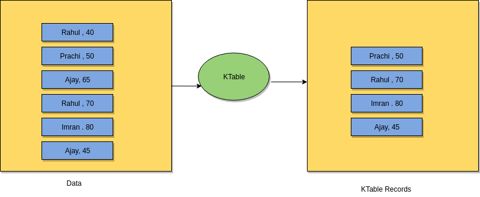

Lab 9. Building Streaming Applications Using Kafka Streams
-----------------------------------------------------------------------


In the previous lab, you learned about Kafka Connect and how it
makes a user\'s job simple when it comes to importing and exporting data
from Kafka. You also learned how Kafka Connect can be used as an extract
and load processor in the ETL pipeline. In this lab, we will focus
on Kafka Stream, which is a lightweight streaming library used to
develop a streaming application that works with Kafka. Kafka Stream can
act as a transformer in the ETL phase.

We will cover the following topics in this lab:


-   Introduction to Kafka Stream 
-   Kafka Stream architecture
-   Advantages of using Kafka Stream
-   Introduction to `KStream` and `KTable` 
-   Use case example 


Introduction to Kafka Streams 
---------------------------------------------


The data processing strategy has evolved over time, and it\'s still
being used in different ways. The following are the important terms
related to Kafka Streams:


-   [**Request/response**]: In this type of processing, you
    send a single request. This is sent as request data, and the server
    processes it and returns the response data as a result. You may take
    the example of REST servers, where processing is done on request and
    the response is sent to the client after processing. Processing may
    involve filtering, cleansing, aggregation, or lookup operations.
    Scaling such a processing engine requires adding more services in
    order to handle the increase in traffic. 
-   [**Batch processing**]: This is a process where you send a
    bounded set of input data in batches, and the processing engine
    sends the response in batches after processing. In batch processing,
    data is already available in the file or database. Hadoop MapReduce
    is a good example of a batch processing model. You can increase
    throughput by adding more processing nodes to the cluster; however,
    achieving high latency is very challenging in batch processing jobs.
    The sources of input data and the processing engine are loosely
    coupled with each other, and hence, the time difference between
    producing the input data and processing it may be big.
-   [**Stream processing**]: The Stream of data is processed as
    soon as it is generated from the source system. Data is passed to
    the Stream processing application in the form of Streams. Streams
    are ordered sets of unbounded data. Stream processing helps you
    achieve high latency because you get a processed result for data as
    soon as it originates from the source.


### Note

You may need to trade off between latency, cost, and correctness when it
comes to Stream processing. For example, if you want to develop a fraud
analytics application, you will focus more on latency and correctness
than on cost. Similarly, if you are just performing an ETL of Stream of
data, you may not care about latency in this case, you will look for
more correctness. 


### Using Kafka in Stream processing


Kafka is the persistence queue for data where data is stored in order of
time stamp. The following properties of Kafka allow it to occupy its
place in most Streaming architecture:


-   [**Persistence queue and loose coupling**]: Kafka stores
    data in topics, which store data in order. The data producer does
    not have to wait for a response from the application that processes
    data. It simply puts data into the Kafka queue, and the processing
    application consumes data from the Kafka queue to process it. 
-   [**Fault tolerance**]: Data stored in Kafka will not be
    lost even if one or two brokers fail. This is because Kafka
    replicates topic partition in multiple brokers, so if a broker
    fails, data will be served from the other broker holding the
    replica. It has the ability to serve a data Stream without any long
    delay, which is a critical part of the Stream processing
    application. Kafka also allows consumers to read messages as per
    their requirement, meaning you can read from the beginning or you
    can read from anywhere by providing an offset of the message.
-   [**Logical ordering**]: Data ordering is important for a
    few critical Streaming applications. Kafka stores data in order of
    time stamp. Applications such as fraud analytics will not be able to
    bear the cost of unordered data. The Stream application will be able
    to read messages in the same order in which they were written in the
    Kafka topic partition.
-   [**Scalability**]: Kafka has the ability to scale up as per
    need. All that we need to do is add more broker nodes to the Kafka
    cluster, and our job is done. You don\'t need to care about whether
    your data source will grow exponentially in the future, or whether
    more applications want to use the same data for multiple use cases.
    The data is available in Kafka, and any application can read it from
    here.


Apache Kafka can be easily integrated with any Stream processing
application.


### Note

Stream processing applications, such as Spark, Storm, or Flink, provide
good APIs to integrate Kafka with them. This Stream processing framework
provides a nice feature to build the application, but there is some cost
and complexity involved. You need to first set up the specific cluster
before running the application. You also need to maintain the cluster to
identify any problem, to optimize the application, or to check the
health of the cluster.


### Kafka Stream - lightweight Stream processing library 


[**Kafka Stream**] is a lightweight Stream processing library
that is tightly coupled with Kafka. It does not require any cluster
setup or any other operational cost. We will discuss the features that
any Stream processing application should persist and how Kafka Stream
provides those features.


### Note

Before starting this lab, we recommend you go through the concept of
Apache Kafka. You should know about the producer, consumer, topic,
parallelism, broker, and other concepts of Apache Kafka to better
understand Kafka Stream.


The following are a few important features that Kafka Stream provides
you with as an effort to build a robust and reliable Stream processing
application:


-   [**Ordering**]: Kafka stores messages/data in topic
    partitions. Partitions store data in in order of their timestamp.
    This means that the data in topic partitions is ordered. Kafka
    Stream utilizes the capability of Kafka and consumes data in order.
    Order processing can be easily achievable as Kafka also stores the
    time stamp with messages in topic partition. You can reorder the
    data in any form using this time stamp property.
-   [**State management**]: Maintaining the
    state in a Stream processing application is also very important for
    some state dependent applications. Data processing may require
    access to recently processed data or derived data, so it is a great
    idea to maintain the state of the data as close to processing as
    possible. There are two ways to maintain the state:
    
    -   [**Remote state**]: State is maintained in a
        third-party storage database, and the application needs to make
        a connection to the database to retrieve the state of the
        records. Many large Streaming applications use this practice to
        maintain the state, but this will cost you high latency as
        access to the state is remote and depends on network bandwidth
        and availability.
    -   [**Local state**]: The state is maintained on the same
        machine where the application instance is running. This allows
        quick access to the state of records and helps you increase
        latency.
    


Kafka Stream provides a more powerful feature of maintaining the state
using the local state management technique. It maintains the local state
at each running instance of the application. These local states are
shards of the global state. Kafka Stream instance only processes non
overlapping subsets of Kafka topic partition.


-   [**Fault tolerance**]: Fault tolerance is a
    very common and important feature in the Stream processing
    application. Failure of any instance should not affect the
    application processing. Kafka Stream maintains change of state in
    some topic. In case any instance fails, it restarts the process in
    some other working instance and does the load balancing internally. 
-   [**Time and window**]: Time refers to the event time and
    the processing time of records. Event time is the time when the
    record is produced or generated, and processing time is the time
    when the record is actually processed.


When the record is processed, the data may be processed out of order,
irrespective of its event time. Kafka Stream supports the windowing
concept, where each record is associated with a time stamp, which helps
in the order processing of the event or record. It also helps us deal
with late arriving data and to change log efficiently. 


-   [**Partition and scalability**]: Kafka Stream utilizes the
    capability of data parallelism. Multiple instances of the same
    application work on non overlapping subsets of Kafka topic
    partitions. Remember that the number of partitions in Kafka is the
    key to processing parallelism.


Kafka Stream applications are easily scalable. You just need to ask more
instances, and it will do auto load balancing for you. 


-   [**Reprocessing**]: This is the ability to reprocess the
    records from any point. Sometimes you may find that the application
    logic is missing, or there is a bug that forces you to rewrite the
    logic or make changes in the existing code and reprocess the data.
    Kafka Stream can reprocess the records by simply resetting the
    offset in the Kafka topic. 


Kafka Stream architecture  
------------------------------------------


Kafka Streams internally uses the Kafka producer and consumer libraries.
It is tightly coupled with Apache Kafka and allows you to leverage the
capabilities of Kafka to achieve data parallelism, fault tolerance, and
many other powerful features.

In this section, we will discuss how Kafka Stream works internally and
what the different components involved in building Stream applications
using Kafka Streams are. The following figure is an internal
representation of the working of Kafka Stream:




Kafka Stream architecture 

Stream instance consists of multiple tasks, where each task processes
non overlapping subsets of the record. If you want to increase
parallelism, you can simply add more instances, and Kafka Stream will
auto distribute work among different instances.

Let\'s discuss a few important components seen in the previous figure:


-   [**Stream topology**]: Stream topology in Kafka Stream is
    somewhat similar to the topology of Apache Storm. The topology
    consists of Stream processor nodes connected with each other to
    perform the desired computation. Stream topology contains three
    types of processors:
    
    -   [**Source processor**]: This is responsible for
        consuming records from the source topic and forwarding records
        to the downstream processor. It does not have any upstream
        processor, meaning that it is the first node or processor in
        Stream topology.
    -   [**Stream processor**]: This is responsible for
        computing data. The logic of data transformation is handled by
        the Stream processor. There can be multiple such processors in a
        single topology. 
    -   [**Sink processor**]: This is responsible for consuming
        data from Stream processors and then writing them to the target
        topic or system. It is the last processor in the topology,
        meaning it does not have any downstream processor.
    
-   [**Local state**]: Kafka Stream maintains a local state for
    each instance of the application. It provides two types of
    operators: one is a stateless operator, and the other is a stateful
    operator. It is similar to the concepts of transformations and
    actions in Spark; stateless operators are equivalent to
    transformations, and stateful operators are equivalent to actions.


When Kafka Stream encounters any stateful operation, it creates and
manages the local state store. The data structure used for the state
store can be an internal map or a DB. 


-   [**Record cache**]: Kafka Stream caches data before storing
    it to the local state or forwarding it to any downstream. The cache
    helps in improving read and write performance of the local state
    store. It can be used as a write-back buffer or as a read buffer. It
    also allows you to send records in batches to the local state store,
    which significantly reduces write\--request calls to the local state
    store. 


Integrated framework advantages 
-----------------------------------------------


Kafka Stream is tightly integrated with Apache Kafka. It provides reach
sets of API and offers powerful features to build the Stream processing
application. If you are using Kafka as a centralized storage layer for
your data and want to do Stream processing over the it, then using Kafka
Stream should be preferred because of the following reasons:


-   [**Deployment**]: An application built using Kafka Stream
    does not require any extra setup of the clusters to run. It can be
    run from a single-node machine or from your laptop. This is a huge
    advantage over other processing tools, such as Spark, Storm, and so
    on, which require clusters to be ready before you can run the
    application. Kafka Stream uses Kafka\'s producer and consumer
    library.


If you want to increase parallelism, you just need to add more instances
of the application, and Kafka Stream will do the auto load balancing for
you. Just because Kafka Streams is framework free does not mean that
Kafka Stream will not need Kafka; Kafka Stream is tightly coupled with
Kafka and will not work if you do not have the Kafka cluster running.
You need to specify the details of the Kafka cluster when you write your
Stream application.


-   [**Simple and easy features: **]Developing the Kafka Stream
    application is easy compared to other Streaming applications. Kafka
    Stream simply reads data from the Kafka topic and outputs data to
    the Kafka topic. Stream partition is similar to Kafka partition
    Streams, and it works for them too. The Stream application just acts
    as another consumer that utilizes the capability of Kafka\'s
    consumer offset management; it maintains states and other
    computations in the Kafka topic, and so it does not require an
    externally dependent system. 
-   [**Coordination and fault tolerance**]: Kafka Stream does
    not depend on any resource manager or third-party application for
    coordination. It uses the Kafka cluster for the load balancing
    application when a new instance is added or an old instance fails.
    In case of failure of load balancing, relievers automatically
    receive a new partition set to process from the broker. 


Understanding tables and Streams together 
---------------------------------------------------------


Before we start discussing tables and Streams, let\'s understand the
following simple code of a word count program written in Java using a
Kafka Stream API, and then we will look into the concepts of
`KStream` and `KTable`. We have been discussing the
concepts of Kafka Stream; in this section, we will discuss
`KStream`, `KTable`, and their internals.


### Maven dependency


The Kafka Stream application can be run from anywhere. You just need to
add library dependency and start developing your program. We are using
Maven to build our application. Add the following dependency into your
project:

```
<dependency>
    <groupId>org.apache.Kafka</groupId>
    <artifactId>Kafka-Streams</artifactId>
    <version>0.10.0.0</version>
</dependency>
```


### Kafka Stream word count


The following code is a simple word count program built using a Stream
API. We will go through the important APIs used in this program, and
will talk about their uses:

```
package com.fenago.Kafka;

import org.apache.Kafka.common.serialization.Serde;
import org.apache.Kafka.common.serialization.Serdes;
import org.apache.Kafka.Streams.KafkaStreams;
import org.apache.Kafka.Streams.KeyValue;
import org.apache.Kafka.Streams.StreamsConfig;
import org.apache.Kafka.Streams.kStream.KStream;
import org.apache.Kafka.Streams.kStream.KStreamBuilder;

import java.util.Arrays;
import java.util.Properties;

public class KafkaStreamWordCount {
    public static void main(String[] args) throws Exception {
        Properties KafkaStreamProperties = new Properties();
// Stream configuration 
        KafkaStreamProperties.put(StreamsConfig.APPLICATION_ID_CONFIG, "Kafka-Stream-wordCount");
        KafkaStreamProperties.put(StreamsConfig.BOOTSTRAP_SERVERS_CONFIG, "localhost:9092");
        KafkaStreamProperties.put(StreamsConfig.ZOOKEEPER_CONNECT_CONFIG, "localhost:2181");
        KafkaStreamProperties.put(StreamsConfig.KEY_SERDE_CLASS_CONFIG, Serdes.String().getClass().getName());
        KafkaStreamProperties.put(StreamsConfig.VALUE_SERDE_CLASS_CONFIG, Serdes.String().getClass().getName());

        Serde<String> stringSerde = Serdes.String();
        Serde<Long> longSerde = Serdes.Long();

        KStreamBuilder StreamTopology = new KStreamBuilder();

//Kstream to read input data from input topic
        KStream<String, String> topicRecords = StreamTopology.Stream(stringSerde, stringSerde, "input");
        KStream<String, Long> wordCounts = topicRecords
                .flatMapValues(value -> Arrays.asList(value.toLowerCase().split("\\W+")))
                .map((key, word) -> new KeyValue<>(word, word))
                .countByKey("Count")
                .toStream();

//Store wordcount result in wordcount topic
        wordCounts.to(stringSerde, longSerde, "wordCount");

        KafkaStreams StreamManager = new KafkaStreams(StreamTopology, KafkaStreamProperties);
//Running Stream job
        StreamManager.start();

        Runtime.getRuntime().addShutdownHook(new Thread(StreamManager::close));
    }

}
```

The application starts with a configuration where we define the set,
Kafka Stream provides two important abstractions: one is
`KStream`, and the other is `KTable`.

`KStream` is an abstraction of a key-value pair record Stream
of Kafka\'s topic record. In `KStream`, each record is
independent, meaning that a record with a key does not replace an old
record with the same key. `KStream` can be created in two
ways:


-   [**Using the Kafka topic**]: Any Kafka Stream application
    starts with `KStream`, which consumes data from the Kafka
    topic. If you look into the earlier program, the following lines
    create `KStream topicRecords`, which will consume data
    from the topic input:


```
KStream<String, String> topicRecords = StreamTopology.Stream(stringSerde, stringSerde, "input");
```


-   [**Using transformation**]: `KStream` can be
    created by doing transformation on the existing `KStream`.
    If you look at the previous program, you will see that there are
    transformations such as `flatMapValues` and
    `map` that are used on `KStream topicRecords`.
    `KStream` can also be created by converting
    `KTable` into `KStream`. In the same example,
    `countByKey` will create `KTable Count`, and
    then we convert it to `KStream` using
    `toStream()`:




KStream record representation


### KTable


`KTable` is a representation of `Changelog`, which
does not contain a record with the same key twice. This means that if
`KTable` encounters a record with the same key in the table,
it will simply replace the old record with the current record.

If the same record represented in the previous diagram for
`KStream` is converted to `KTable`, it will look
like this: 




KTable record representation

In the previous figure, you can see that the records of
`Rahul` and `Ajay` have been updated and the old
entries have been removed. `KTable` is similar to the update
operation in Map. Whenever a duplicate key is inserted, the old value
gets replaced by a new value. We can perform various operations on
`KTable` and join it to other `KStream` or
`KTable` instances.


Use case example of Kafka Streams 
-------------------------------------------------


### Maven dependency of Kafka Streams


The best part of Kafka Stream is that it does not require any extra
dependency apart from Stream libraries. Add the dependency to your
`pom.xml`:

```
<?xml version="1.0" encoding="UTF-8"?>
<project xmlns="http://Maven.apache.org/POM/4.0.0"
         xmlns:xsi="http://www.w3.org/2001/XMLSchema-instance"
         xsi:schemaLocation="http://Maven.apache.org/POM/4.0.0 http://Maven.apache.org/xsd/Maven-4.0.0.xsd">
    <modelVersion>4.0.0</modelVersion>

    <groupId>com.fenago</groupId>
    <artifactId>KafkaStream</artifactId>
    <version>1.0-SNAPSHOT</version>
    <build>
        <plugins>
            <plugin>
                <groupId>org.apache.Maven.plugins</groupId>
                <artifactId>Maven-compiler-plugin</artifactId>
                <configuration>
                    <source>1.8</source>
                    <target>1.8</target>
                </configuration>
            </plugin>
        </plugins>
    </build>
    <dependencies>
        <!-- https://mvnrepository.com/artifact/org.apache.Kafka/Kafka-Streams -->
        <dependency>
            <groupId>org.apache.Kafka</groupId>
            <artifactId>Kafka-Streams</artifactId>
            <version>0.10.0.1</version>
        </dependency>

    </dependencies>

</project>
```


### Property reader


We are going to use the same property file and property reader that we
used in Lab 6 with a few
changes. Kafka Stream will read the record from the `iprecord`
topic and will produce the output to the `fraudIp` topic: 

```
topic=iprecord
broker.list=localhost:9092
output_topic=fraudIp
```

Here is the property reader class:

```
package com.fenago.Kafka.utils;


import java.io.FileNotFoundException;
import java.io.IOException;
import java.io.InputStream;
import java.util.Properties;

public class PropertyReader {

    private Properties prop = null;

    public PropertyReader() {

        InputStream is = null;
        try {
            this.prop = new Properties();
            is = this.getClass().getResourceAsStream("/Streaming.properties");
            prop.load(is);
        } catch (FileNotFoundException e) {
            e.printStackTrace();
        } catch (IOException e) {
            e.printStackTrace();
        }
    }

    public String getPropertyValue(String key) {
        return this.prop.getProperty(key);
    }
}
```


### IP record producer


Again, the producer is the same as we used in Lab 5 and Lab 6 which generates
records with random IPs. The producer will auto-create the topic if it
does not exist. Here is how the code goes:

```
package com.fenago.Kafka.producer;

import com.fenago.Kafka.utils.PropertyReader;
import org.apache.Kafka.clients.producer.KafkaProducer;
import org.apache.Kafka.clients.producer.ProducerRecord;
import org.apache.Kafka.clients.producer.RecordMetadata;

import java.io.BufferedReader;
import java.io.IOException;
import java.io.InputStreamReader;
import java.util.*;
import java.util.concurrent.Future;


public class IPLogProducer extends TimerTask {

    public BufferedReader readFile() {
        BufferedReader BufferedReader = new BufferedReader(new InputStreamReader(
                this.getClass().getResourceAsStream("/IP_LOG.log")));
        return BufferedReader;

    }

    public static void main(final String[] args) {
        Timer timer = new Timer();
        timer.schedule(new IPLogProducer(), 3000, 3000);
    }

    private String getNewRecordWithRandomIP(String line) {
        Random r = new Random();
        String ip = r.nextInt(256) + "." + r.nextInt(256) + "." + r.nextInt(256) + "." + r.nextInt(256);
        String[] columns = line.split(" ");
        columns[0] = ip;
        return Arrays.toString(columns);
    }

    @Override
    public void run() {
        PropertyReader propertyReader = new PropertyReader();

        Properties producerProps = new Properties();
        producerProps.put("bootstrap.servers", propertyReader.getPropertyValue("broker.list"));
        producerProps.put("key.serializer", "org.apache.Kafka.common.serialization.StringSerializer");
        producerProps.put("value.serializer", "org.apache.Kafka.common.serialization.StringSerializer");
        producerProps.put("auto.create.topics.enable", "true");

        KafkaProducer<String, String> ipProducer = new KafkaProducer<String, String>(producerProps);

        BufferedReader br = readFile();
        String oldLine = "";
        try {
            while ((oldLine = br.readLine()) != null) {
                String line = getNewRecordWithRandomIP(oldLine).replace("[", "").replace("]", "");
                ProducerRecord ipData = new ProducerRecord<String, String>(propertyReader.getPropertyValue("topic"), line);
                Future<RecordMetadata> recordMetadata = ipProducer.send(ipData);
            }
        } catch (IOException e) {
            e.printStackTrace();
        }
        ipProducer.close();
    }
}
```

Verify the producer record using the console producer. Run the following
command on the Kafka cluster:

```
cd ~/kafka-advanced

kafka/bin/kafka-console-consumer.sh \
    --bootstrap-server localhost:9092 \
    --topic iprecord \
    --from-beginning
```

Remember that we are producing multiple records by changing the IP
address randomly. You\'ll be able to see the records as shown in the
following figure:


### IP lookup service


As mentioned earlier, the lookup service is reused from Lab 5 and Lab 6,
[*Building Storm Application with Kafka*]. Note that this is
in the memory lookup created over the interface, so you can add your own
lookup service by simply providing implementation for
`isFraud()`, and you are done. 

The [**IP scanner interface**] looks like this:

```
package com.fenago.Kafka.lookup;

public interface IIPScanner {

    boolean isFraudIP(String ipAddresses);

}
```

We have kept the in-memory IP lookup very simple for an interactive
execution of the application. The lookup service will scan the IP
address and detect whether the record is a fraud or not by comparing the
first 8 bits of the IP address:

```
package com.fenago.Kafka.lookup;

import java.io.Serializable;
import java.util.HashSet;
import java.util.Set;


public class CacheIPLookup implements IIPScanner, Serializable {

    private Set<String> fraudIPList = new HashSet<>();

    public CacheIPLookup() {
        fraudIPList.add("212");
        fraudIPList.add("163");
        fraudIPList.add("15");
        fraudIPList.add("224");
        fraudIPList.add("126");
        fraudIPList.add("92");
        fraudIPList.add("91");
        fraudIPList.add("10");
        fraudIPList.add("112");
        fraudIPList.add("194");
        fraudIPList.add("198");
        fraudIPList.add("11");
        fraudIPList.add("12");
        fraudIPList.add("13");
        fraudIPList.add("14");
        fraudIPList.add("15");
        fraudIPList.add("16");
    }


    @Override
    public boolean isFraudIP(String ipAddresses) {
        return fraudIPList.contains(ipAddresses);
    }
}
```


### Fraud detection application


The fraud detection application will be running continuously, and you
can run as many instances as you want; Kafka will do the load balancing
for you. Let\'s look at the following code that reads the input from
the `iprecord` topic and then filters out records that are
fraud using the lookup service:

```
package com.fenago.Kafka;


import com.fenago.Kafka.lookup.CacheIPLookup;
import com.fenago.Kafka.utils.PropertyReader;
import org.apache.Kafka.common.serialization.Serde;
import org.apache.Kafka.common.serialization.Serdes;
import org.apache.Kafka.Streams.KafkaStreams;
import org.apache.Kafka.Streams.StreamsConfig;
import org.apache.Kafka.Streams.kStream.KStream;
import org.apache.Kafka.Streams.kStream.KStreamBuilder;

import java.util.Properties;

public class IPFraudKafkaStreamApp {
    private static CacheIPLookup cacheIPLookup = new CacheIPLookup();
    private static PropertyReader propertyReader = new PropertyReader();

    public static void main(String[] args) throws Exception {
        Properties KafkaStreamProperties = new Properties();
        KafkaStreamProperties.put(StreamsConfig.APPLICATION_ID_CONFIG, "IP-Fraud-Detection");
        KafkaStreamProperties.put(StreamsConfig.BOOTSTRAP_SERVERS_CONFIG, "localhost:9092");
        KafkaStreamProperties.put(StreamsConfig.ZOOKEEPER_CONNECT_CONFIG, "localhost:2181");
        KafkaStreamProperties.put(StreamsConfig.KEY_SERDE_CLASS_CONFIG, Serdes.String().getClass().getName());
        KafkaStreamProperties.put(StreamsConfig.VALUE_SERDE_CLASS_CONFIG, Serdes.String().getClass().getName());

        Serde<String> stringSerde = Serdes.String();

        KStreamBuilder fraudDetectionTopology = new KStreamBuilder();
//Reading fraud record from topic configured in configuration file

        KStream<String, String> ipRecords = fraudDetectionTopology.Stream(stringSerde, stringSerde, propertyReader.getPropertyValue("topic"));
//Checking if record is fraud using in memory lookup service

        KStream<String, String> fraudIpRecords = ipRecords
                .filter((k, v) -> isFraud(v));
//Storing fraud IP’s to topic 
        fraudIpRecords.to(propertyReader.getPropertyValue("output_topic"));

        KafkaStreams StreamManager = new KafkaStreams(fraudDetectionTopology, KafkaStreamProperties);
        StreamManager.start();

        Runtime.getRuntime().addShutdownHook(new Thread(StreamManager::close));
    }

//Fraud ip lookup method
    private static boolean isFraud(String record) {
        String IP = record.split(" ")[0];
        String[] ranges = IP.split("\\.");
        String range = null;
        try {
            range = ranges[0] + "." + ranges[1];
        } catch (ArrayIndexOutOfBoundsException ex) {
                 //handling here
        }
        return cacheIPLookup.isFraudIP(range);
    }
}
```


Summary 
-----------------------


In this lab, you learned about Kafka Stream and how it makes sense
to use Kafka Stream to do transformation when we have Kafka in our
pipeline. We also went through the architecture, internal working, and
integrated framework advantages of Kafka Streams. We covered
`KStream` and `KTable` in brief and understood how
they are different from each other. A detailed explanation of the Kafka
Stream API is out of the scope of this course.

In the next lab, we will cover the internals of Kafka clusters,
capacity planning, single-cluster and multi-cluster deployment,
and adding and removing brokers.
